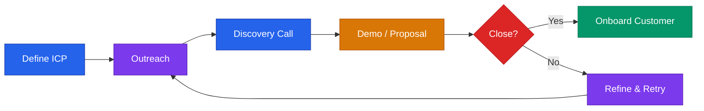

# GTM & Sales Playbook



## Core Rule
**Revenue solves most startup problems.** When in doubt, go sell something — today.

---

## Ideal Customer Profile (ICP)

Define before any outreach:

```
1. Industry/Vertical: [What kind of company/person?]
2. Size: [Revenue, headcount, or other proxy]
3. Role: [Who is the buyer? Who is the user?]
4. Pain: [What specific problem do they have?]
5. Trigger: [What event makes them ready to buy NOW?]
6. Budget: [What do they currently spend on this problem?]
7. Anti-ICP: [Who should we NOT sell to? Why?]
```

Write your ICP in one sentence:
> "[Title] at [company type] who [trigger event] and struggles with [pain] — they currently [workaround] and spend $[X] on it."

### ICP Validation Test

Your ICP is validated when:
- You can name 10 specific people who fit it
- 3+ of them have confirmed the pain in interviews
- At least 1 has paid you money
- You can find more of them through a repeatable channel

If you can't do all four, your ICP needs work.

---

## Go-to-Market Motions

Choose the right motion for your product and stage:

| Motion | Best For | Sales Cycle | ACV | When to Use |
|--------|----------|-------------|-----|-------------|
| **Founder-led sales** | Pre-seed to seed | 1-4 weeks | $1K-$50K | Stage 0-2 (always start here) |
| **Sales-assisted self-serve** | SMB SaaS | 1-7 days | $100-$5K/yr | Stage 2+ with working product |
| **Product-led growth (PLG)** | Developer tools, freemium | Minutes-days | $0-$100K/yr | Stage 2+ with strong product |
| **Enterprise sales** | Large accounts | 2-6 months | $50K-$500K+ | Stage 3+ with case studies |
| **Channel / partner** | Distribution through others | Varies | Varies | Stage 3+ with proven product |
| **Community-led** | Developer, creator, niche B2B | Weeks-months | Varies | Stage 1+ with strong community |

**Most startups should start with founder-led sales** regardless of long-term motion. You need to hear objections firsthand before designing any other GTM.

---

## Outreach Frameworks

### Cold Email (3-Email Sequence)

**Email 1 — The Hook**
```
Subject: [Specific result] for [their company type]

Hi [Name],

[1 sentence personal relevance — why them, why now.]

[Company] helps [ICP] [specific outcome] — [one proof point].

Worth a quick call to see if it's a fit?

[Name]
```

**Email 2 — The Value Add (3 days later)**
```
Subject: Re: [original subject]

Wanted to share [relevant resource / insight / case study] in case useful.

Still happy to connect if the moment is right.
```

**Email 3 — The Close (5 days later)**
```
Subject: Re: [original subject]

Last note — didn't want to keep bothering you.

If timing ever works, [calendly link or simple ask].

Either way, rooting for you.
```

### Response Rate Benchmarks

| Metric | Good | Average | Fix If Below |
|--------|------|---------|-------------|
| Open rate | >50% | 30-50% | Subject line or sender name |
| Reply rate | >10% | 5-10% | First line personalization |
| Positive reply rate | >5% | 2-5% | Value proposition or ICP targeting |
| Meeting booked rate | >3% | 1-3% | CTA clarity or friction in booking |

---

## Discovery Call Framework (30 min)

```
0:00 — Agenda + permission (2 min)
       "I'd like to learn about your situation, share what we do,
        and see if there's a fit. Sound good?"

0:02 — Their situation (8 min)
       "Tell me about [relevant context]."

0:10 — The problem (7 min)
       "What's the hardest part of [topic]?"
       "How much does that cost you?"

0:17 — Current solution (5 min)
       "What are you doing now?"
       "What's not working about that?"

0:22 — The pitch + next step (5 min)
       Position your solution against their specific pain.

0:27 — Close (3 min)
       "Does this make sense to move forward?"
       "What would the next step look like on your end?"
```

**Never pitch before minute 20.** Let them describe the pain first. Your solution should feel like the answer to what they just said.

---

## Pricing Strategy

### Pricing Rules
- **Start higher than you think.** It's easier to discount than to raise.
- **Anchor on value, not cost.** What is the problem worth to them?
- **Always offer 3 tiers.** Middle tier gets chosen most often.
- **Don't negotiate on price — negotiate on scope.**
- **Test pricing with real offers before building pricing pages.**

**See also:** `pricing-strategy.md` for full framework including Van Westendorp WTP research, pricing psychology, and stage-specific guidance.

---

## Objection Handling

| Objection | Response |
|-----------|----------|
| "Too expensive" | "Compared to what?" or "What would make it worth it?" |
| "We already have something" | "What does it not do that you wish it did?" |
| "Let me think about it" | "What would help you decide? Is there info I can provide?" |
| "Not right now" | "When would be right? Can we put something on the calendar?" |
| "Send me more info" | "What specifically would help you evaluate this?" |
| "I need to check with my team" | "Who else should be on the next call?" |
| "We tried something like this" | "What went wrong? How is our approach different?" |
| "How are you different from [competitor]?" | "The key difference for [your use case] is [X]. [Customer] switched because [reason]." |

**The pattern:** Never defend. Ask a question that redirects to their specific pain. Then connect your solution to that pain.

---

## Pipeline Tracking

Track in a spreadsheet or free CRM (HubSpot):

```
Name | Company | Stage | Last Contact | Next Action | Deal Size | Close Date | Notes
```

**Stages:**
1. Lead (identified)
2. Contacted (reached out)
3. Conversation (had a call)
4. Proposal sent
5. Negotiating
6. Closed Won / Closed Lost

**Review pipeline every Friday.** Move stale deals to "Closed Lost" after 30 days of no response. Dead pipeline is worse than no pipeline — it creates false confidence.

---

## Closing Techniques

- **Assumptive close:** "Should I send the agreement today or Monday?"
- **Summary close:** "Based on what you shared, [X] solves [Y]. Should we move forward?"
- **Deadline close:** "We have onboarding slots open this month — want to lock one in?"
- **Trial close:** "If we can solve [objection], is there anything else holding you back?"
- **The direct ask:** "I'd like to work together. Are you ready to move forward?"

**Ask for the close. Explicitly. Every time.** Most deals are lost because the founder never asked.

---

## Revenue Goals — Work Backward

```
Monthly revenue goal:           $[X]
Average deal size:              $[Y]
Deals needed per month:         X ÷ Y = [Z]
Close rate from conversation:   ~20-30%
Conversations needed:           Z × 4 = [W]
Reply rate from outreach:       ~10%
Outreach messages needed:       W × 10 = [MESSAGES/MONTH]
```

**Example:** $10K MRR goal. $500 average deal. Need 20 deals. At 25% close rate = 80 conversations. At 10% reply rate = 800 outreach messages per month = ~40/day.

This math tells you exactly how hard you need to work. If the numbers don't pencil, change the deal size, close rate, or channel — not the effort level.

---

## Post-Close: Customer Onboarding

The sale isn't done when they sign — it's done when they get value.

**First 48 hours:**
- Welcome email with login/access + clear first step
- Personal message from founder (even if automated, make it feel real)
- Schedule a kickoff call within 3 days

**First 2 weeks:**
- Guide them through the core workflow
- Check in at day 3 and day 7
- Ask: "What's confusing?" (not "How's it going?" — too easy to say "fine")

**Day 30:**
- Check retention: are they still active?
- Ask for referral: "Who else deals with [problem]?"
- Ask for testimonial if they're happy

**See also:** `customer-templates.md` for onboarding, NPS, and retention templates.

---

> **Disclaimer:** This playbook provides educational frameworks for sales and go-to-market strategy. Results vary by industry, product, and market. This is not professional business advice.
