# Investor Binder: Due Diligence & Closing (Sections 12–17)

> **Prerequisite:** Complete Sections 1–11 in `investor-binder.md` first.

```mermaid
graph LR
    A[Financial Model] --> B[Cap Table]
    B --> C[The Ask]
    C --> D[Legal Docs]
    D --> E[Customer Evidence]
    E --> F[Q&A Prep]
    F --> G[Data Room]
    style A fill:#d97706,stroke:#b45309,color:#fff
    style B fill:#d97706,stroke:#b45309,color:#fff
    style C fill:#2563eb,stroke:#1e40af,color:#fff
    style D fill:#2563eb,stroke:#1e40af,color:#fff
    style E fill:#7c3aed,stroke:#5b21b6,color:#fff
    style F fill:#7c3aed,stroke:#5b21b6,color:#fff
    style G fill:#059669,stroke:#047857,color:#fff
```



---

### SECTION 12: Financial Model

**What it is:** A 12–24 month model showing revenue, expenses, and cash.

**What investors want:** Realistic assumptions, clear drivers, and evidence you understand your unit economics.

**Model structure (minimum viable):**

```
TAB 1 — ASSUMPTIONS
- Starting MRR: $X
- Monthly new customer growth: X%
- Average deal size: $X
- Monthly churn: X%
- Headcount plan (monthly)
- Key cost drivers

TAB 2 — P&L (Monthly)
Revenue | COGS | Gross Profit | OpEx | Net Income/Loss

TAB 3 — CASH FLOW
Starting Cash | Net Burn | Ending Cash | Runway

TAB 4 — UNIT ECONOMICS
CAC | LTV | Payback Period | LTV:CAC

TAB 5 — SCENARIOS (3 cases)
Conservative | Base | Aggressive
```

**Coaching guidance:**
- Build the model with founders, not for them
- Test assumptions: "How did you get to X% monthly growth?"
- Investors look for: Is burn justified by growth? Is the path to profitability visible?
- Red flags: Hockey stick without explanation; ignoring churn; unrealistic CAC

---

### SECTION 13: Cap Table

**What it is:** Who owns what in the company, fully diluted.

**What investors want:** A clean cap table with no hidden surprises.

**Template:**
```
CAP TABLE (Current — Pre-Money)

Shareholder          | Shares    | %
─────────────────────────────────
[Founder 1]          | [X]       | [X]%
[Founder 2]          | [X]       | [X]%
[Early investor/note]| [X]       | [X]%
Option Pool          | [X]       | [X]%
─────────────────────────────────
Total                | [X]       | 100%

OUTSTANDING CONVERTIBLE INSTRUMENTS
- [SAFE/Note from Investor X]: $[X] at $[X]M cap / [X]% discount

POST-MONEY CAP TABLE (assumes $[X] raise at $[X]M valuation)
[Show post-raise ownership — run the numbers]
```

**Red flags investors look for:**
- Founders with < 50% combined ownership pre-seed (diluted too early)
- Missing IP assignments
- Messy cap table from too many small SAFEs at different caps
- No option pool (or option pool too small)

Tools: Carta (funded), LTSE Equity (free), or a clean Google Sheet early on.

---

### SECTION 14: The Ask + Use of Funds

**What it is:** The specific raise — how much, at what terms, and what it buys.

**Template:**
```
THE ASK

Raising: $[X]
Instrument: [SAFE / Convertible Note / Priced Seed Round]
Valuation cap: $[X]M (postmoney SAFE) [or pre-money for priced round]
Minimum check: $[X]
Closing target: [Date]

USE OF FUNDS
[X]% — Product + Engineering: [What specifically]
[X]% — Sales + Marketing: [What specifically]
[X]% — Team + Operations: [What specifically]

MILESTONES THIS ROUND FUNDS
- [Milestone 1] by [Date]
- [Milestone 2] by [Date]
- [Key metric] this round gets us to [X] — enabling Series A / profitability / [next step]

CURRENT COMMITMENTS
- [Investor/Name]: $[X] committed / soft-circled
- Total soft-circled: $[X]
```

---

### SECTION 15: Legal & Corporate Documents

**What it is:** The paperwork investors expect to see in due diligence.

**Checklist:**
- [ ] Certificate of Incorporation (or Articles of Organization)
- [ ] EIN confirmation letter
- [ ] Cap table (current, signed)
- [ ] All SAFEs, notes, or equity agreements executed to date
- [ ] Founder vesting agreements
- [ ] IP assignment agreements (all founders)
- [ ] Co-founder / shareholders agreement (if applicable)
- [ ] Operating agreement (if LLC)
- [ ] Any customer contracts or signed LOIs
- [ ] Employment agreements for key team
- [ ] Any existing NDAs
- [ ] 409A valuation (if options have been granted)
- [ ] Business licenses / registrations

**Note:** Don't share sensitive legal docs until an investor requests them in diligence. Keep them ready in a secure data room (Google Drive folder, Dropbox, or Capbase/Carta).

---

### SECTION 16: Customer Evidence

**What it is:** Proof that real people get real value from your product.

**What investors want:** Quotes, case studies, metrics, or letters of intent — not just "people love it."

**Customer Quote:**
```
"[Specific result or value statement]"
— [Name], [Title], [Company] (used with permission)
```

**Mini Case Study:**
```
Customer: [Company type, not necessarily name]
Before [Company]: [What they were doing / problem they had]
After [Company]: [Specific result with numbers if possible]
Quote: "[Optional quote]"
```

**Letter of Intent (LOI) template:**
```
[Company letterhead or email]

This letter confirms [Customer Company]'s intent to pilot/purchase [Product] 
at [Price/terms] subject to [conditions — e.g., final contract execution].

Signed: [Name, Title, Date]
```

**Coaching guidance:** One real customer quote with a name is worth more than 10 anonymous "users love us" statements.

---

### SECTION 17: Investor Q&A Prep

**What it is:** The top 20 questions investors will ask — with coached responses.

**Coach founders through these — don't just hand them the list.**

```
Q1: Tell me about yourself and why you're building this.
[Coach: Lead with the personal connection to the problem. Why YOU?]

Q2: What problem are you solving and for whom?
[Coach: Specific customer, specific pain. No vague "everyone has this problem."]

Q3: How big is the market?
[Coach: Bottom-up sizing. Show your math. Don't just cite Gartner reports.]

Q4: Why now?
[Coach: Name the specific shift — technology, behavior, regulation — that makes this possible today.]

Q5: What's your traction?
[Coach: Lead with your best number. Then explain the trend.]

Q6: Why will you win?
[Coach: Name your specific unfair advantage — domain expertise, proprietary data, network, distribution.]

Q7: Who are your competitors?
[Coach: Name real ones. Explain how you're different without dismissing them.]

Q8: How do you make money?
[Coach: Pricing + unit economics. Know your CAC, LTV, and payback period.]

Q9: How do you acquire customers?
[Coach: Describe what's working RIGHT NOW — not the theory.]

Q10: What's your go-to-market strategy at scale?
[Coach: Have a specific hypothesis for the scalable channel. Don't say "viral."]

Q11: Tell me about the team.
[Coach: Why are YOU the right people for THIS problem? Relevant domain or execution track record.]

Q12: What are your biggest risks?
[Coach: Investors respect founders who can name real risks. Don't be defensive — be honest + show mitigation.]

Q13: What does your financial model look like?
[Coach: Know your assumptions cold. Be able to defend every major number.]

Q14: How much are you raising and what does it fund?
[Coach: Specific number, specific use of funds, specific milestone it funds.]

Q15: What's your valuation?
[Coach: Know your cap for a SAFE, or be prepared to discuss pre-money for a priced round. Anchor on milestone, not arbitrary number.]

Q16: Who else are you talking to?
[Coach: Be honest. "We're in conversations with X investors, Y are moving quickly" — creates urgency without lying.]

Q17: What does success look like in 18 months?
[Coach: Specific metrics — not "we'll be growing." Name the milestone.]

Q18: Why does this matter? Why do you care?
[Coach: Personal story + mission. This is the emotional close. Investors invest in people who won't quit.]

Q19: What have you learned so far that's surprised you?
[Coach: This tests coachability and intellectual honesty. Have a real answer.]

Q20: What would make you NOT the right investment?
[Coach: Hardest question. Shows self-awareness. Acceptable answer: "If you don't believe X market will grow" or "If you need revenue faster than our 18-month horizon."]
```

---

## Data Room Setup

When investor says "send me the data room," have this structure ready:

```
[Company Name] — Data Room

01_Executive_Summary.pdf
02_Pitch_Deck.pdf
03_Company_Overview.pdf
04_Financial_Model.xlsx (view-only link)
05_Cap_Table.xlsx (view-only link)
06_Legal/
    ├── Certificate_of_Incorporation.pdf
    ├── Founder_Vesting_Agreements.pdf
    ├── IP_Assignment_Agreements.pdf
    └── Existing_SAFEs_or_Notes.pdf
07_Customer_Evidence/
    ├── Customer_Quotes.pdf
    ├── Case_Studies.pdf
    └── LOIs (if any)
08_Product/
    ├── Demo_Recording.mp4 or link
    └── Product_Screenshots.pdf
09_Team_Bios.pdf
10_Reference_Contacts.pdf (customers or advisors willing to speak)
```

Host in: Google Drive (free), Dropbox, Docsend (track views), or Carta/Capbase (most professional).

---

## Binder Build Sprint (4-Week Plan)

For a founder at Stage 2 with some traction who wants to be raise-ready:

| Week | Focus | Deliverables |
|------|-------|-------------|
| **Week 1** | Foundation | Executive summary, company overview, problem/solution narrative |
| **Week 2** | Market + Product | Market sizing, product screenshots/demo, business model |
| **Week 3** | Proof + Money | Traction dashboard, financial model, cap table |
| **Week 4** | Close + Polish | Competitive analysis, team bios, pitch deck, data room setup, Q&A prep |

**One session per section. Move forward even if imperfect.**

---

## Investor Readiness Score (Final Check)

Before going out to investors, score yourself honestly:

| Criteria | Weight | Score (1–5) |
|----------|--------|-------------|
| Traction signal is real and growing | 25% | |
| Executive summary is clear in 60 seconds | 15% | |
| Pitch deck tells a compelling story | 15% | |
| Financial model has defensible assumptions | 15% | |
| Team section answers "why you?" | 10% | |
| Market sizing is bottom-up and credible | 10% | |
| Legal + cap table is clean | 10% | |

**Weighted Score:**
- 4.0–5.0 → Go raise. Now.
- 3.0–3.9 → Address the lowest-scoring items first, then go.
- Below 3.0 → Build more traction before raising. Use this time well.
