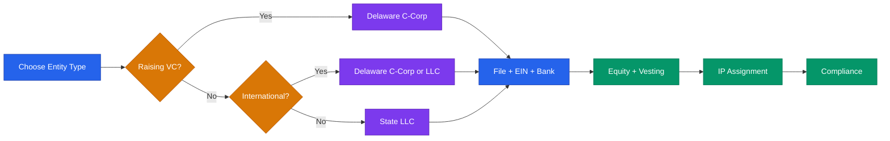

# Legal & Formation Playbook

**Disclaimer:** This is educational context only — not legal advice. Always consult a licensed attorney for entity formation, equity, and compliance decisions.

---

## Entity Choice

### LLC vs C-Corp vs S-Corp

| Factor | LLC | C-Corp (Delaware) | S-Corp Election |
|--------|-----|-------------------|-----------------|
| VC fundable | No (VCs typically won't invest) | Yes | No (ownership restrictions) |
| Pass-through taxes | Yes | No (double taxation) | Yes (with restrictions) |
| QSBS eligibility | No | Yes | No |
| Self-employment tax | Higher | Lower at scale | Lower (reasonable salary) |
| Best for | Bootstrapped, services, lifestyle | VC-backed, high-growth, exits | Profitable small businesses |
| Complexity | Low | High | Medium |
| Stock options | No (can use profits interests) | Yes (ISO, NSO) | Limited |
| Max shareholders | Unlimited | Unlimited | 100 (US residents only) |

**Decision rules:**
- **Raising VC within 24 months?** → Delaware C-Corp. No exceptions.
- **Bootstrapping a services business?** → State LLC. Simple and cheap.
- **Profitable, staying small, want tax savings?** → LLC with S-Corp election (consult CPA).
- **International founder?** → Delaware C-Corp (globally recognized, needed for US banking/investors).

### S-Corp Election — When It Makes Sense

An S-Corp election lets you avoid double taxation while maintaining corporate structure. The key benefit: you pay yourself a "reasonable salary" (subject to payroll taxes) and take remaining profits as distributions (no self-employment tax).

**When to elect S-Corp:**
- You're profitable and taking $80K+ in distributions per year
- You're not raising VC (S-Corps have ownership restrictions)
- All owners are US residents
- You have fewer than 100 shareholders

**How:** File IRS Form 2553 within 75 days of formation (or by March 15 for existing entities).

---

## Formation Quick Reference

### State LLC Formation (General Steps)
1. Choose a business name → check availability at your state SOS website
2. File Articles of Organization → typical fee $50-$300 depending on state
3. Designate a Registered Agent (yourself or a service ~$50-$150/yr)
4. Apply for EIN → irs.gov/ein (free, instant online)
5. Open a business bank account (Mercury, Relay, or local bank)
6. Draft an Operating Agreement (critical even if not legally required)
7. Apply for required business licenses (varies by city/county)

### Delaware C-Corp Formation
**DIY Services:**
- **Stripe Atlas** ($500) — incorporation + EIN + bank + stock issuance (fastest)
- **Clerky** ($399+) — startup-optimized, attorney-reviewed docs
- **Firstbase** ($399) — includes registered agent + compliance tracking
- **Gust Launch** (free) — basic formation

**Attorney:** $1,500-$5,000 for full startup package (recommended if multiple co-founders or complex equity)

**Steps after formation:**
1. Issue founder stock immediately at par value
2. File 83(b) election within 30 days (see below)
3. Assign all IP to the company in writing
4. Set up vesting agreements for all founders
5. Register as foreign corporation in your home state (if not Delaware)
6. Open bank account + apply for EIN
7. Pay Delaware franchise tax annually (~$400 minimum, due March 1)

---

## International Founders — US Entity Formation

If you're based outside the US and want to build a US-structured startup:

**Why Delaware C-Corp:** Globally recognized, required by most US VCs, enables US banking and payment processing.

**Key considerations:**
- You don't need to live in the US to form a Delaware C-Corp
- You DO need a US registered agent (included with Stripe Atlas, Firstbase, etc.)
- US bank account: Mercury and Relay accept foreign founders; some require US address
- EIN: Apply via IRS Form SS-4 (fax or mail if no SSN/ITIN; services like Stripe Atlas handle this)
- Tax obligations: You may owe US tax on US-source income; consult an international tax advisor
- Visa considerations: Forming a US entity does not grant visa status; consider O-1, E-2, or L-1 visas

**Common setup for international founders:**
1. Delaware C-Corp via Stripe Atlas ($500)
2. US bank account via Mercury
3. Stripe for payment processing
4. US-based registered agent (included with formation service)
5. International tax advisor to handle cross-border obligations

---

## Equity & Vesting

### Standard Founder Vesting
- **4 years total** with a **1-year cliff**
- Cliff: No stock vests until 12 months; then 25% vests immediately
- Monthly vesting after cliff: 1/48 per month for remaining 36 months
- **Set this up BEFORE taking any outside money**
- **All founders vest, including the CEO.** No exceptions.

### 83(b) Election — Do Not Skip This
- **File within 30 days of receiving restricted stock.** No extensions.
- Tells the IRS you want to be taxed now on the low early value
- Without it, every vesting date is a taxable event — potentially $100K+ in unnecessary taxes
- File with IRS via certified mail + keep a copy + file with company records
- **This is one of the most costly mistakes founders make.**

### Employee Equity (Options)
- Standard: 10-15% option pool reserved for employees
- Options vest on the same 4yr/1yr cliff schedule
- Strike price = FMV at grant date (set by 409A valuation)
- **Get a 409A valuation before issuing any options** (required for compliance)
- Cost: ~$1K-$5K for early-stage 409A (Carta, Pulley, Preferred Return)

### Equity Ranges by Role and Stage

| Role | Pre-Seed | Seed | Series A |
|------|----------|------|----------|
| Co-founder | 10-50% | N/A | N/A |
| CTO (if not co-founder) | 1-5% | 0.5-2% | 0.25-1% |
| First engineer | 0.5-2% | 0.25-1% | 0.1-0.5% |
| VP Engineering | N/A | 0.5-1.5% | 0.25-0.75% |
| VP Sales | N/A | 0.5-1% | 0.25-0.5% |
| First salesperson | 0.1-0.5% | 0.05-0.25% | 0.02-0.1% |
| Advisor | 0.1-0.25% | 0.05-0.15% | 0.01-0.1% |

---

## SAFE Note

**Simple Agreement for Future Equity** — not a loan, not equity yet.

Key terms:
- **Valuation cap:** Max valuation it converts at. Lower cap = better for investor.
- **Discount rate:** Converts at a discount to the next round (typically 15-25%)
- **Pro-rata rights:** Right to invest in future rounds to maintain ownership %
- **MFN clause:** If you offer better terms to future investors, early SAFE holders get those terms too

**Use YC's standard postmoney SAFE.** Free at ycombinator.com/documents. Don't create custom terms early-stage — it spooks investors and costs legal fees.

---

## Co-Founder Agreement Checklist

Before taking any money or writing any code together:

- [ ] Equity split (and rationale — written down)
- [ ] Vesting schedule for all founders
- [ ] IP assignment (all work belongs to the company)
- [ ] Decision-making authority (who decides what)
- [ ] What happens if a co-founder leaves (buyback rights)
- [ ] Compensation expectations (salary, deferred)
- [ ] Full-time commitment expectations
- [ ] Non-compete / non-solicit scope

**A handshake agreement is not enough. Put it in writing.**

---

## Intellectual Property Basics

- All founders must **assign IP** to the company in writing before taking money
- Any code, designs, or inventions created for the company belong to the company
- Missing IP assignments kill deals — this is standard in every investor's due diligence
- File provisional patent applications for novel inventions before public disclosure
- **See also:** `ip/README.md` for full IP strategy, patents, trademarks, and trade secrets

---

## QSBS (Qualified Small Business Stock)

- **Up to $10 million** in federal capital gains tax exclusion
- Requires: C-Corp, original issuance (not secondary), held 5+ years
- Company must have < $50M in assets at time of issuance
- **One of the most valuable tax benefits for early startup founders and investors**
- **State treatment varies:** Some states (CA) don't conform; others (MO) do. Check your state.

---

## Key Legal Resources

| Need | Resource |
|------|----------|
| Entity formation | Stripe Atlas, Clerky, your state SOS website |
| SAFE / term sheet templates | ycombinator.com/documents |
| Startup-friendly law firms | Cooley, Gunderson, Wilson Sonsini, Orrick |
| IP assignment templates | Clerky, NVCA model docs |
| 409A valuation | Carta, Pulley, Preferred Return |
| Cap table management | Carta (funded) or LTSE Equity (early stage, free) |
| Free legal document generators | cooleygo.com, tsc.orrick.com |

---

> **Disclaimer:** This playbook provides educational information about legal structures and formation. It is not legal advice. Consult a licensed attorney before making entity formation, equity, and compliance decisions. Tax treatment varies by jurisdiction and individual circumstances — consult a CPA.
