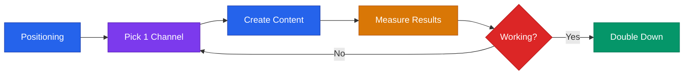

# Marketing & Brand Playbook



## Core Rule
**Pick one channel. Go deep before going wide.** Most early startups fail at marketing by spreading thin across 5 channels instead of dominating 1.

---

## Positioning (Do This First)

Answer these before any marketing spend:

```
For [target customer]
Who [have this problem / are in this situation]
Our product is [category]
That [key benefit / differentiator]
Unlike [main alternative]
We [unique proof point]
```

Test your positioning with 5 target customers before using it anywhere. If they can't repeat it back to you in their own words, it's not clear enough.

### Positioning Mistakes to Avoid

| Mistake | Example | Fix |
|---------|---------|-----|
| Too broad | "We help businesses grow" | Specify ICP + outcome |
| Feature-led | "AI-powered analytics platform" | Lead with the outcome, not the tech |
| No differentiation | "We're like [competitor] but better" | Name the specific dimension you win on |
| Jargon-heavy | "End-to-end synergistic solution" | Use words your customer uses |
| No proof | "The best tool for X" | Replace with specific metric or customer quote |

---

## Channel Selection

Start with channels where your customers already are. Pick ONE.

| Channel | Best For | Cost | Time to Results |
|---------|----------|------|----------------|
| LinkedIn outreach | B2B, professional services | Time | 2-4 weeks |
| Cold email | B2B with known ICP | Time + tools | 2-4 weeks |
| Content / SEO | Searchable problems, long-term | Time | 3-6 months |
| Community (Slack, Reddit) | Niche audiences | Time | 1-3 months |
| Partnerships | Adjacent products with same ICP | Relationships | 1-3 months |
| Events / conferences | High-value enterprise deals | $$$ | Immediate |
| Paid search (Google) | High-intent buyers | $$$ | 1-2 weeks |
| Paid social (Meta, LinkedIn) | Awareness, retargeting | $$ | 2-4 weeks |
| Referral program | Existing happy customers | Product | 1-3 months |

**The 90-day test:** Commit to one channel for 90 days before deciding it doesn't work. Most founders quit channels after 2 weeks — not enough data.

### Channel Selection Framework

Ask these questions:
1. **Where does my ICP already spend time?** (That's your first channel)
2. **Can I reach them for free or cheap?** (Prioritize time-based channels pre-revenue)
3. **Is the feedback loop fast?** (Cold email gives data in days; SEO takes months)
4. **Can I do this myself?** (Don't hire for marketing until you've done it manually)

---

## Content Strategy (Minimum Viable)

Choose one content format. Stick with it for 90 days.

**Content Pillars (choose 3):**
1. Problem awareness — educate on the problem your ICP has
2. Solution showcase — how your product solves it (not features, outcomes)
3. Social proof — customers, results, case studies
4. Industry insight — thought leadership, trends, data
5. Behind the scenes — founder journey, building in public

**Weekly Cadence (sustainable for solo founder):**
- 2-3 LinkedIn posts or tweets
- 1 email newsletter
- 1 longer piece (blog, video, case study) — monthly

**Content repurposing chain:**
```
1 blog post → 3-5 social posts → 1 newsletter → 1 short video
```

One piece of deep content fuels a week of distribution. Don't create 5 separate things.

---

## LinkedIn Content Templates

### Hook Formats That Work
- "The [problem] most [ICP] don't realize they have:"
- "I made a mistake that cost us [X]. Here's what I learned:"
- "[Counterintuitive insight] about [topic]."
- "[Number] things I wish I knew before [situation]:"
- "We just hit [milestone]. Here's what actually made the difference:"
- "Stop [common bad practice]. Do [better approach] instead."

### Post Structure
```
[Hook — 1 sentence that makes them stop scrolling]

[Body — 3-5 short paragraphs, each 1-2 sentences]

[Proof or specific example]

[CTA — one clear ask: comment, share, DM, or link]
```

**Rules:** No hashtag spam. No "agree?" at the end. No engagement bait. Just be useful.

---

## Email Marketing

### Welcome Sequence (New Subscriber or Trial User)

**Email 1 (immediately):** Welcome + what to expect + one quick win
**Email 2 (Day 2):** Your biggest problem, addressed (value, not pitch)
**Email 3 (Day 4):** Success story / case study
**Email 4 (Day 7):** Core product feature + benefit
**Email 5 (Day 10):** Offer or clear next step

### Newsletter Format
```
Subject: [Curiosity hook or specific benefit]

[1 big insight or story — 150-300 words]

[1 resource or tool they can use immediately]

[1 question to reply to — builds engagement]

[CTA — one thing]
```

### Email Benchmarks

| Metric | Good | Average | Investigate If Below |
|--------|------|---------|---------------------|
| Open rate | >40% | 25-40% | 20% |
| Click rate | >3% | 1-3% | 1% |
| Unsubscribe rate | <0.3% | 0.3-0.5% | 0.5% |
| Reply rate | >1% | 0.5-1% | Never getting replies |

---

## Launch Checklist (Product or Feature)

**2 weeks before:**
- [ ] Write launch narrative (why this, why now, why us)
- [ ] Prepare landing page or feature page
- [ ] Line up 3 customer quotes / case studies
- [ ] Build email list segment to launch to

**1 week before:**
- [ ] Draft email sequence (tease → launch → follow-up)
- [ ] Draft social posts (3-5 pieces)
- [ ] Reach out to communities to share on launch day
- [ ] Prepare Product Hunt / Hacker News if applicable

**Launch day:**
- [ ] Send announcement email
- [ ] Post on all channels
- [ ] Engage with every comment and reply (first 24 hours matter most)
- [ ] DM warm contacts personally

**1 week after:**
- [ ] Send "results" update email
- [ ] Follow up with interested-but-didn't-convert leads
- [ ] Capture testimonials from new users

---

## SEO Basics (Early Stage)

Focus on **bottom-of-funnel search intent** first:
- "[product category] for [specific use case]"
- "[your category] vs [competitor]"
- "best [tool type] for [ICP]"
- "how to [solve the exact problem your product solves]"

**Minimum viable SEO setup:**
1. Install Google Search Console (free)
2. Write 5 high-intent blog posts targeting specific search terms
3. Clear title tag + meta description on every page
4. Get 5-10 backlinks from industry publications or directories
5. Make sure your site loads in under 3 seconds

**SEO is a 6-month play.** Don't expect results in weeks. But the content compounds — a blog post written today generates traffic for years.

---

## Brand Voice

Pick 3 adjectives that describe your brand voice. Then pick what you are NOT.

```
We are: [Adjective 1], [Adjective 2], [Adjective 3]
We are not: [Anti-adjective 1], [Anti-adjective 2], [Anti-adjective 3]
```

Apply consistently across: website, emails, social, support, pitch deck, job postings.

**See also:** `pitch/marketing-copy-library.md` for taglines, bios, social copy, and ad templates.

---

## Marketing Metrics to Track

| Metric | What It Tells You | Review Frequency |
|--------|------------------|-----------------|
| Website visitors | Awareness / reach | Weekly |
| Email open rate | Subject line quality + list health | Per send |
| Email click rate | Content relevance | Per send |
| Trial sign-ups | Conversion from marketing | Weekly |
| Trial-to-paid | Product + onboarding quality | Monthly |
| CAC by channel | Where to invest more (or less) | Monthly |
| Organic traffic growth | Content compounding | Monthly |
| Social engagement rate | Content resonance | Weekly |
| Referral rate | Word-of-mouth strength | Monthly |

**The only metric that matters pre-PMF:** Are people signing up and staying? If not, marketing spend is premature — fix the product first.

---

> **Disclaimer:** This playbook provides educational frameworks for startup marketing. Results vary by industry, audience, and execution. This is not professional marketing or business advice.
