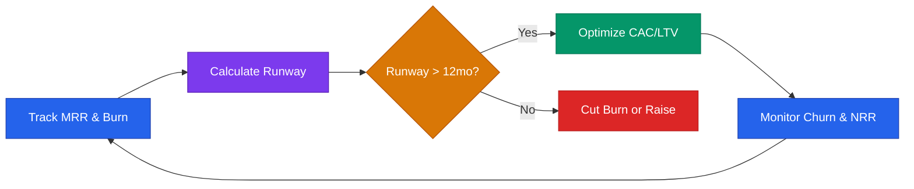

# Metrics & Finance Playbook



## Core Rule
**Know your numbers. Founders who don't know their burn rate lose their company by surprise.**

---

## The 6 Numbers Every Startup Must Know

```
1. MRR (Monthly Recurring Revenue)
2. Burn Rate (monthly cash out)
3. Runway (months of cash left)
4. CAC (Customer Acquisition Cost)
5. LTV (Lifetime Value)
6. Churn Rate
```

If you don't know all 6, stop and calculate them now. Use `apps/runway-calculator.html` and `apps/unit-economics-calculator.html` for interactive modeling.

---

## Key Metric Formulas

### Revenue
```
MRR = Sum of all monthly subscription revenue
ARR = MRR x 12
Net Revenue Retention (NRR) = (Starting MRR - Churn + Expansion) / Starting MRR
Gross Revenue Retention = (Starting MRR - Churn) / Starting MRR
```

### Burn & Runway
```
Gross Burn = Total monthly expenses
Net Burn = Gross Burn - Revenue
Runway = Cash in bank / Net Burn
Months to break-even = Net Burn / Monthly revenue growth rate
```

**Minimum safe runway:** 12-18 months. Start fundraising when you have 9+ months remaining.

### Customer Economics
```
CAC = Total Sales & Marketing Spend / New Customers Acquired
LTV = ARPU x Gross Margin % / Monthly Churn Rate
LTV:CAC Ratio = LTV / CAC (target: >3x)
CAC Payback = CAC / (ARPU x Gross Margin %)
```

### Growth
```
MoM Growth = (This Month MRR - Last Month MRR) / Last Month MRR
Churn Rate = Customers Lost / Customers at Start of Period
Revenue Churn = MRR Lost / MRR at Start of Period
```

### Efficiency
```
Burn Multiple = Net Burn / Net New ARR
  <1x = excellent | 1-1.5x = good | 1.5-2x = acceptable | >2x = inefficient

Magic Number = Net New ARR (quarter) / S&M Spend (prior quarter)
  >0.75 = efficient, invest more | 0.5-0.75 = OK | <0.5 = fix before scaling

Rule of 40 = ARR Growth Rate % + Profit Margin %
  >40% = healthy balance of growth and efficiency

SaaS Quick Ratio = (New MRR + Expansion MRR) / (Churned MRR + Contraction MRR)
  >4 = very healthy growth | 2-4 = good | <2 = churn is eating your growth
```

---

## Financial Model (Minimum Viable)

Build a 12-24 month model with these tabs:

```
TAB 1 — ASSUMPTIONS
  Starting MRR, growth rate, churn, deal size, headcount plan, cost drivers

TAB 2 — P&L (Monthly)
  Revenue | COGS | Gross Profit | Gross Margin %
  Payroll | Marketing | G&A | Total OpEx
  EBITDA | Net Income/(Loss)

TAB 3 — CASH FLOW
  Starting Cash | Revenue | Expenses | Net Burn | Ending Cash | Runway

TAB 4 — UNIT ECONOMICS
  CAC | LTV | LTV:CAC | Payback | Burn Multiple | NRR

TAB 5 — SCENARIOS
  Conservative | Base | Aggressive
  Key variable that changes in each scenario
```

**Update monthly. Compare actuals vs projections.** The gap between plan and reality IS the learning.

### Model Red Flags Investors Spot

| Red Flag | What It Signals | Fix |
|----------|----------------|-----|
| Hockey stick with no explanation | Wishful thinking | Show the driver (customers x price) |
| No churn modeled | Inexperience | Always model churn, even if optimistic |
| Revenue grows but burn grows faster | No path to efficiency | Show when unit economics improve |
| "We only need 1% of the market" | Top-down thinking | Use bottom-up: customers x price x close rate |
| No scenarios | Overconfidence | Always show conservative + base + aggressive |

---

## Pricing Scenarios

Before setting a price, model 3 scenarios:

```
Conservative: $X/mo, X customers -> $XK MRR
Base:         $Y/mo, Y customers -> $YK MRR
Aggressive:   $Z/mo, Z customers -> $ZK MRR
```

Price to the base. Manage toward aggressive. Plan cash around conservative.

---

## OKRs (Objectives & Key Results)

Set quarterly. Max 3 OKRs. Max 3 KRs per OKR.

```
Objective: [Qualitative goal — ambitious but clear]
  KR1: [Measurable result with specific number and deadline]
  KR2: [Measurable result with specific number and deadline]
  KR3: [Measurable result with specific number and deadline]
```

**Example by stage:**

Stage 1:
```
Objective: Validate product-market fit
  KR1: 10 paying customers by end of Q2
  KR2: Monthly churn < 5%
  KR3: 3 unprompted referrals
```

Stage 2:
```
Objective: Build repeatable revenue engine
  KR1: $25K MRR by end of Q3
  KR2: CAC payback < 12 months
  KR3: Non-founder closes 5 deals
```

Stage 3:
```
Objective: Reach Series A readiness
  KR1: $100K MRR with 15%+ MoM growth
  KR2: NRR > 110%
  KR3: Burn multiple < 2x
```

Review OKR progress every Friday. Adjust KR targets if you learn they were wrong — but don't lower them just because they're hard.

---

## Unit Economics Health Check

| Metric | Danger Zone | Warning | Healthy | Excellent |
|--------|-----------|---------|---------|-----------|
| LTV:CAC | < 1x | 1-2x | 3-5x | > 5x |
| Monthly churn | > 8% | 5-8% | 2-5% | < 2% |
| Gross margin | < 40% | 40-60% | 60-75% | > 75% |
| CAC payback | > 24 mo | 12-24 mo | 6-12 mo | < 6 mo |
| Burn multiple | > 3x | 2-3x | 1-2x | < 1x |
| NRR | < 80% | 80-100% | 100-120% | > 120% |

**See also:** `traction-benchmarks.md` for full stage-by-stage benchmark tables.

---

## Investor-Ready Metrics Dashboard

Track and report these monthly:

```
[COMPANY] — [Month] Metrics

Revenue:
  MRR: $X (change% MoM)
  ARR: $X
  NRR: X%

Customers:
  Total: X (new: X, churned: X)
  Monthly churn: X%

Unit Economics:
  CAC: $X
  LTV: $X
  LTV:CAC: Xx
  Payback: X months

Cash:
  Balance: $X
  Net Burn: $X/mo
  Runway: X months

Efficiency:
  Burn Multiple: Xx
  Gross Margin: X%
```

---

## Tools

| Need | Tool |
|------|------|
| Financial modeling | Google Sheets, Causal |
| Revenue tracking | Stripe, Baremetrics, ChartMogul |
| Expense tracking | Ramp, Mercury, QuickBooks |
| Cap table | Carta, LTSE Equity |
| KPI dashboard | Notion, Coda, Databox |
| Accounting | Pilot (startup-focused bookkeeping) |
| Interactive calculators | `apps/runway-calculator.html`, `apps/unit-economics-calculator.html` |

---

> **Disclaimer:** This playbook provides educational frameworks for startup metrics and financial planning. These are general guidelines — your specific industry, business model, and stage may require different benchmarks. Consult a CPA or financial advisor for tax and accounting decisions. This is not financial advice.
