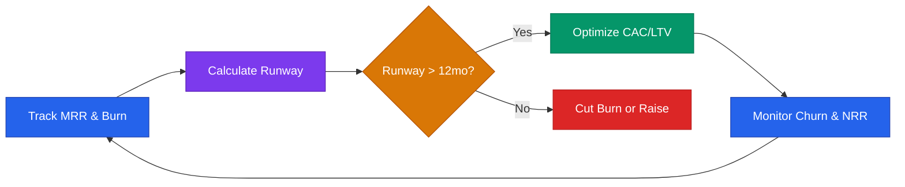

# Metrics & Finance Playbook



## Core Rule
**Know your numbers. Founders who don't know their burn rate lose their company by surprise.**

---

## The 6 Numbers Every Startup Must Know

```
1. MRR (Monthly Recurring Revenue)
2. Burn Rate (monthly cash out)
3. Runway (months of cash left)
4. CAC (Customer Acquisition Cost)
5. LTV (Lifetime Value)
6. Churn Rate
```

If you don't know all 6, stop and calculate them now.

---

## Key Metric Formulas

### Revenue
```
MRR = Sum of all monthly subscription revenue
ARR = MRR × 12
Net Revenue Retention = (MRR end - churn + expansion) / MRR start
```

### Burn & Runway
```
Gross Burn = Total monthly expenses
Net Burn = Gross Burn - Revenue
Runway = Cash in bank ÷ Net Burn
```

**Minimum safe runway:** 12–18 months. Raise when you have 9+ months.

### Customer Economics
```
CAC = Total Sales & Marketing Spend ÷ New Customers Acquired
LTV = ARPU × Gross Margin % ÷ Churn Rate
LTV:CAC Ratio = LTV ÷ CAC (target: >3x)
CAC Payback Period = CAC ÷ (ARPU × Gross Margin %)
```

**Targets:**
- LTV:CAC > 3x
- CAC Payback < 12 months (SaaS), < 6 months (early stage ideal)

### Growth
```
MoM Growth Rate = (This Month MRR - Last Month MRR) / Last Month MRR
Churn Rate = Customers Lost / Customers at Start of Period
```

### Efficiency
```
Burn Multiple = Net Burn ÷ Net New ARR
  - <1x = great
  - 1–1.5x = good
  - 1.5–2x = acceptable
  - >2x = needs improvement

Rule of 40 = ARR Growth Rate % + Profit Margin %
  - >40% = healthy
```

---

## Financial Model (Minimum Viable)

Build a 12-month model with:

| Row | Description |
|-----|-------------|
| Revenue | MRR × 12, new customers × ARPU |
| COGS | Hosting, support, variable costs |
| Gross Profit | Revenue - COGS |
| Operating Expenses | Salaries, marketing, tools, rent |
| Net Burn | Gross Profit - OpEx |
| Cash | Rolling balance |

**Update monthly. Compare actuals vs projections.**

---

## Pricing Scenarios

Before setting a price, model 3 scenarios:

```
Conservative: $X/mo, X customers → $XK MRR
Base: $Y/mo, Y customers → $YK MRR
Aggressive: $Z/mo, Z customers → $ZK MRR
```

Price to the base. Manage toward aggressive.

---

## OKRs (Objectives & Key Results)

Set quarterly. Max 3 OKRs. Max 3 KRs per OKR.

```
Objective: [Qualitative goal — ambitious but clear]
  KR1: [Measurable result with number]
  KR2: [Measurable result with number]
  KR3: [Measurable result with number]
```

Example:
```
Objective: Reach initial revenue milestone
  KR1: $10K MRR by end of Q2
  KR2: 20 paying customers
  KR3: < 5% monthly churn
```

Review OKR progress every Friday.

---

## Unit Economics Health Check

| Metric | Warning Sign | Healthy |
|--------|-------------|---------|
| LTV:CAC | < 1x | > 3x |
| Churn (monthly) | > 5% | < 2% |
| Gross Margin | < 50% | > 70% |
| CAC Payback | > 18 months | < 12 months |
| Burn Multiple | > 2x | < 1x |
| Net Revenue Retention | < 90% | > 110% |

---

## Investor-Ready Metrics Dashboard

Track and report these monthly to investors and your board:

```
📊 [Month] Metrics

Revenue:
  MRR: $X (↑/↓ X% MoM)
  ARR: $X
  Net Revenue Retention: X%

Customers:
  Total: X (↑ X new, ↓ X churned)
  Churn Rate: X%

Unit Economics:
  CAC: $X
  LTV: $X
  LTV:CAC: X

Cash:
  Balance: $X
  Net Burn: $X/mo
  Runway: X months
```

---

## Tools

| Need | Tool |
|------|------|
| Financial modeling | Google Sheets, Causal |
| Revenue tracking | Stripe, Baremetrics, ChartMogul |
| Expense tracking | Ramp, Mercury, QuickBooks |
| Cap table | Carta, LTSE Equity |
| KPI dashboard | Notion, Coda, Databox |
| Accounting | Pilot (startup-focused bookkeeping) |
