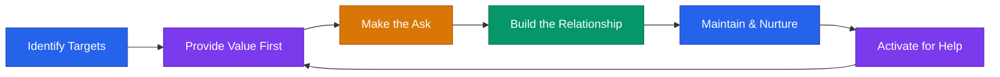

# Network Building System for Founders



## Core Rule
**Your network is your net worth — but only if you build it before you need it.** Give first. Give often. The returns compound.

---

## The 5 Networks Every Founder Needs

Most founders think "networking" means one thing. It's actually five distinct efforts, each with different people, different channels, and different rhythms.

```
1. Customer network      — prospects, users, advocates
2. Investor network      — angels, VCs, family offices
3. Advisor/mentor network — domain experts, been-there founders
4. Peer network          — other founders at your stage
5. Talent network        — future hires, contractors, agencies
```

Build all five in parallel. Neglect any one and you'll feel the gap when it matters most.

---

## Network 1: Customer Network

The people who will buy, use, and champion your product.

### Where to Find Them
```
- LinkedIn Sales Navigator (filter by title, industry, company size)
- Industry-specific Slack/Discord communities
- Reddit subreddits where your ICP hangs out
- Industry conferences and trade shows
- Twitter/X conversations about the problem you solve
- Your competitors' review sites (G2, Capterra commenters)
```

### Cold Outreach — Email
```
Subject: Quick question about [their specific pain]

Hi [NAME],

I noticed [specific thing about their company/role].

I'm working on [1-sentence product description] and talking to
[TITLE]s like you to make sure we're solving the right problem.

Would you have 15 minutes this week for a quick call? Happy to
share what we're learning about [industry trend] in return.

[YOUR NAME]
```

### Cold Outreach — LinkedIn
```
Hi [NAME] — saw your post about [TOPIC]. Really resonated.

Quick question: how are you currently handling [SPECIFIC PROBLEM]?

Working on something in this space and would value your perspective.
No pitch, just learning.
```

### Warm Intro Request
```
"Hey [CONNECTOR] — I'm trying to reach [PERSON] at [COMPANY].
We're building [1 sentence] and they'd be a great person to learn
from. Would you be comfortable making an intro? Here's a blurb
you can forward:

'[YOUR NAME] is building [PRODUCT] — helps [ICP] [outcome].
They'd love 15 minutes to learn about [SPECIFIC TOPIC].'"
```

### Follow-Up Cadence
```
Initial outreach:     Day 0
Follow-up 1:          Day 3 (add value — share an article or insight)
Follow-up 2:          Day 7 (brief, friendly, offer an out)
Quarterly touch:      Every 90 days (share something useful, no ask)
```

### Value Before the Ask
- Share industry research or data relevant to their role
- Make introductions to people they'd benefit from knowing
- Provide feedback on their product or content
- Invite them to relevant events or communities

---

## Network 2: Investor Network

Angels, VCs, family offices, and strategic investors.

### Where to Find Them
```
- AngelList / Signal by NFX
- Crunchbase (filter by stage, industry, geography)
- LinkedIn (search "angel investor" + your industry)
- Local pitch events and demo days
- Twitter/X — many investors are active and accessible
- Accelerator alumni networks
- Landscape.VC (filter by thesis match)
```

### Cold Outreach — Email
```
Subject: [YOUR COMPANY] — [One-line traction signal]

Hi [NAME],

[1 sentence — why them. Reference their thesis, portfolio, or a talk they gave.]

[COMPANY] helps [ICP] [outcome]. We have [TRACTION SIGNAL] and
are raising [AMOUNT] on a [INSTRUMENT].

I'd value your perspective even if timing isn't right. 20 minutes?

[YOUR NAME] | [EMAIL] | [DECK LINK]
```

### Cold Outreach — LinkedIn
```
Hi [NAME] — I follow your work in [SPACE] and your investment in
[PORTFOLIO COMPANY] caught my eye.

Building something in a similar space — [1 sentence].
Would love 15 minutes to get your take, even if it's not a fit.
```

### Warm Intro Request
```
"Hey [CONNECTOR] — I'm raising a [STAGE] round and [INVESTOR]
is a strong fit given their focus on [THESIS/SECTOR].

Would you be willing to make a double-opt-in intro? Here's the
blurb:

'[YOUR NAME] is building [COMPANY] — [1 sentence + traction].
Raising [AMOUNT]. Would love to connect.'"
```

### Follow-Up Cadence
```
Initial outreach:     Day 0
Follow-up 1:          Day 5 (add a new data point or traction update)
Follow-up 2:          Day 12 (brief, offer to reconnect later)
Quarterly update:     Every 90 days (even if they passed — send traction updates)
```

### Value Before the Ask
- Share a market insight or trend analysis from your space
- Introduce them to another strong founder in their thesis area
- Engage thoughtfully with their content (blog, Twitter, podcast)
- Invite them to speak at events you're organizing

---

## Network 3: Advisor / Mentor Network

Domain experts and been-there founders who can shortcut your learning.

### Where to Find Them
```
- LinkedIn (search for executives / founders in your industry)
- Startup communities (Indie Hackers, Founder Slack groups)
- Accelerator mentor rosters
- Conference speaker lists
- Former founders now in advisory roles
- Your investors' portfolios (ask for introductions)
```

### Cold Outreach — Email
```
Subject: Would value your perspective on [SPECIFIC TOPIC]

Hi [NAME],

I've followed your work at [COMPANY/ROLE] — particularly
[SPECIFIC THING YOU ADMIRE].

I'm building [COMPANY] ([1 sentence]) and wrestling with
[SPECIFIC CHALLENGE] right now. Your experience with
[RELEVANT BACKGROUND] would be incredibly valuable.

Would you have 20 minutes for a call? Happy to buy the coffee
(virtual or real).

[YOUR NAME]
```

### Cold Outreach — LinkedIn
```
Hi [NAME] — your experience scaling [COMPANY/AREA] is exactly
the kind of perspective I need right now.

Building [1 sentence about company]. Facing a challenge with
[SPECIFIC TOPIC]. Would you have 20 minutes to share your take?

No strings — just trying to learn from people who've been there.
```

### Warm Intro Request
```
"Hey [CONNECTOR] — I'm looking for a mentor with experience in
[SPECIFIC DOMAIN]. [PERSON] has exactly the background I need.

Could you connect us? Here's the blurb:

'[YOUR NAME] is building [COMPANY]. They're looking for guidance
on [SPECIFIC TOPIC] and your experience at [RELEVANT ROLE] would
be a huge help.'"
```

### Follow-Up Cadence
```
Initial outreach:     Day 0
Follow-up 1:          Day 5 (share what you've tried, show effort)
Follow-up 2:          Day 14 (brief, respectful close)
After first meeting:  Thank-you within 24 hours + action you took
Ongoing:              Monthly or bimonthly check-in (keep it light)
```

### Value Before the Ask
- Implement their advice and report back with results (this is the highest-value currency)
- Share relevant articles, data, or introductions
- Offer to help with something they're working on
- Provide a testimonial or endorsement for their work

---


**More networks + deep-dive:** See [`network-building-advanced.md`](network-building-advanced.md) for Networks 4 (Peer) and 5 (Talent), the Give First framework, conference networking, online community strategy, and the quick-start checklist. For formalizing advisor relationships specifically, see [`network-building-advisors.md`](network-building-advisors.md).

---

> **This playbook is for educational purposes.** Networking is a long game. Relationships built on genuine value and mutual respect will always outperform transactional outreach. Be patient, be generous, and be real.
