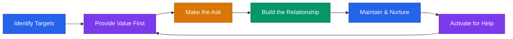

# Network Building System for Founders



## Core Rule
**Your network is your net worth — but only if you build it before you need it.** Give first. Give often. The returns compound.

---

## The 5 Networks Every Founder Needs

Most founders think "networking" means one thing. It's actually five distinct efforts, each with different people, different channels, and different rhythms.

```
1. Customer network      — prospects, users, advocates
2. Investor network      — angels, VCs, family offices
3. Advisor/mentor network — domain experts, been-there founders
4. Peer network          — other founders at your stage
5. Talent network        — future hires, contractors, agencies
```

Build all five in parallel. Neglect any one and you'll feel the gap when it matters most.

---

## Network 1: Customer Network

The people who will buy, use, and champion your product.

### Where to Find Them
```
- LinkedIn Sales Navigator (filter by title, industry, company size)
- Industry-specific Slack/Discord communities
- Reddit subreddits where your ICP hangs out
- Industry conferences and trade shows
- Twitter/X conversations about the problem you solve
- Your competitors' review sites (G2, Capterra commenters)
```

### Cold Outreach — Email
```
Subject: Quick question about [their specific pain]

Hi [NAME],

I noticed [specific thing about their company/role].

I'm working on [1-sentence product description] and talking to
[TITLE]s like you to make sure we're solving the right problem.

Would you have 15 minutes this week for a quick call? Happy to
share what we're learning about [industry trend] in return.

[YOUR NAME]
```

### Cold Outreach — LinkedIn
```
Hi [NAME] — saw your post about [TOPIC]. Really resonated.

Quick question: how are you currently handling [SPECIFIC PROBLEM]?

Working on something in this space and would value your perspective.
No pitch, just learning.
```

### Warm Intro Request
```
"Hey [CONNECTOR] — I'm trying to reach [PERSON] at [COMPANY].
We're building [1 sentence] and they'd be a great person to learn
from. Would you be comfortable making an intro? Here's a blurb
you can forward:

'[YOUR NAME] is building [PRODUCT] — helps [ICP] [outcome].
They'd love 15 minutes to learn about [SPECIFIC TOPIC].'"
```

### Follow-Up Cadence
```
Initial outreach:     Day 0
Follow-up 1:          Day 3 (add value — share an article or insight)
Follow-up 2:          Day 7 (brief, friendly, offer an out)
Quarterly touch:      Every 90 days (share something useful, no ask)
```

### Value Before the Ask
- Share industry research or data relevant to their role
- Make introductions to people they'd benefit from knowing
- Provide feedback on their product or content
- Invite them to relevant events or communities

---

## Network 2: Investor Network

Angels, VCs, family offices, and strategic investors.

### Where to Find Them
```
- AngelList / Signal by NFX
- Crunchbase (filter by stage, industry, geography)
- LinkedIn (search "angel investor" + your industry)
- Local pitch events and demo days
- Twitter/X — many investors are active and accessible
- Accelerator alumni networks
- Landscape.VC (filter by thesis match)
```

### Cold Outreach — Email
```
Subject: [YOUR COMPANY] — [One-line traction signal]

Hi [NAME],

[1 sentence — why them. Reference their thesis, portfolio, or a talk they gave.]

[COMPANY] helps [ICP] [outcome]. We have [TRACTION SIGNAL] and
are raising [AMOUNT] on a [INSTRUMENT].

I'd value your perspective even if timing isn't right. 20 minutes?

[YOUR NAME] | [EMAIL] | [DECK LINK]
```

### Cold Outreach — LinkedIn
```
Hi [NAME] — I follow your work in [SPACE] and your investment in
[PORTFOLIO COMPANY] caught my eye.

Building something in a similar space — [1 sentence].
Would love 15 minutes to get your take, even if it's not a fit.
```

### Warm Intro Request
```
"Hey [CONNECTOR] — I'm raising a [STAGE] round and [INVESTOR]
is a strong fit given their focus on [THESIS/SECTOR].

Would you be willing to make a double-opt-in intro? Here's the
blurb:

'[YOUR NAME] is building [COMPANY] — [1 sentence + traction].
Raising [AMOUNT]. Would love to connect.'"
```

### Follow-Up Cadence
```
Initial outreach:     Day 0
Follow-up 1:          Day 5 (add a new data point or traction update)
Follow-up 2:          Day 12 (brief, offer to reconnect later)
Quarterly update:     Every 90 days (even if they passed — send traction updates)
```

### Value Before the Ask
- Share a market insight or trend analysis from your space
- Introduce them to another strong founder in their thesis area
- Engage thoughtfully with their content (blog, Twitter, podcast)
- Invite them to speak at events you're organizing

---

## Network 3: Advisor / Mentor Network

Domain experts and been-there founders who can shortcut your learning.

### Where to Find Them
```
- LinkedIn (search for executives / founders in your industry)
- Startup communities (Indie Hackers, Founder Slack groups)
- Accelerator mentor rosters
- Conference speaker lists
- Former founders now in advisory roles
- Your investors' portfolios (ask for introductions)
```

### Cold Outreach — Email
```
Subject: Would value your perspective on [SPECIFIC TOPIC]

Hi [NAME],

I've followed your work at [COMPANY/ROLE] — particularly
[SPECIFIC THING YOU ADMIRE].

I'm building [COMPANY] ([1 sentence]) and wrestling with
[SPECIFIC CHALLENGE] right now. Your experience with
[RELEVANT BACKGROUND] would be incredibly valuable.

Would you have 20 minutes for a call? Happy to buy the coffee
(virtual or real).

[YOUR NAME]
```

### Cold Outreach — LinkedIn
```
Hi [NAME] — your experience scaling [COMPANY/AREA] is exactly
the kind of perspective I need right now.

Building [1 sentence about company]. Facing a challenge with
[SPECIFIC TOPIC]. Would you have 20 minutes to share your take?

No strings — just trying to learn from people who've been there.
```

### Warm Intro Request
```
"Hey [CONNECTOR] — I'm looking for a mentor with experience in
[SPECIFIC DOMAIN]. [PERSON] has exactly the background I need.

Could you connect us? Here's the blurb:

'[YOUR NAME] is building [COMPANY]. They're looking for guidance
on [SPECIFIC TOPIC] and your experience at [RELEVANT ROLE] would
be a huge help.'"
```

### Follow-Up Cadence
```
Initial outreach:     Day 0
Follow-up 1:          Day 5 (share what you've tried, show effort)
Follow-up 2:          Day 14 (brief, respectful close)
After first meeting:  Thank-you within 24 hours + action you took
Ongoing:              Monthly or bimonthly check-in (keep it light)
```

### Value Before the Ask
- Implement their advice and report back with results (this is the highest-value currency)
- Share relevant articles, data, or introductions
- Offer to help with something they're working on
- Provide a testimonial or endorsement for their work

---

## Network 4: Peer Network

Other founders at your stage. The people who actually understand what you're going through.

### Where to Find Them
```
- YC co-founder matching / Startup School
- Indie Hackers community
- Local startup meetups and co-working spaces
- Twitter/X "building in public" community
- Founder-specific Slack groups (Elpha, Founders Network, On Deck)
- Accelerator cohorts (even ones you didn't join — attend events)
- Reddit: r/startups, r/SaaS, r/Entrepreneur
```

### Cold Outreach — Email
```
Subject: Fellow founder in [SPACE] — let's connect

Hi [NAME],

Saw what you're building at [COMPANY] — really like [SPECIFIC THING].

I'm at a similar stage with [YOUR COMPANY] ([1 sentence]).
Always helpful to compare notes with someone in the trenches.

Coffee chat this week?

[YOUR NAME]
```

### Cold Outreach — LinkedIn
```
Hi [NAME] — love what you're building at [COMPANY]. I'm at a
similar stage with [YOUR COMPANY] and always find it helpful to
trade notes with other founders.

Open to a 20-minute call this week?
```

### Follow-Up Cadence
```
Initial outreach:     Day 0
Follow-up:            Day 7 (keep it casual)
After first meeting:  Share a resource or intro within 48 hours
Ongoing:              Monthly or biweekly check-in
```

### Value Before the Ask
- Share your lessons learned openly (what failed, what worked)
- Make introductions to investors, customers, or advisors you know
- Provide beta testing or feedback on their product
- Co-promote each other's launches

---

## Network 5: Talent Network

Future hires, contractors, and agencies you'll need as you grow.

### Where to Find Them
```
- LinkedIn (engage with potential hires before you have roles open)
- GitHub / open source communities (for technical talent)
- Industry-specific job boards and communities
- Referrals from your advisor and peer networks
- Freelance platforms (Toptal, Upwork) — test before committing
- University programs and coding bootcamps
- Twitter/X (many top operators are active there)
```

### Cold Outreach — Email
```
Subject: Impressed by your work on [SPECIFIC PROJECT]

Hi [NAME],

Came across your [work/portfolio/post] on [TOPIC] — really sharp.

I'm building [COMPANY] and while I don't have a role open today,
I'd love to stay connected. We're growing and your skills in
[AREA] are exactly what we'll need.

Happy to chat about what we're building if you're curious.

[YOUR NAME]
```

### Cold Outreach — LinkedIn
```
Hi [NAME] — your work on [PROJECT/TOPIC] stood out. Building
something in [SPACE] and would love to stay connected as we grow.

No hard pitch — just planting a seed for the future.
```

### Follow-Up Cadence
```
Initial outreach:     Day 0
Follow-up:            Day 10 (share something about your company's mission)
Ongoing:              Quarterly (share company updates, milestones, culture)
When hiring:          Reach out personally with the specific role
```

### Value Before the Ask
- Share job market insights or salary data for their field
- Make introductions to other companies hiring (yes, even if you want them)
- Provide mentorship or advice on their career questions
- Invite them to company events or demo days

---

## The "Give First" Framework

This is the single most important principle in network building.

```
Rule: Help 3 people before asking 1 thing of anyone.

How:
1. Make an introduction between two people who should know each other
2. Share a useful resource, article, or insight with someone
3. Provide feedback, a testimonial, or amplify someone's work

Then — and only then — make your ask.
```

**Why this works:**
- Reciprocity is the most powerful force in human relationships
- People remember who helped them before they needed anything
- Your reputation compounds. Word travels fast in startup communities.
- When you do ask, people say yes because you've already invested

**Track it.** Keep a simple log:

```
DATE        | PERSON         | WHAT I GAVE              | ASK MADE?
[DATE]      | [NAME]         | Intro to [PERSON]        | No
[DATE]      | [NAME]         | Shared [RESOURCE]        | No
[DATE]      | [NAME]         | Feedback on their pitch   | No
[DATE]      | [NAME]         | —                         | Yes: [ASK]
```

---

## Conference Networking Playbook

### Before the Conference
```
- [ ] Review speaker list and attendee list (if published)
- [ ] Identify 5-10 target people you want to meet
- [ ] Research each target (LinkedIn, recent work, shared connections)
- [ ] Send pre-conference outreach to targets:

    "Hi [NAME] — I'll be at [CONFERENCE] next week. Would love
    to connect briefly. I'm working on [1 sentence] and your
    perspective on [TOPIC] would be valuable. Coffee or a hallway
    chat?"

- [ ] Prepare your 30-second intro (not an elevator pitch — a conversation starter)
- [ ] Bring business cards or have a clean LinkedIn QR code ready
- [ ] Block 30 minutes each evening to process contacts
```

### During the Conference
```
- [ ] Arrive early to sessions — easier to talk to speakers before crowds form
- [ ] Sit near the front (serious people sit up front)
- [ ] Ask thoughtful questions during Q&A (visibility + credibility)
- [ ] At networking events: approach groups of 3+ (they're more open than pairs)
- [ ] Use this opener: "What brings you to [CONFERENCE]?"
- [ ] Listen more than you talk. Ask follow-up questions.
- [ ] Take notes on your phone immediately after each conversation:
      [NAME] | [COMPANY] | [WHAT WE DISCUSSED] | [FOLLOW-UP NEEDED]
- [ ] Don't spend all your time with people you already know
```

### After the Conference (Within 48 Hours)
```
- [ ] Send personalized follow-ups to everyone you met:

    "Great meeting you at [CONFERENCE]. Enjoyed our conversation
    about [SPECIFIC TOPIC]. [SPECIFIC FOLLOW-UP — resource,
    intro, or next step we discussed]. Let's stay in touch."

- [ ] Connect on LinkedIn with a personal note
- [ ] Deliver on any promises made (intros, resources, emails)
- [ ] Add contacts to your relationship tracking system
- [ ] Schedule follow-up touchpoints (30 days, 90 days)
```

---

## Online Community Strategy

Different communities serve different purposes at different stages.

### Pre-Launch / Idea Stage
```
Community:           Reddit (r/startups), Indie Hackers, Twitter/X
Purpose:             Validate ideas, find early users, learn from others
How to engage:       Answer questions, share learnings, ask for feedback
Time investment:     30 min/day in 1-2 communities
```

### Early Traction / Building
```
Community:           Founder Slack groups, accelerator networks, niche communities
Purpose:             Peer support, tactical advice, first customers
How to engage:       Share your journey, help others, participate in AMAs
Time investment:     20 min/day in your primary community
```

### Growth Stage
```
Community:           Industry conferences, executive networks, investor circles
Purpose:             Strategic relationships, partnerships, talent pipeline
How to engage:       Speak at events, host dinners, write thought leadership
Time investment:     5-10 hours/month on high-value relationship building
```

**Pick 2-3 communities max.** Depth beats breadth. Become a known, trusted member of a few communities rather than a ghost in many.

---

## Mentor / Advisor Ask Templates

### Informal Mentor Ask
```
"[NAME], I've gotten so much value from our conversations over
the past [TIMEFRAME]. You've helped me think through [SPECIFIC
EXAMPLES].

Would you be open to making this a more regular thing? I'd love
to check in monthly — even just 30 minutes. I'll come prepared
with specific questions and always respect your time.

No formal arrangement needed. Just want to make sure you know
how much I value your guidance."
```

### Formal Advisor Ask
```
"[NAME], your guidance on [SPECIFIC AREAS] has been invaluable
to [COMPANY]. We're at a point where having you as a formal
advisor would mean a lot — both for your ongoing input and the
signal it sends to our customers and investors.

Here's what I'm thinking:
- Monthly 1-hour call (I'll send an agenda in advance)
- Occasional email/text for quick questions
- Introductions when natural opportunities arise
- Advisory equity: [X]% over [Y] years with a [Z]-month cliff

I've attached a standard advisory agreement for your review.
No pressure at all — happy to discuss terms or adjust the
structure.

Either way, I'm grateful for everything you've already done."
```

---

## Advisory Agreement Basics

If someone agrees to advise formally, put it in writing. Keep it simple.

### Standard Terms
```
Equity range:         0.1% — 1.0% (stage and involvement dependent)
  - Light touch:      0.1% — 0.25% (monthly call, occasional intros)
  - Medium:           0.25% — 0.5% (monthly call, active intros, strategic input)
  - Heavy:            0.5% — 1.0% (weekly involvement, domain expertise, key intros)

Vesting:              1-2 years, monthly vesting
Cliff:                3-6 months (protects both sides)
Expected time:        2-5 hours/month

What to include in the agreement:
  - Scope of advisory role
  - Expected time commitment
  - Equity amount and vesting schedule
  - Confidentiality and IP provisions
  - Term and termination clauses
```

Use the FAST Agreement from the Founder Institute as a starting template: fi.co/fast

**Do not over-promise equity.** Advisory shares add up. 3-5 advisors at 0.25% each = 0.75% - 1.25% of your cap table before you've hired anyone.

---

## Relationship Tracking System

Use a simple spreadsheet or lightweight CRM. Do not overthink this.

```
NAME | NETWORK TYPE | COMPANY/ROLE | HOW WE MET | LAST CONTACT | NEXT ACTION | NOTES
[NAME] | Customer    | [COMPANY]    | [CONTEXT]  | [DATE]       | [ACTION]    | [NOTES]
[NAME] | Investor    | [FUND]       | [CONTEXT]  | [DATE]       | [ACTION]    | [NOTES]
[NAME] | Advisor     | [COMPANY]    | [CONTEXT]  | [DATE]       | [ACTION]    | [NOTES]
[NAME] | Peer        | [COMPANY]    | [CONTEXT]  | [DATE]       | [ACTION]    | [NOTES]
[NAME] | Talent      | [COMPANY]    | [CONTEXT]  | [DATE]       | [ACTION]    | [NOTES]
```

### Maintenance Rhythm
```
Weekly (Friday, 15 min):    Review this week's contacts. Update notes. Set next actions.
Monthly (1st of month):     Reach out to 5 people you haven't talked to in 60+ days.
Quarterly:                  Review full list. Archive dead contacts. Identify gaps.
```

**The goal is not a massive network.** It's 50-100 genuine relationships across all five categories, maintained with care.

---

## Quick-Start Checklist

- [ ] Identify your top 5 target people in each of the 5 network categories
- [ ] Send 5 "give first" actions this week (intros, resources, feedback)
- [ ] Set up your relationship tracking spreadsheet
- [ ] Join 2-3 online communities relevant to your stage and industry
- [ ] Write your 30-second conversational intro (not a pitch — a conversation starter)
- [ ] Draft your cold outreach templates (email + LinkedIn) for each network type
- [ ] Schedule your first "networking hour" this week (dedicated outreach time)
- [ ] Identify your next conference or event and do pre-event outreach

> **This playbook is for educational purposes.** Networking is a long game. Relationships built on genuine value and mutual respect will always outperform transactional outreach. Be patient, be generous, and be real.
