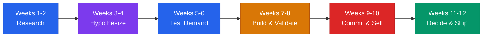

# 90-Day Sprint Plans by Stage



## Core Rule
**90 days is enough to prove anything.** If you can't show measurable progress in 12 weeks, the problem isn't time — it's focus.

---

## Stage 0: Idea — 90 Days to Validated Problem

**Goal:** Go from "I have an idea" to "I have evidence that real people will pay for this."

### Weeks 1-2: Problem Interviews

**Deliverables:**
- List of 50 target interview candidates (name, contact, why they fit)
- 20 completed problem interviews (minimum)
- Interview notes document with verbatim quotes
- Top 3 pain points ranked by frequency and intensity

**Daily actions:**
- Send 5 outreach messages per day requesting interviews
- Conduct 2 interviews per day (20-minute calls)
- Log every conversation same-day — don't let memory fade

**Interview script:**
```
1. "Tell me about the last time you dealt with [problem area]."
2. "What did you do about it?"
3. "What was the hardest part?"
4. "If you could wave a magic wand, what would change?"
5. "Have you looked for solutions? What did you find?"
6. "How much time/money does this cost you today?"
```

**Week 2 checkpoint:** If you cannot find 20 people to talk to, the market may be too small or the problem too niche. Pivot the audience, not the solution.

---

### Weeks 3-4: Solution Hypothesis + Landing Page

**Deliverables:**
- One-page solution brief (problem, solution, who it's for, how it works)
- Live landing page with clear value proposition
- Email capture form connected to a mailing list
- 3 distinct positioning statements to A/B test

**Week 3 tasks:**
- Write the solution brief based on interview data
- Register domain name
- Build landing page (Carrd, Framer, or simple HTML — no code needed)
- Write 3 headline variations for testing

**Week 4 tasks:**
- Launch landing page
- Share with 10 interviewees for feedback
- Set up basic analytics (page views, signup rate)
- Revise copy based on which headline converts best

**Landing page must include:**
```
- Headline: [Specific outcome] for [specific audience]
- Subhead: 1 sentence on how it works
- 3 bullet points on key benefits
- Email signup: "Join the waitlist" or "Get early access"
- Social proof placeholder (interview quotes work here)
```

**Week 4 checkpoint:** If zero interviewees say "I'd use this," revisit your solution hypothesis before moving on.

---

### Weeks 5-6: Waitlist Building

**Target: 100 signups**

**Deliverables:**
- 100+ email signups on waitlist
- Documented acquisition channels (which worked, which didn't)
- Cost-per-signup data if running paid experiments
- Waitlist welcome email sequence (3 emails)

**Week 5 tasks:**
- Post in 5 relevant communities (Reddit, LinkedIn groups, Slack communities, forums)
- Direct-message 20 people from your interview list
- Ask every signup to share with one friend
- Write 3-email welcome sequence

**Week 6 tasks:**
- Run a small paid test ($50-100 on Facebook or Google) to test cold demand
- Publish one piece of content about the problem (blog post, tweet thread, LinkedIn post)
- Reach out to 5 potential distribution partners or influencers
- Compile channel performance data

**Welcome email sequence:**
```
Email 1 (immediate): "You're on the list. Here's what we're building and why."
Email 2 (day 3): "The problem we're solving — and what we've learned so far."
Email 3 (day 7): "Want to help shape this? Reply with your biggest challenge."
```

**Week 6 checkpoint:** If you cannot reach 100 signups across all channels, demand signal is weak. Either the problem isn't painful enough or the positioning is off. Go back to interviews.

---

### Weeks 7-8: Prototype / Mockup Testing

**Deliverables:**
- Clickable prototype or detailed mockup (Figma, slides, or paper)
- 10 prototype walkthroughs with waitlist members
- Feedback log with feature priorities
- Updated solution spec based on feedback

**Week 7 tasks:**
- Build clickable prototype (Figma, InVision, or Google Slides with linked screens)
- Schedule 10 walkthrough sessions with waitlist members
- Prepare a standard walkthrough script

**Week 8 tasks:**
- Conduct all 10 walkthroughs
- Score each feature: Must-have / Nice-to-have / Don't care
- Identify the one feature that gets the most emotional response
- Update your spec: build the must-haves only

**Walkthrough script:**
```
1. "I'm going to show you something early. Be brutally honest."
2. Walk through the core flow — no more than 5 screens.
3. "What would you expect to happen next?"
4. "What's confusing?"
5. "Would you pay for this? How much?"
6. "What's missing that would make this a must-have?"
```

**Week 8 checkpoint:** If nobody would pay, you have a vitamin, not a painkiller. Narrow the problem or change the audience.

---

### Weeks 9-10: Pre-sell or LOI Collection

**Target: 5 letters of intent or 3 pre-sales**

**Deliverables:**
- 5 signed letters of intent (LOIs), OR
- 3 pre-sale payments collected, OR
- 10 verbal commitments with follow-up dates
- Pricing validated at a specific number

**Week 9 tasks:**
- Draft LOI template (one paragraph, non-binding, states intent to purchase at $X)
- Email top 20 waitlist members with pre-sale offer
- Offer early-bird pricing: 30-50% discount for committing now
- Set up payment collection (Stripe link, invoice, or simple PayPal)

**Week 10 tasks:**
- Follow up with every lead who didn't respond
- Conduct 5 closing conversations (phone or video, not email)
- Collect signed LOIs or payments
- Document objections and reasons for "no"

**LOI template:**
```
LETTER OF INTENT

I, [NAME], [TITLE] at [COMPANY], confirm interest in [PRODUCT NAME]
for the purpose of [USE CASE].

I intend to purchase at a price point of approximately $[AMOUNT]/[PERIOD]
upon product availability.

This letter is non-binding and represents intent, not commitment.

Signed: _______________
Date: _______________
```

**Week 10 checkpoint:** If you cannot get a single pre-sale or LOI, the willingness to pay is not there. Re-examine pricing, audience, or the entire concept.

---

### Weeks 11-12: Go / No-Go Decision

**Deliverables:**
- Decision document: GO or NO-GO with supporting data
- If GO: 90-day build plan with launch date
- If NO-GO: Pivot hypothesis or shutdown plan
- Investor-ready one-pager (if GO)

**Week 11 tasks:**
- Compile all data: interviews, signups, prototype feedback, pre-sales
- Score against go/no-go criteria (see below)
- Draft decision document
- Share with 2-3 trusted advisors for gut check

**Week 12 tasks:**
- Make the call
- If GO: Write the Stage 1 sprint plan, start building
- If NO-GO: Send honest update to waitlist, document learnings, decide on pivot or stop
- Either way: publish a brief retrospective for yourself

**Go / No-Go Scorecard:**

| Criteria | Green | Yellow | Red |
|----------|-------|--------|-----|
| Problem interviews | 20+ with clear pattern | 10-19, mixed signals | <10 or no pattern |
| Waitlist signups | 100+ | 50-99 | <50 |
| Prototype feedback | "Shut up and take my money" | "Interesting, maybe" | "I don't get it" |
| Pre-sales / LOIs | 3+ paying or 5+ LOIs | 1-2 paying or 3-4 LOIs | Zero |
| Your conviction | "I'll work on this for 3 years" | "I think this could work" | "I'm not sure anymore" |

**3+ Green = GO. 3+ Red = NO-GO. Everything else = revisit your weakest area for 2 more weeks.**

---

## Stage 1: Pre-Revenue — 90 Days to First 10 Customers

**Goal:** Go from "validated idea" to "10 paying customers acquired through a repeatable motion."

### Weeks 1-2: Direct Outreach Blitz

**Deliverables:**
- 100 personalized outreach messages sent
- 15+ conversations booked
- CRM spreadsheet tracking every lead
- Outreach templates that get >10% response rate

**Daily actions:**
- Send 10 personalized outreach messages
- Follow up with all non-responders after 3 days
- Log every interaction in your CRM spreadsheet

---

### Weeks 3-4: Manual Onboarding of First 3

**Deliverables:**
- 3 paying customers onboarded (even at a discount)
- Onboarding checklist documented
- Customer feedback from each (what worked, what didn't)
- Refined pitch based on what actually closed

**Tactics:**
- Offer concierge onboarding — do it for them if needed
- Price at 50% of target to reduce friction
- Get on a call with every customer during their first week
- Ask: "What almost stopped you from buying?"

---

### Weeks 5-6: Pricing Experiments

**Deliverables:**
- 3 pricing variations tested with real prospects
- Data on conversion rate by price point
- Final pricing decision for next 90 days
- Updated landing page with pricing

**Test structure:**
```
Group A (10 prospects): Original price
Group B (10 prospects): 20% higher
Group C (10 prospects): Different model (annual vs monthly, per-seat vs flat)
Track: response rate, close rate, objections
```

---

### Weeks 7-8: Referral + Second Channel

**Deliverables:**
- Referral ask sent to all existing customers
- 2 new customers from referrals
- One new acquisition channel tested (content, partnerships, community)
- Channel performance comparison document

**Referral script:**
```
"Hey [Name], glad things are going well. Quick ask:
Do you know 1-2 people dealing with [problem]?
Happy to give them [incentive — discount, free month, etc.]
and you get [referral reward] if they sign up."
```

---

### Weeks 9-10: Process Lock-In

**Deliverables:**
- Sales process documented end-to-end (outreach to close)
- Onboarding process documented step-by-step
- Average time from first contact to payment calculated
- 7+ total paying customers

---

### Weeks 11-12: Push to 10 and Retrospective

**Deliverables:**
- 10 paying customers
- Customer acquisition cost (CAC) calculated
- Monthly recurring revenue (MRR) documented
- Stage 1 retrospective: what worked, what didn't, what to double down on

**Week 12 checkpoint:** If you have 10 customers, you have a business. If you have 5-9, extend this stage. Under 5 after 12 weeks means your channel, pricing, or product needs a rethink.

---

**Stages 2 and 3 continue in [`ninety-day-sprints-growth.md`](ninety-day-sprints-growth.md)** — repeatable sales playbook, channel testing, first hire, metrics dashboard, pricing optimization, systems audit, team buildout, unit economics, fundraising prep, growth experiments, scale-readiness scorecard, and weekly checkpoint template.

---

> **Disclaimer:** This playbook provides educational frameworks for startup planning. Timelines and targets vary by industry, market, and founder circumstances. Adjust targets to your specific context. This is not professional business advice.
