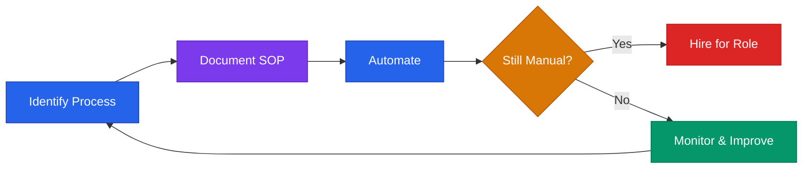

# Operations Playbook



## Core Rule
**Build systems that run without you. Every manual process is technical debt.**
Document before you automate. Automate before you hire.

---

## The Operations Maturity Ladder

Most founders jump straight to tools. Follow this order instead:

```
1. DO IT YOURSELF     — Understand the process deeply
2. DOCUMENT IT        — Write the SOP so anyone could follow it
3. TEMPLATE IT        — Create reusable templates and checklists
4. AUTOMATE IT        — Use tools to remove manual steps
5. DELEGATE IT        — Hire someone to own the process
6. MEASURE IT         — Track performance and improve continuously
```

**Never automate a process you don't understand.** And never hire for a role you can't describe step-by-step.

---

## Startup Tool Stack (Free / Low-Cost Defaults)

| Category | Recommended | Cost |
|----------|-------------|------|
| Communication | Slack | Free tier |
| Project tracking | Linear or Notion | Free tier |
| Docs / Wiki | Notion | Free tier |
| Email | Gmail (Google Workspace) | $6/user/mo |
| Video calls | Google Meet or Zoom | Free tier |
| Calendar | Google Calendar | Free |
| CRM | HubSpot (free tier) or Airtable | Free |
| Design | Figma | Free tier |
| File storage | Google Drive | Free |
| Banking | Mercury | Free |
| Accounting | Wave (free) or QuickBooks | Free / $30/mo |
| Invoicing | Wave, Stripe, or HoneyBook | % or flat |
| E-signatures | DocuSign or PandaDoc | Free tier |
| Automation | Zapier or Make | Free tier |
| Password manager | 1Password or Bitwarden | $3/user/mo |

**Rule:** Consolidate tools aggressively. Every new tool adds login friction, data silos, and cost. If Notion can replace 3 tools, use Notion.

---

## SOP (Standard Operating Procedure) Template

Use for any process you repeat more than twice:

```
SOP: [What this covers]
Owner: [Who is responsible]
Frequency: [Daily / Weekly / Per-trigger]
Last Updated: [Date]
Time to complete: [Estimated minutes]

PURPOSE:
[Why this process exists — 1 sentence]

TRIGGER:
[What event starts this process — e.g., "new customer signs up"]

STEPS:
1. [Action] → [Tool/where] → [Expected output]
2. [Action] → [Tool/where] → [Expected output]
3. [Action] → [Tool/where] → [Expected output]

EDGE CASES:
- If [X], then [Y]
- If something breaks, escalate to [person]

DONE WHEN:
[Clear definition of completion]

QUALITY CHECK:
[How to verify the process was done correctly]
```

### SOPs Every Startup Needs by Stage 2

| SOP | Why |
|-----|-----|
| Customer onboarding | First impression; sets retention trajectory |
| Invoice and payment collection | Cash flow depends on it |
| Bug reporting and triage | Customer trust depends on response time |
| New hire onboarding | First 5 hires set culture |
| Monthly financial close | You can't manage what you don't measure |
| Customer support escalation | Keeps founders out of every ticket |
| Sales follow-up cadence | Deals die from no follow-up |

---

## Weekly Operating Cadence

| Rhythm | Format | Duration | Owner |
|--------|--------|----------|-------|
| Daily standup | Async (Slack) or sync | 15 min | All |
| Weekly team sync | Video | 45 min | Founder |
| Friday close | Written update | 15 min | All |
| Monthly metrics review | Doc + discussion | 60 min | Founder |
| Quarterly planning | Offsite or full day | 4 hrs | Leadership |

### Daily Standup Template (Async)
Post in Slack by 9:30am:
```
Yesterday: [What I shipped]
Today: [What I'm working on]
Blocked: [Anything stopping me — or "none"]
```

### Friday Close Template
```
This week I shipped:
- [Deliverable 1]
- [Deliverable 2]

This week's biggest win: [One thing]
This week's biggest blocker: [One thing]
Next week's #1 priority: [One thing]
```

---

## Async Communication Rules

Define these before you have 3+ people:

1. **Default to async.** Don't schedule a call for something a message handles.
2. **Every message needs context + ask.** Not just "hey" or "quick question."
3. **Use threads.** Keep channels organized.
4. **Set response expectations.** Slack: 4 hours during business hours. Email: 24 hours.
5. **Document decisions.** If decided in a call, write it in Notion within 1 hour.
6. **Meetings need agendas.** No agenda = cancel the meeting.
7. **Record important calls.** Use Otter.ai or Fireflies for async review.

---

## Automation Targets (High ROI)

| Manual Process | Automation | Tool |
|----------------|-----------|------|
| Sending invoices | Auto-invoice on payment | Stripe / QuickBooks |
| Follow-up emails | Drip sequence | HubSpot, ActiveCampaign |
| Lead capture | Form → CRM | Zapier, Typeform |
| Meeting scheduling | Self-schedule link | Calendly |
| Contract signing | Auto-send after proposal | PandaDoc, DocuSign |
| Monthly reports | Auto-pull from data | Google Sheets + Zapier |
| Onboarding emails | Triggered sequence | ConvertKit, HubSpot |
| Receipt capture | Auto-forward to bookkeeper | Dext, Expensify |

**Rule:** If you do something manually 3+ times per week, it should be automated or templated.

**See also:** `automation.md` for detailed automation recipes by category.

---

## Financial Operations

### Monthly Close Checklist
- [ ] Reconcile bank accounts
- [ ] Categorize all expenses
- [ ] Send all pending invoices
- [ ] Follow up on overdue payments
- [ ] Calculate MRR, net burn, runway
- [ ] Update financial model with actuals
- [ ] Review against budget — flag variances > 10%

### Late Payment Process
1. Day 1 past due: Friendly reminder email
2. Day 7: Follow-up with invoice attached
3. Day 14: Phone call or direct message
4. Day 30: Final notice, pause services
5. Day 45: Consider collections or write-off

**See also:** `accounting/README.md` for bookkeeping setup and chart of accounts.

---

## Data & Security Basics

Even at early stage, do these:

- [ ] Use a password manager (1Password or Bitwarden) — no shared passwords
- [ ] Enable 2FA on all critical accounts (banking, AWS, email, GitHub)
- [ ] Store contracts and legal docs in Google Drive or Notion (backed up)
- [ ] Never store customer PII in spreadsheets without encryption
- [ ] Document data retention policy if you handle sensitive data
- [ ] Use environment variables — never hardcode API keys or credentials
- [ ] Run quarterly access audits: who has access to what?
- [ ] Have an incident response plan before you need one

**See also:** `compliance/security-basics.md` for OWASP, incident response, and security stack.

---

## Process Debt — The Hidden Killer

Process debt accumulates when you skip documentation and systemization:

| Symptom | Root Cause | Fix |
|---------|-----------|-----|
| "Only I know how to do this" | No SOP exists | Write the SOP this week |
| "We keep making the same mistake" | No checklist or QA step | Add a quality check to the process |
| "Onboarding takes 3 weeks" | No onboarding system | Document + template the first 2 weeks |
| "I spend all day in email" | No async norms or templates | Set rules + create canned responses |
| "We lost a customer and didn't know why" | No churn tracking or exit interview | Add exit interview to cancellation flow |

**Audit your process debt quarterly.** List every process you do manually. Prioritize by frequency × time cost.

---

## Inbox Zero Protocol

For founders drowning in email:

1. **Unsubscribe aggressively** — anything you don't act on
2. **4 folders only:** Action, Waiting, Reference, Archive
3. **Touch once:** Read → decide → act or archive
4. **Scheduled processing:** 2x per day max (9am, 4pm)
5. **Use templates** for repeat responses (Gmail Canned Responses)
6. **Delegate email checking** as soon as you have an assistant or ops person

---

> **Disclaimer:** This playbook provides educational frameworks for startup operations. Tool recommendations are based on common startup patterns and are not endorsements. Evaluate tools based on your specific needs. This is not professional business advice.
