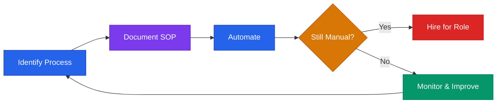

# Operations Playbook



## Core Rule
**Build systems that run without you. Every manual process is technical debt.**  
Document before you automate. Automate before you hire.

---

## Startup Tool Stack (Free / Low-Cost Defaults)

| Category | Recommended | Cost |
|----------|-------------|------|
| Communication | Slack | Free tier |
| Project tracking | Linear or Notion | Free tier |
| Docs / Wiki | Notion | Free tier |
| Email | Gmail (Google Workspace) | $6/user/mo |
| Video calls | Google Meet or Zoom | Free tier |
| Calendar | Google Calendar | Free |
| CRM | HubSpot (free tier) or Airtable | Free |
| Design | Figma | Free tier |
| File storage | Google Drive | Free |
| Banking | Mercury | Free |
| Accounting | Wave (free) or QuickBooks | Free / $30/mo |
| Invoicing | Wave, Stripe, or HoneyBook | % or flat |
| E-signatures | DocuSign or PandaDoc | Free tier |
| Automation | Zapier or Make | Free tier |
| Password manager | 1Password or Bitwarden | $3/user/mo |

---

## SOP (Standard Operating Procedure) Template

Use for any process you repeat more than twice:

```
SOP Title: [What this covers]
Owner: [Who is responsible]
Frequency: [Daily / Weekly / Per-trigger]
Last Updated: [Date]

Purpose:
[Why this process exists — 1 sentence]

Steps:
1. [Action] → [Tool/where] → [Expected output]
2. [Action] → [Tool/where] → [Expected output]
3. ...

Edge Cases:
- If [X], then [Y]
- If something breaks, escalate to [person]

Done When:
[Clear definition of completion]
```

---

## Weekly Operating Cadence

| Rhythm | Format | Duration | Owner |
|--------|--------|----------|-------|
| Daily standup | Async (Slack) or sync | 15 min | All |
| Weekly team sync | Video | 45 min | Founder |
| Friday close | Written update | 15 min | All |
| Monthly metrics review | Doc + discussion | 60 min | Founder |
| Quarterly planning | Offsite or full day | 4 hrs | Leadership |

---

## Async Communication Rules

Define these before you have 3+ people:

1. **Default to async.** Don't schedule a call for something that can be a message.
2. **Every Slack message should have context + ask.** Not just "hey" or "quick question".
3. **Use threads.** Keep channels organized.
4. **Set response time expectations.** (e.g., Slack: within 4 hours during business hours)
5. **Document decisions.** If it's decided in a call, write it down in Notion.

---

## Automation Targets (High ROI)

| Manual Process | Automation | Tool |
|----------------|-----------|------|
| Sending invoices | Auto-invoice on payment | Stripe / QuickBooks |
| Follow-up emails | Drip sequence | HubSpot, ActiveCampaign |
| Lead capture | Form → CRM | Zapier, Typeform |
| Meeting scheduling | Self-schedule link | Calendly |
| Contract signing | Auto-send after proposal | PandaDoc, DocuSign |
| Monthly reports | Auto-pull from data | Google Sheets + Zapier |
| Onboarding emails | Triggered sequence | ConvertKit, HubSpot |

**Rule:** If you do something manually 3+ times, it should be automated or templated.

---

## Financial Operations

### Monthly Close Checklist
- [ ] Reconcile bank accounts
- [ ] Categorize all expenses
- [ ] Send all pending invoices
- [ ] Follow up on overdue payments
- [ ] Calculate MRR, net burn, runway
- [ ] Update financial model with actuals

### Invoice Template (Minimum)
```
Invoice #: [Number]
Date: [Date]
Due: [Net 15 / Net 30]

Bill to: [Client name + address]

Services:
[Description] — $X

Total Due: $X

Payment methods: [Stripe link / bank info]
```

### Late Payment Process
1. Day 1 past due: Friendly reminder email
2. Day 7: Follow-up with invoice attached
3. Day 14: Phone call or direct message
4. Day 30: Final notice, pause services

---

## Data & Security Basics

Even at early stage, do these:

- [ ] Use a password manager (1Password or Bitwarden) — no shared passwords
- [ ] Enable 2FA on all critical accounts (banking, AWS, email, GitHub)
- [ ] Store contracts and legal docs in Google Drive or Notion (backed up)
- [ ] Never store customer PII in spreadsheets without encryption
- [ ] Document data retention policy if you handle sensitive data
- [ ] Use environment variables — never hardcode API keys or credentials

---

## Inbox Zero Protocol

For founders drowning in email:

1. **Unsubscribe aggressively** — anything you don't act on
2. **4 folders only:** Action, Waiting, Reference, Archive
3. **Touch once:** Read → decide → act or archive
4. **Scheduled processing:** 2x per day max (9am, 4pm)
5. **Use templates** for repeat responses (Gmail Canned Responses)
