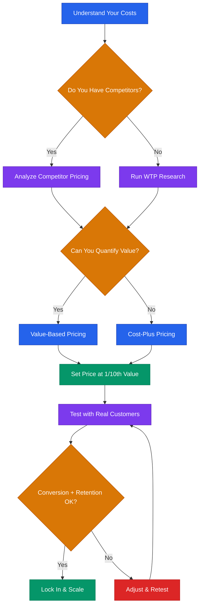

# Pricing Strategy for Startups



## Core Rule
**Price on value, not on cost.** If your customer gets $100K in value, charging $1K is not generous — it is a positioning mistake.

---

## 5 Pricing Frameworks

### 1. Cost-Plus Pricing
Add a margin on top of your cost to deliver.

```
Price = Cost to Serve + Desired Margin (typically 50-80% for software)
```

**When to use:** Physical products, services with predictable delivery costs, very early stage when you have zero data.

**Limitation:** Ignores what the customer is willing to pay. You leave money on the table or price yourself out.

### 2. Competitor-Based Pricing
Set your price relative to alternatives in the market.

```
1. List top 3-5 competitors
2. Map their pricing tiers and features
3. Position yourself: cheaper (value play), same (feature play), or premium (quality play)
```

**When to use:** Crowded markets where buyers already comparison-shop.

**Limitation:** You anchor to competitors instead of your own value. Race-to-the-bottom risk.

### 3. Value-Based Pricing
Price based on the measurable outcome you deliver.

```
1. Quantify the customer's pain in dollars (time saved, revenue gained, cost avoided)
2. Set price at 1/10th of that value (the "10x value" rule)
3. Validate with customer interviews
```

**When to use:** B2B SaaS, any product where you can tie usage to a dollar outcome. This is the gold standard.

### 4. Willingness-to-Pay (WTP) Research
Ask customers directly using the Van Westendorp method.

```
Ask 4 questions:
1. "At what price would this be so cheap you'd question the quality?" (Too Cheap)
2. "At what price would this be a bargain — a great buy?" (Cheap/Good Value)
3. "At what price would this start to get expensive but you'd still consider it?" (Expensive)
4. "At what price would this be too expensive to consider?" (Too Expensive)
```

Plot the answers. The intersection of "Too Cheap" and "Too Expensive" curves gives your acceptable range. The intersection of "Cheap" and "Expensive" curves gives your optimal price.

**When to use:** Before launching or before a major price change. Need 30+ responses to be useful.

### 5. Freemium / Free Trial
Give something away. Convert a percentage to paid.

| Model | How It Works | Good For |
|-------|-------------|----------|
| Freemium | Free tier forever, limited features | High-volume, self-serve products |
| Free trial (time-limited) | Full access for 7-14 days | Products where value is clear quickly |
| Reverse trial | Start on paid, downgrade to free after trial | Showing the premium experience first |
| Usage-based free tier | Free up to X units/month | API products, developer tools |

**Rule of thumb:** If fewer than 2-5% of free users convert to paid, your free tier is too generous or your paid tier is not compelling enough.

---

## Setting Your First Price: The 10x Value Rule

Your price should be roughly 1/10th of the value you deliver.

```
Customer Value Calculation:
1. Hours saved per month:        [X] hours x $[hourly rate] = $[SAVINGS]
2. Revenue increase per month:   $[REVENUE_GAIN]
3. Cost avoided per month:       $[COST_AVOIDED]
4. Total monthly value:          $[TOTAL]
5. Your monthly price:           $[TOTAL] / 10 = $[PRICE]
```

If you cannot quantify value, start with competitor pricing and iterate.

**Do not overthink your first price.** Pick a number, launch, and adjust based on real data. A wrong price is better than no price.

---

## When and How to Raise Prices

### When to Raise
- You have not raised prices in 12+ months
- Your close rate is above 40% (you are too cheap)
- Customers say "that's it?" when they hear the price
- You have added significant features since the last price change
- Your costs have increased

### How to Raise

**For new customers:** Just change the price. No announcement needed.

**For existing customers:** Give notice and grandfather or transition.

**Price Increase Email — Existing Customers**
```
Subject: Update to your [PRODUCT] plan

Hi [NAME],

We're updating our pricing on [DATE — at least 30 days out].

Your [CURRENT_PLAN] plan will move from $[OLD_PRICE]/mo to $[NEW_PRICE]/mo.

Since you've been with us since [SIGNUP_DATE], we're locking you in at
$[DISCOUNTED_PRICE]/mo for the next [6/12] months as a thank-you.

Here's what we've added since you joined:
- [FEATURE_1]
- [FEATURE_2]
- [FEATURE_3]

If you have any questions, hit reply. Happy to chat.

[YOUR_NAME]
```

**Price Increase Email — Annual Upsell**
```
Subject: Lock in your current rate

Hi [NAME],

We're raising prices on [DATE]. Your current plan goes from
$[OLD_PRICE]/mo to $[NEW_PRICE]/mo.

Want to keep today's price? Switch to annual billing before [DATE]
and you'll pay $[ANNUAL_PRICE]/mo (billed yearly) — that's [X]% less
than the new monthly rate.

[CTA_LINK]

[YOUR_NAME]
```

---

**Pricing page best practices, psychology, common mistakes, testing methods, stage-specific guidance, and the pricing worksheet continue in [`pricing-strategy-advanced.md`](pricing-strategy-advanced.md).**

---

> **Disclaimer:** This playbook is educational information, not financial or legal advice. Pricing decisions depend on your specific market, cost structure, and competitive context. Consult qualified advisors for decisions with significant financial impact.
