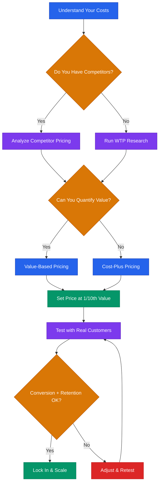

# Pricing Strategy for Startups



## Core Rule
**Price on value, not on cost.** If your customer gets $100K in value, charging $1K is not generous — it is a positioning mistake.

---

## 5 Pricing Frameworks

### 1. Cost-Plus Pricing
Add a margin on top of your cost to deliver.

```
Price = Cost to Serve + Desired Margin (typically 50-80% for software)
```

**When to use:** Physical products, services with predictable delivery costs, very early stage when you have zero data.

**Limitation:** Ignores what the customer is willing to pay. You leave money on the table or price yourself out.

### 2. Competitor-Based Pricing
Set your price relative to alternatives in the market.

```
1. List top 3-5 competitors
2. Map their pricing tiers and features
3. Position yourself: cheaper (value play), same (feature play), or premium (quality play)
```

**When to use:** Crowded markets where buyers already comparison-shop.

**Limitation:** You anchor to competitors instead of your own value. Race-to-the-bottom risk.

### 3. Value-Based Pricing
Price based on the measurable outcome you deliver.

```
1. Quantify the customer's pain in dollars (time saved, revenue gained, cost avoided)
2. Set price at 1/10th of that value (the "10x value" rule)
3. Validate with customer interviews
```

**When to use:** B2B SaaS, any product where you can tie usage to a dollar outcome. This is the gold standard.

### 4. Willingness-to-Pay (WTP) Research
Ask customers directly using the Van Westendorp method.

```
Ask 4 questions:
1. "At what price would this be so cheap you'd question the quality?" (Too Cheap)
2. "At what price would this be a bargain — a great buy?" (Cheap/Good Value)
3. "At what price would this start to get expensive but you'd still consider it?" (Expensive)
4. "At what price would this be too expensive to consider?" (Too Expensive)
```

Plot the answers. The intersection of "Too Cheap" and "Too Expensive" curves gives your acceptable range. The intersection of "Cheap" and "Expensive" curves gives your optimal price.

**When to use:** Before launching or before a major price change. Need 30+ responses to be useful.

### 5. Freemium / Free Trial
Give something away. Convert a percentage to paid.

| Model | How It Works | Good For |
|-------|-------------|----------|
| Freemium | Free tier forever, limited features | High-volume, self-serve products |
| Free trial (time-limited) | Full access for 7-14 days | Products where value is clear quickly |
| Reverse trial | Start on paid, downgrade to free after trial | Showing the premium experience first |
| Usage-based free tier | Free up to X units/month | API products, developer tools |

**Rule of thumb:** If fewer than 2-5% of free users convert to paid, your free tier is too generous or your paid tier is not compelling enough.

---

## Setting Your First Price: The 10x Value Rule

Your price should be roughly 1/10th of the value you deliver.

```
Customer Value Calculation:
1. Hours saved per month:        [X] hours x $[hourly rate] = $[SAVINGS]
2. Revenue increase per month:   $[REVENUE_GAIN]
3. Cost avoided per month:       $[COST_AVOIDED]
4. Total monthly value:          $[TOTAL]
5. Your monthly price:           $[TOTAL] / 10 = $[PRICE]
```

If you cannot quantify value, start with competitor pricing and iterate.

**Do not overthink your first price.** Pick a number, launch, and adjust based on real data. A wrong price is better than no price.

---

## When and How to Raise Prices

### When to Raise
- You have not raised prices in 12+ months
- Your close rate is above 40% (you are too cheap)
- Customers say "that's it?" when they hear the price
- You have added significant features since the last price change
- Your costs have increased

### How to Raise

**For new customers:** Just change the price. No announcement needed.

**For existing customers:** Give notice and grandfather or transition.

**Price Increase Email — Existing Customers**
```
Subject: Update to your [PRODUCT] plan

Hi [NAME],

We're updating our pricing on [DATE — at least 30 days out].

Your [CURRENT_PLAN] plan will move from $[OLD_PRICE]/mo to $[NEW_PRICE]/mo.

Since you've been with us since [SIGNUP_DATE], we're locking you in at
$[DISCOUNTED_PRICE]/mo for the next [6/12] months as a thank-you.

Here's what we've added since you joined:
- [FEATURE_1]
- [FEATURE_2]
- [FEATURE_3]

If you have any questions, hit reply. Happy to chat.

[YOUR_NAME]
```

**Price Increase Email — Annual Upsell**
```
Subject: Lock in your current rate

Hi [NAME],

We're raising prices on [DATE]. Your current plan goes from
$[OLD_PRICE]/mo to $[NEW_PRICE]/mo.

Want to keep today's price? Switch to annual billing before [DATE]
and you'll pay $[ANNUAL_PRICE]/mo (billed yearly) — that's [X]% less
than the new monthly rate.

[CTA_LINK]

[YOUR_NAME]
```

---

## SaaS Pricing Page Best Practices

### The 3-Tier Structure

| Element | Starter | Pro (Most Popular) | Enterprise |
|---------|---------|-------------------|------------|
| Target | Individuals / small teams | Growing teams | Large orgs |
| Price | $[X]/mo | $[Y]/mo | "Contact us" |
| Anchor | Low entry point | Best value (highlight this) | Social proof + custom |
| Features | Core features only | Everything in Starter + key upgrades | Everything + SLA, SSO, support |
| CTA | "Start Free" or "Try It" | "Start Free Trial" (primary color) | "Talk to Sales" |

**Rules:**
1. Highlight the middle tier. Use a "Most Popular" badge and a different visual weight.
2. Show annual pricing by default with a toggle. Display the monthly equivalent.
3. Keep it to 3 tiers. Four or more creates decision paralysis.
4. Feature comparison table below the tier cards for detail-oriented buyers.
5. Include an FAQ section addressing objections: "Can I cancel anytime?" "What happens after my trial?"

---

## Pricing Psychology

### Anchoring
Show the most expensive option first (or a high reference price) so the real price feels reasonable.

```
Example: "Enterprise is $500/mo. Pro is $99/mo." — $99 now feels like a deal.
```

### Decoy Effect
Add a tier that exists primarily to make another tier look better.

```
Basic: $29/mo — 5 users, 10 GB
Pro:   $79/mo — 25 users, 100 GB     <-- This is what you want them to buy
Team:  $69/mo — 10 users, 25 GB      <-- The decoy (close to Pro price, much less value)
```

### Annual Discount
Offer 15-25% off for annual billing. Frame it as "2 months free" rather than "17% off." People respond to concrete savings.

### Charm Pricing
$99 converts better than $100 for self-serve. Use round numbers ($100, $500) for enterprise/sales-led — it signals confidence.

### Price Ending
- `.00` — signals premium, confidence
- `.99` — signals value, consumer
- `.95` — signals sale, discount

---

## Common Pricing Mistakes

| Mistake | Why It Hurts | Fix |
|---------|-------------|-----|
| Pricing too low | Attracts price-sensitive customers who churn. Signals low quality. | Raise price 20%. See if close rate drops. If not, raise again. |
| Free tier too generous | No urgency to upgrade. Drains support resources. | Cut the free tier. Gate the feature they ask about most. |
| No annual plan | Higher churn, less cash upfront, harder to forecast. | Offer annual at 15-25% discount. Make it the default. |
| Too many tiers | Decision paralysis. Buyers leave. | Collapse to 3 tiers. |
| Hiding the price | Adds friction. Prospects assume you are expensive. | Show pricing unless deal size is >$20K/yr and requires scoping. |
| Per-seat pricing only | Discourages adoption within the org. | Add a usage or value metric alongside seat count. |
| One price fits all | Leaves money on the table with large customers. | Segment by company size or usage. |

---

## Price Testing Methods

### A/B Testing
Show different prices to different visitors. Measure conversion rate and revenue per visitor.

**Caution:** This is ethically and legally sensitive. Test different packages (feature bundles), not raw prices for the same thing. Be ready to honor the lower price if discovered.

### Cohort Testing
Change prices for new signups on a specific date. Compare cohort metrics (conversion, LTV, churn) against the previous cohort.

```
Cohort A (Jan signups):  $49/mo — 8% conversion, 4% monthly churn
Cohort B (Feb signups):  $79/mo — 6% conversion, 3% monthly churn

Revenue per 1000 visitors:
  A: 1000 x 8% x $49 = $3,920/mo
  B: 1000 x 6% x $79 = $4,740/mo  <-- Winner
```

### Grandfathering
Keep existing customers on old pricing when you raise prices. Reduces churn from price increases. Accept the short-term revenue trade-off for long-term retention.

**When to stop grandfathering:** When the old price is so low it distorts your metrics, or when the feature set has changed enough that old plans no longer make sense.

---

## Stage-Specific Pricing Guidance

### Stage 0 — Idea
Do not set a price yet. Run WTP interviews. Understand the problem's dollar value.

### Stage 1 — Validation
Charge something. Even $1 validates intent better than "would you pay for this?" Run pre-sales or paid pilots. Use round numbers. Do not optimize.

### Stage 2 — MVP / Early Customers
Pick a single price point based on WTP research or competitor analysis. Offer annual billing from day one. Do not build a self-serve pricing page yet — close deals manually.

### Stage 3 — Growth
Introduce tiers. Test pricing with cohorts. Add the 3-tier pricing page. Start tracking price sensitivity metrics: close rate by tier, expansion revenue, downgrade rate.

### Stage 4 — Scale
Segment pricing by customer size. Introduce enterprise tier with custom pricing. Hire someone to own pricing. Review pricing quarterly.

---

## Pricing Worksheet Template

Use this to work through your pricing before launch or before a price change.

```
PRICING WORKSHEET
=================

Company: [YOUR_COMPANY]
Product: [YOUR_PRODUCT]
Date:    [DATE]

1. VALUE QUANTIFICATION
   What measurable outcome does the customer get?
   - Time saved:        [X] hours/month x $[RATE] = $[VALUE_1]/mo
   - Revenue gained:    $[VALUE_2]/mo
   - Cost avoided:      $[VALUE_3]/mo
   - Total value:       $[TOTAL_VALUE]/mo

2. COMPETITOR LANDSCAPE
   | Competitor    | Price        | Positioning      |
   |--------------|-------------|-----------------|
   | [COMP_1]     | $[PRICE_1]  | [POSITION_1]   |
   | [COMP_2]     | $[PRICE_2]  | [POSITION_2]   |
   | [COMP_3]     | $[PRICE_3]  | [POSITION_3]   |

3. YOUR POSITIONING
   [ ] Cheaper than competitors (value play)
   [ ] Same range (feature differentiation)
   [ ] Premium (quality/outcome play)

4. PROPOSED PRICING
   Starter:    $[X]/mo — [WHO_IT_IS_FOR]
   Pro:        $[Y]/mo — [WHO_IT_IS_FOR]
   Enterprise: $[Z]/mo or "Contact Us" — [WHO_IT_IS_FOR]
   Annual discount: [X]% (recommend 15-25%)

5. WILLINGNESS-TO-PAY CHECK
   Van Westendorp results (if available):
   - Too Cheap:     $[A]
   - Good Value:    $[B]
   - Expensive:     $[C]
   - Too Expensive: $[D]
   - Optimal price: $[OPTIMAL]

6. UNIT ECONOMICS CHECK
   Cost to serve per customer/mo: $[COST]
   Proposed price/mo:             $[PRICE]
   Gross margin:                  [X]%
   Target: >70% for SaaS

7. DECISION
   [ ] Launch at this price
   [ ] Run more WTP interviews (need [X] more)
   [ ] Test with a cohort before committing
   [ ] Revisit in [X] weeks

Notes:
[FREE_TEXT]
```

---

> **Disclaimer:** This playbook is educational information, not financial or legal advice. Pricing decisions depend on your specific market, cost structure, and competitive context. Consult qualified advisors for decisions with significant financial impact.
