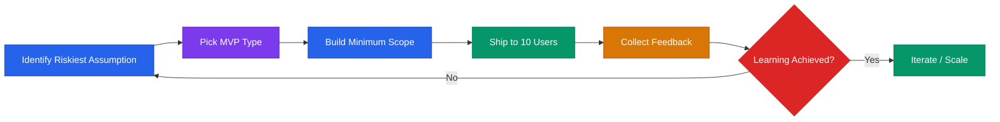

# Product & MVP Playbook



## Core Rule
**Ship fast. Learn fast. Kill features that don't serve the core job.**
The goal of an MVP is to learn, not to impress.

---

## MVP Principles

1. **An MVP is not a bad version of your product.** It's the minimum needed to test your riskiest assumption.
2. **Cut scope until it hurts, then cut more.** If you're not embarrassed by your MVP, you launched too late. (Reid Hoffman)
3. **Build for your first 10 customers, not your first 1,000.**
4. **Manual before automated.** Do it yourself before building software to do it.
5. **Feedback is the product.** Your job is to collect it, not to ship features.

---

## MVP Types (Pick the Right One)

| Type | Description | Best For | Time to Build |
|------|-------------|----------|---------------|
| Concierge | You do it manually for the customer | Validating demand + process | 0 days |
| Wizard of Oz | Looks automated, you do it manually | Testing UX without backend | 1-2 weeks |
| Landing page | Describe solution, collect emails | Measuring interest | 1-2 days |
| Prototype | Clickable mockup (Figma) | UX validation | 3-5 days |
| Piecemeal | Stitch existing tools (Zapier + Airtable + Stripe) | Fast delivery without custom build | 1-2 weeks |
| Single feature | One core feature, nothing else | Focused validation | 2-4 weeks |

### No-Code MVP Options

You don't need to write code to validate most ideas:

| What You're Building | No-Code Stack | Cost |
|---------------------|---------------|------|
| Landing page + waitlist | Carrd + Mailchimp | Free |
| Simple SaaS | Bubble or Softr + Airtable | $25-50/mo |
| Marketplace | Sharetribe or Bubble | $50-100/mo |
| Mobile app | Glide or Adalo + Airtable | Free-$50/mo |
| Internal tool | Retool or Notion | Free tier |
| E-commerce | Shopify or Gumroad | $29/mo or % |
| Scheduling / booking | Cal.com + Stripe | Free |
| Course / info product | Teachable or Gumroad | Free-$39/mo |

**Use no-code to validate. Rebuild in code only when no-code breaks** (usually at 50-100 users or when you need custom logic).

---

## When to Stop Building and Start Selling

Founders overbuild. Use this checklist:

**Ship when:**
- [ ] One person can complete the core workflow end-to-end
- [ ] The biggest pain point is addressed (even if imperfectly)
- [ ] You've cut every feature that isn't required for the first use
- [ ] A real user has tested it and found the core value

**Do NOT wait for:**
- Edge case handling
- Beautiful design
- Mobile responsive layout
- Multi-user support
- Settings and preferences
- Analytics dashboard
- Email notifications for everything

**The test:** Can a customer pay you money and get value? If yes, ship it.

---

## Feature Prioritization (ICE Framework)

Score each feature 1-10 on:
- **I**mpact — How much will this move the north star metric?
- **C**onfidence — How sure are we this will work?
- **E**ase — How fast/cheap can we build it?

`ICE Score = (Impact + Confidence + Ease) / 3`

Build highest-scoring features first. Review and re-score weekly.

### Alternative: RICE Framework (for larger teams)

- **R**each — How many users does this affect per quarter?
- **I**mpact — How much does it move the metric? (3=massive, 2=high, 1=medium, 0.5=low)
- **C**onfidence — How sure are we? (100%, 80%, 50%)
- **E**ffort — Person-weeks to build

`RICE Score = (Reach × Impact × Confidence) / Effort`

---

## North Star Metric

Your north star metric is the **one number** that best captures value delivered to customers.

| Company Type | Possible North Star |
|-------------|---------------------|
| Marketplace | GMV, transactions |
| SaaS | MRR, WAU, activated users |
| Consumer | DAU, retention D30 |
| Social | Posts created, connections made |
| Productivity | Tasks completed, time saved |

**Choose one. Align the whole team to it. Review weekly.**

---

## Product Roadmap (Startup Format)

Don't build 12-month roadmaps. Build rolling 90-day plans.

```
NOW (this sprint):
- [Feature/fix 1]
- [Feature/fix 2]

NEXT (next 4 weeks):
- [Feature 3]
- [Feature 4]

LATER (90 days):
- [Big bet 1]
- [Big bet 2]

NOT DOING:
- [Thing people ask for but doesn't move NSM]
```

Review and update every 2 weeks. The "NOT DOING" list is as important as the "NOW" list.

---

## User Story Format

```
As a [user type],
I want to [action],
So that I can [outcome/benefit].

Acceptance Criteria:
- [ ] Given [context], when [action], then [result]
- [ ] Edge case: [X]
```

---

## Sprint Structure (2-Week Cycle)

| Day | Activity |
|-----|----------|
| Mon (Week 1) | Sprint planning — what ships by Friday of week 2? |
| Tue-Fri (Week 1) | Build |
| Mon (Week 2) | Mid-sprint check — cut scope if behind |
| Tue-Thu (Week 2) | Build + QA |
| Fri (Week 2) | Ship + demo + retro |

**Retro questions:**
1. What went well?
2. What slowed us down?
3. What do we change next sprint?

**Rule:** Never extend a sprint. Cut scope instead. Shipping on time builds the muscle.

---

## Product Metrics to Track Weekly

| Metric | Why It Matters |
|--------|---------------|
| Activation rate | % of new users who complete core action |
| Retention (D7, D30) | Are users coming back? |
| Feature adoption | Are people using what you built? |
| Bug reports | Quality signal |
| NPS / CSAT | Satisfaction signal |
| Time to value | How fast do users get the first win? |

**The most important metric pre-PMF is retention.** If users aren't coming back, nothing else matters.

---

## Common Product Mistakes

| Mistake | Fix |
|---------|-----|
| Building what users say they want (not what they need) | Watch behavior, not just feedback |
| Too many features | Kill the bottom 30% of features quarterly |
| Shipping without talking to users | Minimum 2 customer calls per sprint |
| Optimizing before PMF | Focus on retention, not performance |
| Ignoring churn | Churn is the most honest signal you have |
| Building for edge cases | Build for the core 80% use case |
| Perfecting before shipping | Launch at 80%. Improve based on real usage. |
| Adding features instead of fixing onboarding | Most "missing feature" complaints are onboarding failures |

---

## The "Should I Build This?" Test

Before building any feature, ask:

1. **Does it serve the core job?** If not, it waits.
2. **Will 3+ current customers use it this week?** If not, it's speculative.
3. **Can we test the idea without building it?** (Mock, prototype, manual)
4. **What's the cost of NOT building it?** (Churn? Lost deals? Nothing?)
5. **Does it make the product simpler or more complex?** Complexity is a tax.

If you can't answer #2 with specific customer names, don't build it.

---

## Tools (Free / Low Cost Tier)

| Category | Tool |
|----------|------|
| Wireframing | Figma (free) |
| Project tracking | Linear, Notion, GitHub Projects |
| User feedback | Typeform, Tally |
| Analytics | Mixpanel (free tier), PostHog (open source) |
| Session replay | Hotjar, FullStory |
| Feature flags | Flagsmith (open source), LaunchDarkly |
| Error tracking | Sentry (free tier) |
| No-code builder | Bubble, Softr, Retool |

---

> **Disclaimer:** This playbook provides educational frameworks for product development. Tool recommendations are not endorsements. This is not professional business advice.
