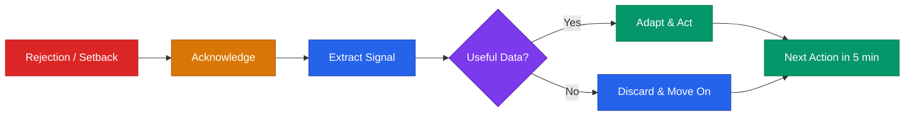

# Resilience Playbook



## Core Rule
**The startup is the test. You are not the startup.**
Founders who survive long enough to find PMF usually win. The main thing is staying in the game.

---

## Rejection Protocol

When you get a "no" — from a customer, investor, partner, or hire:

**Step 1 — Acknowledge it (30 seconds):**
Say to yourself: "That's data." Not "I failed." Not "they're wrong." Just: data.

**Step 2 — Extract the signal (5 minutes):**
- Was this a timing issue, a fit issue, or a message issue?
- Would a different customer/investor say yes?
- Would a different framing change the outcome?
- Did I learn something I didn't know before?

**Step 3 — Categorize it:**

| Type | Example | Response |
|------|---------|----------|
| **Useful rejection** | "We'd buy this if it had X feature" | Log the feedback. Decide if it's worth building. |
| **Timing rejection** | "Check back in 6 months when we have budget" | Set a calendar reminder. Follow up. |
| **Fit rejection** | "This isn't relevant to our workflow" | Wrong ICP. Refine targeting. |
| **Generic rejection** | "Not interested" / ghosted | Part of the funnel. Means nothing. Send the next one. |

**Step 4 — Next action in 5 minutes:**
Send the next outreach. File the feedback. Do not spiral.

### Rejection Math

Most founders underestimate how much rejection is normal:

```
Cold outreach response rate:     5-15%
Demo-to-close rate:              10-30%
Investor meeting-to-term-sheet:  1-3%
First hire offer acceptance:     30-50%
```

This means: **to close 3 customers, you may need 100 outreach messages.** To get 1 term sheet, you may need 50 investor meetings. This isn't failure — it's the conversion funnel. Track it, don't feel it.

### The Rejection Log

Keep a simple tracker. Patterns emerge that feelings obscure.

```
DATE       | WHO           | ASK        | RESULT  | SIGNAL           | NEXT ACTION
[DATE]     | [Name/Co]     | Customer   | No      | Wrong timing     | Follow up Q3
[DATE]     | [Name/Fund]   | Investment | Passed  | Too early stage  | Build more traction
[DATE]     | [Name]        | Hire       | Declined| Comp too low     | Adjust offer range
```

**Review monthly.** If 80% of rejections cite the same reason, that's not rejection — that's a roadmap.

---

## Reframing Setbacks

| What happened | Gut reaction | Founder reframe | Next action |
|---------------|-------------|-----------------|-------------|
| Lost a customer | "We're failing" | Got data on what to fix | Exit interview within 48 hrs |
| Investor passed | "We're not good enough" | Wrong fit or wrong timing | Send 5 more intros this week |
| Feature flopped | "We wasted time" | Learned what users don't want cheaply | Kill it, redirect resources |
| Co-founder left | "It's over" | Painful, survivable — many great companies went through this | Stabilize team, consult attorney |
| Competitor launched | "We're too late" | Validates the market exists | Differentiate, don't panic |
| Revenue missed target | "The model is broken" | Tells you which assumptions were wrong | Diagnose the specific gap |
| Key hire quit | "They don't believe in us" | Culture signal or better offer elsewhere | Exit interview, backfill, learn |
| Bad press / public failure | "Everyone saw it" | Nobody remembers in 2 weeks | Respond once, then ship |
| Product went down | "Users will leave" | How fast you recover matters more than the outage | Fix, postmortem, communicate |

---

## Pivot vs Persevere Framework

Ask these questions when something isn't working:

```
1. Is the problem real? (customers still have it)
   YES → continue to 2 | NO → pivot problem

2. Is our solution solving it? (retention, satisfaction)
   YES → continue to 3 | NO → pivot solution

3. Can we reach our customers at viable cost?
   YES → continue to 4 | NO → pivot channel

4. Will they pay what we need to be sustainable?
   YES → keep going | NO → pivot model or pricing
```

**Pivot ≠ failure.** Slack, Instagram, YouTube, Twitter — all pivots.
**Panic pivot = failure.** Pivot based on data, not fear.

### Types of Pivots

| Pivot Type | What Changes | What Stays | Example |
|-----------|-------------|-----------|---------|
| Customer pivot | Who you sell to | The product | B2C → B2B |
| Problem pivot | Which pain you solve | The customer | Scheduling → communication |
| Solution pivot | How you solve it | The problem | Software → services |
| Channel pivot | How you reach them | Product + customer | Direct sales → self-serve |
| Revenue model pivot | How you charge | Product + customer | Subscription → usage-based |
| Technology pivot | What you build with | The business logic | Rebuild on different stack |

**Rule:** Change one thing at a time. If you change the customer, the problem, and the solution simultaneously, you're not pivoting — you're starting over.

---

## Founder Burnout

### The Burnout Spectrum

Burnout isn't binary. It's a spectrum, and early intervention matters.

```
LEVEL 1 — Fatigue         "I'm tired but still motivated"
  → Adjust pace. Protect sleep. Take a weekend.

LEVEL 2 — Cynicism        "Is any of this worth it?"
  → Talk to a customer who loves the product. Talk to a peer.

LEVEL 3 — Detachment      "I don't care anymore"
  → This is serious. Reduce commitments. Talk to a therapist.

LEVEL 4 — Breakdown       Physical symptoms, inability to function
  → Stop. Get professional help. The company can wait.
```

### Warning Signs (Be Honest)

**Physical:**
- Sleep disruption (insomnia or oversleeping)
- Persistent fatigue that rest doesn't fix
- Headaches, stomach problems, jaw clenching
- Getting sick more often

**Emotional:**
- Dreading work you used to enjoy
- Irritability with team, co-founder, or family
- Feeling trapped ("I can't quit but I can't keep going")
- Loss of excitement about wins

**Cognitive:**
- Decision fatigue starting early in the day
- Inability to focus on deep work
- Avoiding important tasks (fundraising calls, hard conversations)
- Catastrophizing ("if this doesn't work, everything is ruined")

**Behavioral:**
- Working more hours but producing less
- Canceling plans to "catch up" (but not catching up)
- Numbing (alcohol, scrolling, binge-watching to avoid thinking)
- Withdrawing from co-founder, team, or support network

### Recovery Protocol

**Immediate (this week):**
1. Identify the root cause: Is it the work, a relationship, the direction, or the pace?
2. Cancel or delegate 3 things on your calendar this week
3. Protect one 2-hour block per day that isn't meetings or email
4. Talk to someone who isn't your co-founder (peer founder, therapist, mentor)
5. Do one thing that reconnects you to the mission (call a happy customer)

**Structural (this month):**
1. Audit your calendar: what can be eliminated, delegated, or batched?
2. Identify your energy drains vs. energy sources — restructure your week around them
3. Set a hard stop time at least 3 days per week
4. Redefine what "enough" looks like for a workday
5. Schedule recurring time off (one full day per week, minimum)

### Sustainable Founder Habits

These are not nice-to-haves. They are performance infrastructure.

- **Sleep 7+ hours.** Decisions degrade without it. This is not negotiable.
- **Exercise 3x per week.** Sedentary = foggy. Even a 30-minute walk counts.
- **One full day off per week.** Not "light work Sunday." Off.
- **One meal per day not at your desk.** Transitions matter.
- **Monthly solo reflection:** Where am I? Where is the company? Are they going the same direction?
- **Quarterly check-in with yourself:** Am I still the right person to lead this? (The answer is usually yes, but asking keeps you honest.)

---

## Managing Uncertainty

Startup = permanent ambiguity. Get comfortable with these truths:

- **You will not have enough information.** Decide anyway.
- **You will be wrong regularly.** Adjust quickly.
- **The plan will change.** Write it down anyway.
- **You don't know when it will work.** Keep showing up.
- **Nobody has it figured out.** The confident founders are just better at acting despite doubt.

### Tactics for Navigating Uncertainty

1. **Set 90-day milestones** instead of 5-year plans
2. **Make reversible decisions fast;** slow down only for irreversible ones
3. **Write down your assumptions** before executing — check them after
4. **Timebox your worry:** 15 minutes to catastrophize, then move on
5. **Find 2-3 peer founders** to talk to regularly (peer group > solo reflection)
6. **Separate "what I can control" from "what I can't"** — and only act on the first list

---

## When to Quit vs When to Persist

### Signals to Persist

- Customers love it but growth is slow (distribution problem, not product problem)
- The core insight is still valid even if the execution needs work
- You have runway and real learning happening
- You still believe in the problem, even when the solution is hard
- Each iteration gets closer to something that works

### Signals to Seriously Reconsider

- No customers will pay, regardless of version or price — after real effort
- The market fundamentally changed and the problem is gone
- The founding team is broken beyond repair
- You no longer believe in the mission (not a bad week — a sustained loss of conviction)
- You've run out of ways to test the core hypothesis

**Give it one year of real effort before concluding it can't work.** But don't confuse persistence with denial.

### How to Shut Down Well (If You Decide To)

1. Tell your team first, with honesty and gratitude
2. Notify customers with a transition plan
3. Return unused investor capital (if applicable and required by terms)
4. Handle legal obligations (wind down entity, final tax filings)
5. Write a retrospective — for yourself and for the next thing
6. Take time before starting something new. Grief is legitimate.

---

## Founder Support Resources

### Peer Communities
- YC Startup School (free, global community)
- Indie Hackers (bootstrapper-friendly)
- On Deck, Founders Network (curated)
- Local ecosystem: check your regional playbook for local founder groups

### Mental Health
- Therapy is legitimate business strategy. Many investors now expect it.
- **Founder-specific:** FLOWN, Sanctus, Modern Health (if employer-sponsored)
- **Crisis:** 988 Suicide & Crisis Lifeline (call or text 988)
- **Peer support:** Founders who've been through it are often the most helpful

### Reading
- *The Hard Thing About Hard Things* — Ben Horowitz (operating through crisis)
- *Lost and Founder* — Rand Fishkin (honest account of startup struggle)
- *Founders at Work* — Jessica Livingston (interviews with founders on the hard parts)
- *Resilient Management* — Lara Hogan (managing yourself and others under pressure)
- *Burnout* — Emily & Amelia Nagoski (the science of stress and recovery)

---

**Deeper content on co-founder conflict, isolation, identity, impostor syndrome, and crisis-specific protocols continues in [`resilience-advanced.md`](resilience-advanced.md).**

---

> **Disclaimer:** This playbook provides educational frameworks for founder well-being. It is not a substitute for professional mental health support. If you are in crisis, contact a mental health professional or the 988 Suicide & Crisis Lifeline.
