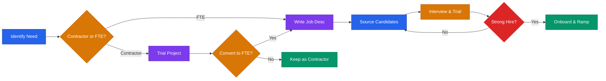

# Team & Hiring Playbook



## Core Rule
**Hire slow. Fire fast. The first 5 hires define your culture permanently.**

---

## When to Hire

Hire when:
- A specific role is blocking revenue or product — and you can name the blocker
- You've validated the need for 3+ months (not just 1 busy week)
- You can clearly define what "good" looks like in the role
- You have runway to cover 12+ months of their salary

Don't hire when:
- You're avoiding a hard problem by adding headcount
- You don't have time to onboard them properly
- The role is undefined ("we just need more help")
- You could solve it with a tool, automation, or contractor first

### The Hiring Ladder

Before making a full-time hire, exhaust cheaper options:

```
1. CAN YOU AUTOMATE IT?     → Use a tool (Zapier, templates, AI)
2. CAN YOU OUTSOURCE IT?    → Use a freelancer or agency for a project
3. CAN YOU CONTRACT IT?     → Hire a part-time contractor for 3 months
4. IS IT STILL A BOTTLENECK? → Now hire full-time
```

This saves months of salary and lets you test the role before committing.

---

## First 5 Hires Priority Order

For most startups:

1. **First engineer** (if founders aren't technical) — can build the product
2. **First salesperson** (if founders aren't selling) — can close revenue
3. **Customer success / support** — reduces churn, captures feedback
4. **Second engineer or designer** — product velocity
5. **Marketing / growth** — only after you have repeatable GTM

**Do not hire for ops, finance, or HR until you have real scale (20+ people).**

---

## Contractor-to-FTE Conversion

The safest hiring pattern for early-stage:

**Step 1 — Paid trial project (1-2 weeks)**
- Give them a real project with a clear deliverable
- Pay market rate — don't ask for free work
- Evaluate: quality, speed, communication, independence

**Step 2 — Part-time contract (1-3 months)**
- 10-20 hours/week on ongoing work
- Treat them like a team member (standups, Slack, context)
- Evaluate: consistency, culture fit, self-direction

**Step 3 — Full-time offer (if it's working)**
- Convert with a proper offer letter, equity, and onboarding
- Use the trial period data to set expectations

**Why this works:** You've de-risked the hire before committing salary + equity. The candidate has also de-risked YOU — they know what they're joining.

---

## Remote Hiring

Most early-stage startups hire remote. Do it well:

**What to look for in remote hires:**
- Strong written communication (this IS the work in remote)
- Self-directed — doesn't need to be told what to do next
- Proactive updater — shares progress without being asked
- Timezone overlap of at least 4 hours with core team

**Remote interview additions:**
- Ask: "Walk me through how you structure a work-from-home day"
- Give a take-home project instead of a whiteboard — better signal for async work
- Do one interview via async video (Loom) — tests their written/async communication

**Remote onboarding extras:**
- Virtual coffee chat with every team member in week 1
- Buddy system — pair them with someone for the first 30 days
- Daily 15-min check-in for the first 2 weeks, then taper

---

## Job Description Template

```
Title: [Specific — "Head of Sales" not "Growth Person"]

We're looking for: [2 sentences — what they'll do and why it matters]

You'll be great if you:
- [Required: specific, observable skill]
- [Required: mindset or working style]
- [Nice to have: bonus experience]

What you'll own in the first 90 days:
- [Concrete deliverable 1]
- [Concrete deliverable 2]
- [Concrete deliverable 3]

Compensation:
- Salary: $X–$X
- Equity: X% (4yr / 1yr cliff)
- [Benefits if any]

This is NOT a fit if you:
- [Anti-pattern 1]
- [Anti-pattern 2]
```

---

## Equity Ranges by Stage

| Role | Pre-Seed | Seed | Series A |
|------|----------|------|----------|
| Co-founder | 10-50% | N/A | N/A |
| CTO (if not co-founder) | 1-5% | 0.5-2% | 0.25-1% |
| First engineer | 0.5-2% | 0.25-1% | 0.1-0.5% |
| VP Engineering | N/A | 0.5-1.5% | 0.25-0.75% |
| VP Sales | N/A | 0.5-1% | 0.25-0.5% |
| First salesperson | 0.1-0.5% | 0.05-0.25% | 0.02-0.1% |
| Designer / Product | 0.25-1% | 0.1-0.5% | 0.05-0.25% |
| Advisor | 0.1-0.25% | 0.05-0.15% | 0.01-0.1% |

Source: Holloway Guide to Equity Compensation, AngelList benchmarks.

**Cash vs. equity tradeoff:** Early employees accept lower cash for higher equity. As you raise more, cash goes up and equity percentages go down. Always be transparent about the tradeoff.

---

## Interview Process (Early Stage, Lean)

Keep it to 3 rounds max. Respect candidate time.

**Round 1 (30 min):** Founder screen — culture, motivation, basics
**Round 2 (60 min):** Skills assessment — relevant work sample or case
**Round 3 (30 min):** Reference check + offer conversation

**Work sample examples:**
- Engineer: Code review or take-home challenge (<2 hours, paid)
- Salesperson: Mock cold call or discovery call roleplay
- Designer: Portfolio review + design critique
- Marketer: Critique your current website or write a sample post

**Pay for take-home work.** Even $200 shows respect and gets better candidates.

---

## Reference Check Questions

Call references — don't just email.

- "How would you describe [candidate]'s greatest strength?"
- "What's the area where they most need to grow?"
- "On a scale of 1-10, how likely are you to hire them again? Why not a 10?"
- "How did they handle a significant failure or setback?"
- "What type of environment brings out their best work?"

A lukewarm reference is a red flag. A great candidate has enthusiastic references.

---

## Onboarding (First 90 Days)

**Before Day 1:**
- Accounts, tools, access set up before they arrive
- Welcome message from founder
- First week schedule shared

**Day 1:**
- Meet the whole team (even if it's 2 people)
- Read company docs: mission, strategy, product overview
- First task assigned — something small they can ship today

**Week 1:**
- Shadow all key workflows
- Customer calls (even if not their role — everyone should hear customers)
- 1:1 with founder — learn context, ask anything

**30 / 60 / 90 Day Check-Ins:**
- What's going well?
- What's unclear or blocking you?
- What do you need from me to be successful?

**Success metric:** Can they operate independently in their role by day 90?

---

## Culture (Define It Early)

Culture is what you tolerate and what you reward — not what you write on the wall.

Define 3-5 cultural values with specific behavioral examples:

```
Value: [Name]
What it looks like: [Specific behavior we reward]
What violates it: [Specific behavior we don't tolerate]
```

Hire and fire according to these. Inconsistency kills culture.

### When to Fire

Fire when:
- Performance hasn't improved after clear feedback and a plan (30-60 day PIP)
- Culture violations (dishonesty, toxicity, harassment) — immediately
- The role no longer exists (be honest about this)

**How to fire well:** Direct, compassionate, final. Don't drag it out. Offer severance if you can. Be honest with the team about what happened (without oversharing).

**See also:** `crisis-difficult-templates.md` for separation communication templates.

---

> **Disclaimer:** This playbook provides educational frameworks for hiring and team building. Employment law varies by jurisdiction — consult an employment attorney for compliance questions. This is not legal or HR advice.
