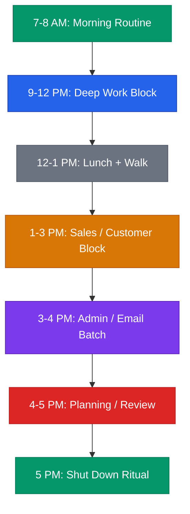

# Founder Time-Blocking System



## Core Rule
**You don't need more time. You need fewer priorities.** Pick 3 things per day. Do those. Everything else is a distraction disguised as urgency.

---

## The "Big 3" Daily Framework

Every morning before you open email, write down your Big 3:

```
Today's Big 3:
1. [Most important task — moves the business forward]
2. [Second priority — customer, product, or revenue related]
3. [Third priority — necessary but not urgent]

If I only finish #1 today, that's still a win.
```

**Rules:**
- Maximum 3 priorities. Not 5. Not 7. Three.
- At least one must be customer-facing (sales call, user interview, support).
- Write them on paper or a sticky note. Not in a project management tool with 47 other tasks.
- If you finish all 3 before 3pm, take the rest of the day for strategic thinking or rest.

---

## Weekly Time Allocation by Stage

Your calendar should reflect your company's stage, not your comfort zone.

### Stage 0: Pre-Product (Validation)

| Activity | Time | Hours/Week |
|----------|------|------------|
| Customer conversations | 70% | 28 hrs |
| Building / prototyping | 20% | 8 hrs |
| Admin / overhead | 10% | 4 hrs |

You should be uncomfortable with how much time you spend talking to people.

### Stage 1: Post-MVP (Early Revenue)

| Activity | Time | Hours/Week |
|----------|------|------------|
| Sales / outreach | 50% | 20 hrs |
| Product development | 30% | 12 hrs |
| Operations / admin | 20% | 8 hrs |

Revenue is the only metric that matters. Your calendar should prove it.

### Stage 2: Growth (Team of 3-10)

| Activity | Time | Hours/Week |
|----------|------|------------|
| Sales / customer success | 40% | 16 hrs |
| Product / roadmap | 30% | 12 hrs |
| Team / hiring / 1:1s | 20% | 8 hrs |
| Operations / admin | 10% | 4 hrs |

You are now splitting time between doing and managing. This is the hardest transition.

### Stage 3: Scaling (10+ People)

| Activity | Time | Hours/Week |
|----------|------|------------|
| Strategy / vision | 30% | 12 hrs |
| Fundraising / partnerships | 25% | 10 hrs |
| Team / culture / hiring | 25% | 10 hrs |
| Operations / admin | 20% | 8 hrs |

If you are still in the weeds on product or individual sales, you are the bottleneck.

---

## Daily Time Blocks

### Deep Work Block: 9:00 AM - 12:00 PM

**This is sacred. Protect it like revenue.**

- No meetings. No exceptions.
- Slack closed or set to Do Not Disturb.
- Phone on airplane mode or in another room.
- Work on Big 3 item #1 during this block.
- If someone asks for a meeting during this window, say: "I'm available after 1pm."

**What goes here:** Writing code, building features, writing proposals, strategic thinking, financial modeling, pitch deck work.

### Sales / Customer Block: 1:00 PM - 3:00 PM

- All customer calls, demos, and outreach happen here.
- Batch all sales emails at the start of this block.
- Follow-up calls and prospect research.
- User interviews if in validation stage.

**What goes here:** Sales calls, demos, customer check-ins, user interviews, partner conversations.

### Admin / Email Batch: 3:00 PM - 4:00 PM

- Process all email (aim for inbox zero by end of block).
- Respond to Slack messages accumulated during the day.
- Handle invoices, receipts, minor operational tasks.
- Sign documents, approve requests.

**What goes here:** Email, Slack catch-up, invoicing, admin tasks, quick approvals.

### Planning / Review: 4:00 PM - 5:00 PM

- Review what you accomplished against your Big 3.
- Set tomorrow's Big 3 (so you can start immediately the next morning).
- Update your project tracker or CRM.
- Flag blockers for tomorrow.

**What goes here:** Daily review, tomorrow planning, CRM updates, metric checks.

---

## Meeting Rules

1. **No meetings before 11:00 AM.** Your morning is for deep work.
2. **Maximum 3 meetings per day.** If you have more, cancel the least important one.
3. **Default meeting length: 25 minutes.** Not 30. The 5-minute buffer prevents back-to-back meeting fatigue.
4. **Every meeting needs an agenda sent in advance.** No agenda, no meeting.
5. **End every meeting with:** "Who does what by when?"
6. **Recurring meetings get audited monthly.** If a recurring meeting has no clear output, kill it.

### Meeting Decision Tree

```
Is this an email? → Send an email instead.
Is this a Slack message? → Send a Slack message instead.
Does this require real-time discussion? → Schedule a 25-min meeting.
Does this require deep collaboration? → Schedule a 50-min meeting (rare).
```

---

## Energy Management

Not all hours are equal. Match task difficulty to your energy level.

| Time of Day | Energy Level | Best Used For |
|-------------|-------------|---------------|
| 7-9 AM | Rising | Morning routine, exercise, Big 3 planning |
| 9-12 PM | Peak | Deep work, hardest problems, creative thinking |
| 12-1 PM | Dipping | Lunch, walk, recharge |
| 1-3 PM | Moderate | Meetings, calls, collaborative work |
| 3-5 PM | Declining | Admin, email, planning, low-stakes tasks |
| After 5 PM | Low | Rest. Stop working. Seriously. |

**Key insight:** Most founders waste peak energy on email and Slack. That is like using a power drill to stir coffee.

---

## Weekly Review Template (Friday, 30 Minutes)

Do this every Friday between 4:00 and 4:30 PM. Non-negotiable.

```
WEEKLY REVIEW — Week of [DATE]

1. BIG 3 SCORECARD
   Monday:    [Hit / Miss] — [what you did]
   Tuesday:   [Hit / Miss] — [what you did]
   Wednesday: [Hit / Miss] — [what you did]
   Thursday:  [Hit / Miss] — [what you did]
   Friday:    [Hit / Miss] — [what you did]

   Hit rate: [X/15] — Target: 10+

2. TOP WIN THIS WEEK
   [One sentence — the thing that moved the needle most]

3. BIGGEST BLOCKER
   [What slowed you down? What will you change?]

4. NEXT WEEK'S PRIORITIES
   Priority 1: [Must happen]
   Priority 2: [Should happen]
   Priority 3: [Nice to have]

5. CALENDAR AUDIT
   Hours in deep work:    [X] — Target: 15+
   Hours in meetings:     [X] — Target: under 10
   Hours on admin/email:  [X] — Target: under 5
   Hours on sales/customers: [X] — Target: stage-dependent

6. ENERGY CHECK
   [ ] Did I protect my morning block every day?
   [ ] Did I batch email instead of checking constantly?
   [ ] Did I take at least one real break per day?
   [ ] Did I stop working by 6 PM at least 3 days?
```

---

## Calendar Audit Template

Run this monthly. Categorize every event from last week into one of these buckets:

```
CALENDAR AUDIT — Week of [DATE]

Category A: Revenue-generating (sales, demos, customer calls)
  [List events] — Total hours: [X]

Category B: Product/building (deep work, coding, design)
  [List events] — Total hours: [X]

Category C: Team (1:1s, standups, hiring)
  [List events] — Total hours: [X]

Category D: Admin (email, finance, legal, misc)
  [List events] — Total hours: [X]

Category E: Waste (meetings with no outcome, context-switching)
  [List events] — Total hours: [X]

RESULTS:
  A + B should be > 60% of your week.
  E should be < 5%.
  If not, restructure next week.
```

---

## Common Traps

| Trap | Fix |
|------|-----|
| "I'll just check email quickly" at 9 AM | Email app stays closed until 3 PM |
| Back-to-back meetings all day | Hard cap at 3 meetings. Decline the rest. |
| Working until midnight "to catch up" | You are not behind. You have too many priorities. Cut. |
| Saying yes to every coffee chat | One networking meeting per week, max. Scheduled in the 1-3 PM block. |
| Context-switching every 20 minutes | Group similar tasks. Sales calls together. Admin together. |
| No plan for tomorrow | Spend 10 minutes at 4 PM planning. Start tomorrow with clarity. |

---

*This is a time management framework, not a rigid schedule. Adapt the clock times to your natural rhythm. The principle matters more than the specific hours: protect deep work, batch similar tasks, limit meetings, and plan before you execute.*
