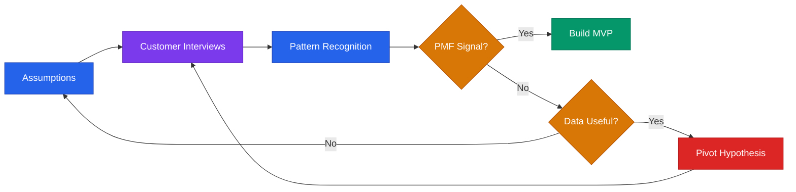

# Validation Playbook



## Core Rule
**Never build before you validate.** Talk to 10 customers before writing 1 line of code. A week of conversations saves months of wasted development.

---

## Assumption Mapping

Before validating, surface every assumption that could kill the business. Then rank them.

### The 5 Critical Assumptions

```
1. Customer:  Who exactly is this for? Can I name 10 specific people?
2. Problem:   Do they have this problem badly enough to pay? Or just complain?
3. Solution:  Does our approach actually solve it better than alternatives?
4. Channel:   Can we reach them at a viable cost? Where are they?
5. Revenue:   Will they pay? How much? Monthly or one-time?
```

### Assumption Risk Matrix

For each assumption, score two dimensions:

```
                    HIGH IMPACT IF WRONG
                    |
    Test these      |  TEST THESE FIRST
    second          |  (highest priority)
                    |
LOW UNCERTAINTY ----+---- HIGH UNCERTAINTY
                    |
    Skip these      |  Monitor these
    (safe enough)   |  (uncertain but survivable)
                    |
                    LOW IMPACT IF WRONG
```

**Always test the upper-right quadrant first** — high uncertainty AND high impact. If that assumption is wrong, nothing else matters.

### Assumption Log Template

```
ASSUMPTION LOG
==============
Date: [DATE]

#  | Assumption                    | Risk (H/M/L) | Test             | Result    | Action
1  | [ICP] has [problem]           | High          | 10 interviews    | [RESULT]  | [ACTION]
2  | They'll pay $[X]/mo           | High          | Pre-sale offer   | [RESULT]  | [ACTION]
3  | We can reach them via [channel]| Medium       | 50 outreach msgs | [RESULT]  | [ACTION]
4  | [Solution] solves it          | Medium        | Prototype test   | [RESULT]  | [ACTION]
5  | Market is large enough        | Low           | TAM analysis     | [RESULT]  | [ACTION]
```

---

## Customer Discovery Framework

### The Mom Test (Rob Fitzpatrick)

The core rule: **Ask about their life, not your idea.** People will lie to be nice. Design questions that prevent it.

**Bad questions (leading, hypothetical):**
- "Would you use this?" → They'll say yes to be polite
- "Do you think this is a good idea?" → Their opinion doesn't predict behavior
- "Would you pay $50/month for this?" → Hypothetical money isn't real
- "Don't you hate when [problem]?" → Leading question invites agreement

**Good questions (behavioral, specific, past-tense):**
- "Walk me through the last time you dealt with [problem]."
- "What did you actually do about it?"
- "How much did that cost you — in time, money, or frustration?"
- "Have you looked for solutions? What did you find? Why didn't you buy it?"
- "What's the most frustrating part of how you handle this today?"
- "If you could wave a magic wand, what would change?"

**The Mom Test Golden Rules:**
1. Talk about their life, not your idea
2. Ask about specifics in the past, not generics about the future
3. Talk less, listen more — if you're talking >30% of the time, you're doing it wrong
4. Get commitments, not compliments — "interesting" means nothing; "can I pre-order?" means everything
5. Bad news is good news early — finding out the idea is wrong at interview #5 saves you 6 months

### Interview Structure (20-30 min)

```
SETUP (2 min):
  "Thanks for taking the time. I'm researching [problem area].
   No pitch — just trying to learn from people who deal with this."

PROBLEM EXPLORATION (12-15 min):
  1. "Tell me about your role and what a typical week looks like."
  2. "When was the last time you dealt with [problem area]?"
  3. "Walk me through what happened."
  4. "What was the hardest part?"
  5. "How are you solving it today?"
  6. "How much does that cost you — time, money, or missed opportunities?"

BEHAVIOR & ALTERNATIVES (5-8 min):
  7. "Have you looked for a better solution? What did you find?"
  8. "Why didn't you buy [existing alternative]?"
  9. "What would have to be true for you to switch from your current approach?"

CLOSE (3 min):
  10. "Who else deals with this that I should talk to?"
  11. "Can I follow up in a few weeks with what we've learned?"
```

**After every interview — debrief within 10 minutes:**
- Top 3 insights
- Best direct quotes (verbatim — these are gold)
- Did this confirm or challenge my assumptions?
- What should I ask differently next time?

---

## Validation Tests (Ordered by Effort)

### Tier 1: Low Effort (1-3 days)

**Smoke Test Landing Page**
- Build a simple page describing the value proposition
- Include a clear CTA ("Join waitlist" / "Get early access")
- Drive traffic from relevant communities
- **Validates:** Does the positioning resonate? Will people opt in?
- **Green signal:** >5% visitor-to-signup conversion
- **Red signal:** <1% conversion or zero signups after 200+ visitors

**Fake Door / Feature Test**
- Add a button or link for a feature you haven't built
- Track clicks. Show "coming soon" message on click.
- **Validates:** Do users want this specific feature?
- **Green signal:** >10% click rate from users who see the button

**Community Validation**
- Post your problem statement (not solution) in 3-5 relevant communities
- Track responses, DMs, "me too" reactions
- **Validates:** Do real people in the wild confirm the problem?
- **Green signal:** Strangers DM you asking for the solution

### Tier 2: Medium Effort (1-2 weeks)

**Pre-Sell Offer**
- Describe the product. Set a price. Ask for payment before building.
- Offer early-bird pricing (30-50% off) and a delivery date
- **Validates:** Will people pay real money before the product exists?
- **Green signal:** 3+ pre-sales from people who aren't friends/family
- **See:** `first-revenue.md` Path 1 for the full pre-sale playbook

**Concierge MVP**
- Deliver the result manually to 3-5 customers
- Charge full price. Track your time per customer.
- **Validates:** Is the outcome valuable? Can you deliver it?
- **Green signal:** Customers want to continue after the manual period
- **See:** `first-revenue.md` Path 5 for the services wrapper approach

**Wizard of Oz MVP**
- Front-end looks automated. Back-end is you doing it manually.
- Customer doesn't know (or doesn't care) that it's not automated.
- **Validates:** Does the experience work? Would automation be worth building?
- **Green signal:** Users treat it as a real product and get real value

### Tier 3: High Effort (2-4 weeks)

**Working Prototype**
- Build the minimum possible version that tests the core hypothesis
- Not feature-complete — just the one thing that matters most
- **Validates:** Does the technology solve the problem?
- **Green signal:** Users complete the core workflow without hand-holding

**Paid Pilot**
- 5-10 customers at 50-70% of target price for 30-90 days
- Weekly check-ins. Structured feedback.
- **Validates:** Will they pay, use it, and stay?
- **Green signal:** >60% convert to full price at pilot end
- **See:** `first-revenue.md` Path 3 for the full pilot playbook

---

## Minimum Viable Tests by Business Type

Different business models need different validation approaches:

| Business Type | Best First Test | What You're Looking For |
|--------------|----------------|------------------------|
| B2B SaaS | 10 problem interviews + 3 pre-sales | "How much does this cost you today?" |
| B2C App | Landing page + community validation | Viral sharing, organic signups |
| Marketplace | Supply-side interviews + demand-side waitlist | Can you get both sides interested? |
| Hardware | Pre-orders via Kickstarter/Indiegogo | Will 100+ people commit money? |
| Services / Agency | 3 paid clients (concierge) | Can you deliver + charge profitably? |
| API / Developer Tool | GitHub repo + docs + Hacker News post | Stars, forks, genuine usage |
| E-commerce / D2C | Small batch + paid ads test ($200) | Cost per acquisition vs. margin |
| Content / Media | 10 published pieces + subscriber growth | Retention and engagement, not just views |

---

## PMF Signals

### How to Know You Have Product-Market Fit

| Signal | Strong PMF | Weak / No PMF |
|--------|-----------|---------------|
| Retention | Users come back without prompting | High churn, re-engagement campaigns needed |
| Word of mouth | Organic referrals happening | All growth is paid or founder-driven |
| Sean Ellis test | >40% "very disappointed" if product disappeared | <40% — nice-to-have, not must-have |
| Demand vs. capacity | Struggling to keep up | Struggling to get attention |
| Sales cycle | Getting shorter over time | Staying the same or getting longer |
| Churn | Decreasing as you improve | Flat or increasing despite improvements |
| Customer emotion | "I love this" / "how did I live without this?" | "It's fine" / "it's interesting" |

### The Sean Ellis Test

Ask existing users: *"How would you feel if you could no longer use [product]?"*
- Very disappointed
- Somewhat disappointed
- Not disappointed
- I no longer use [product]

**>40% "very disappointed" = PMF.** Below that, keep iterating.

**When to run it:** After you have 30+ active users who have used the product at least twice. Don't run it on day 1 — wait until they've experienced the core value.

### When You DON'T Have PMF Yet

**No PMF signals:** High acquisition but high churn. Users sign up but don't stay. This means your marketing works but your product doesn't.

**What to do:**
1. Stop spending on acquisition — it's waste until retention improves
2. Interview churned users: "What would have made you stay?"
3. Interview power users: "What keeps you coming back?"
4. Double down on whatever the power users love
5. Kill features that nobody uses

---

## Kill Criteria

Consider killing or pivoting if:
- Fewer than 3 of 10 interviews confirm the problem is painful
- No one has tried to solve it themselves (low pain = low willingness to pay)
- They say "yes" but won't pre-pay, join a waitlist, or give a referral
- The willingness-to-pay is below your cost to serve
- You've tested 3 different audiences and none care enough
- After 20+ interviews, you still can't describe the ICP in one sentence

**Pivoting is not failing.** It's the whole point of validation — to learn what works before you invest months building the wrong thing.

**See also:** `resilience.md` for the emotional side of pivoting | `first-revenue.md` for monetizing what you've learned | `customer-discovery.md` for detailed interview scripts | [validation-advanced.md](validation-advanced.md) for Jobs To Be Done framing and a 1-week validation sprint plan

---

> **Disclaimer:** This playbook provides educational frameworks for startup validation. Customer discovery methods should be adapted to your specific industry and context. This is not professional business advice.
