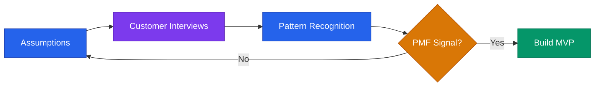

# Validation Playbook



## Core Rule
**Never build before you validate.** Talk to 10 customers before writing 1 line of code.

---

## Assumption Mapping

Before validating, surface the riskiest assumptions:

```
1. Customer: [Who exactly is this for?]
2. Problem: [Do they have this problem badly enough to pay?]
3. Solution: [Does our approach actually solve it?]
4. Channel: [Can we reach them at a viable cost?]
5. Revenue: [Will they pay? How much?]
```

Start by testing assumptions in order. Kill bad ideas early.

---

## Customer Discovery Framework

### The Mom Test (Rob Fitzpatrick)
Ask about their life, not your idea.

**Bad questions:**
- "Would you use this?"
- "Do you think this is a good idea?"
- "Would you pay for this?"

**Good questions:**
- "Walk me through the last time you dealt with [problem]."
- "What do you currently do to solve this?"
- "How much does that cost you — in time and money?"
- "What's the most frustrating part of your current solution?"
- "Have you tried to fix this before? What happened?"

### Interview Structure (30 min)
1. Warm up — their background, context (5 min)
2. Explore the problem space — open questions (15 min)
3. Understand current behavior — what do they do today? (7 min)
4. Close — ask for referrals (3 min)

**Never pitch during discovery calls.** Just listen.

---

## Validation Tests (in order of effort)

| Test | Effort | What It Proves |
|------|--------|----------------|
| Smoke test landing page | Low | Do people click "sign up"? |
| Fake door / waitlist | Low | Will they give you an email? |
| Pre-sell offer | Medium | Will they pay before you build? |
| Concierge MVP | Medium | Can you deliver value manually? |
| Wizard of Oz MVP | Medium | Does the experience work without the tech? |
| Working prototype | High | Does it solve the problem? |
| Paid pilot | High | Will they pay real money? |

---

## PMF Signals

You have product-market fit when:
- Retention is strong (users come back without prompting)
- Word of mouth is happening organically
- The "40% rule": >40% of users would be "very disappointed" if your product disappeared (Sean Ellis test)
- You're struggling to keep up with demand, not create it
- Churn is decreasing as you improve the product

**No PMF signals:** High acquisition but high churn. Keep validating — don't scale yet.

---

## Jobs To Be Done (JTBD)

Frame every product decision around the job the customer is hiring your product to do.

```
When [situation], I want to [motivation], so I can [outcome].
```

Example:
> "When I'm trying to track co-parenting communications for court, I want a neutral documentation tool, so I can protect my child and my legal position."

Define your top 3 JTBD statements before building anything.

---

## Validation Sprint (1 Week)

| Day | Action |
|-----|--------|
| Mon | Define top 3 assumptions. Build smoke test page. |
| Tue | Share in 5 communities / with 20 personal contacts. |
| Wed | Run 3 customer discovery calls. |
| Thu | Run 3 more calls. Analyze patterns. |
| Fri | Summarize learnings. Kill or continue. |

---

## Kill Criteria

Consider killing or pivoting if:
- Fewer than 3 of 10 interviews confirm the problem is painful
- No one has tried to solve it themselves (low pain signal)
- They say "yes" but won't pre-pay or join a waitlist
- The willingness-to-pay is below your cost to serve
