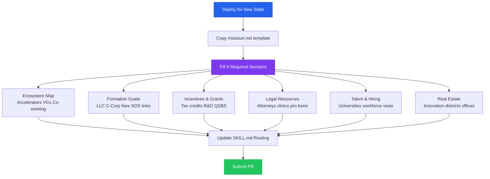
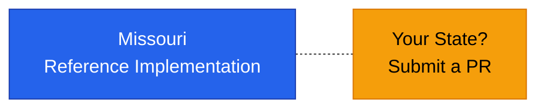

# Regional Deployment Guide

## State Deployment Process



## Current Deployments



## Purpose

Access to Business is designed for **state-level deployment**. Each state or region gets
its own file covering the local startup ecosystem, formation requirements, incentives,
legal resources, talent pipelines, and real estate options.

Missouri is the **reference implementation**. Use it as a template for new states.

---

## How to Deploy for a New State

### Step 1: Copy the Template

```bash
cp references/regional/missouri.md references/regional/[your-state].md
```

### Step 2: Replace All Sections

Each state file must cover these sections:

| Section | What to Include |
|---------|----------------|
| **Ecosystem Map** | Accelerators, incubators, VCs, angel groups, university programs, co-working spaces, startup events |
| **Formation Guide** | State-specific LLC and C-Corp formation steps, fees, registered agent requirements, SOS links |
| **Incentives & Grants** | State tax credits, non-dilutive grants, angel investor credits, R&D credits, QSBS treatment |
| **Legal Resources** | Startup-friendly attorneys, legal aid, law school clinics, pro bono programs |
| **Talent & Hiring** | University pipelines, workforce programs, salary benchmarks, visa resources |
| **Real Estate** | Innovation districts, co-working spaces, office lease guidance by metro |

### Step 3: Source Your Data

Recommended primary sources:
- State Secretary of State website (formation)
- State economic development agency (incentives)
- SBA district office (resources)
- Local bar association (legal aid)
- University tech transfer offices (talent)
- State workforce development board (hiring programs)

### Step 4: Update SKILL.md Routing

Add your state to the Regional Directory Routing table in SKILL.md:

```markdown
| [State] ecosystem, accelerators, formation, incentives | `references/regional/[state].md` |
```

### Step 5: Submit a PR

Title: `Add regional deployment: [State Name]`

Include:
- The new state file
- Updated SKILL.md routing table
- Sources cited in the file

---

## Quality Checklist

Before submitting:

- [ ] All 6 sections populated with state-specific data
- [ ] Links verified and working
- [ ] Fees and deadlines current
- [ ] No Missouri-specific content remaining
- [ ] Educational-information disclaimer included
- [ ] Sources cited where possible

---

## Current Deployments

| State | File | Status |
|-------|------|--------|
| Missouri | `missouri.md` | Reference implementation |

---

## File Template

See `missouri.md` for the complete structure. Key conventions:
- Use tables for structured data (accelerators, grants, firms)
- Include direct URLs where available
- Note effective dates for fees and deadlines
- Mark items as "verify current" when data may change frequently
