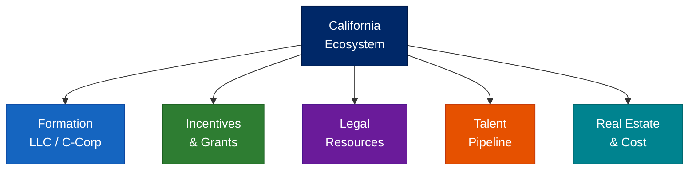

# California — Regional Deployment

**Part of Access to Business — Pillar 7 of the Access To Initiative**

**Disclaimer:** Program details, availability, fees, and contact information change.
Always verify directly with each organization before applying or reaching out.
This is educational context — not legal, tax, or financial advice.

---

## Table of Contents

1. California Startup Quick Facts
2. Ecosystem Map (Bay Area, Los Angeles, San Diego, Statewide)
3. Formation Guide (LLC vs C-Corp)
4. Incentives & Grants
5. Legal Resources
6. Talent & Real Estate

---

## 1. California Startup Quick Facts

- **Largest state startup ecosystem** — home to Silicon Valley, the global center of venture capital
- **~50% of all US VC funding** flows through California-based startups
- **No enforcement of non-compete agreements** — employees can move freely (Business and Professions Code 16600)
- **QSBS exclusion partially recognized** — California does NOT conform to federal Section 1202 QSBS exclusion (gains are taxed at state level)
- **High tax burden** — top marginal state income tax rate is 13.3%; significant franchise tax ($800 minimum)
- **Three major metros:** Bay Area (VC/tech), Los Angeles (media/commerce/space), San Diego (biotech/defense)
- **University pipeline:** Stanford, UC Berkeley, UCLA, Caltech, USC, UCSD — world-class talent

---

## 2. Ecosystem Map

## Bay Area — Accelerators & Incubators

### Y Combinator (San Francisco)
- **Type:** Accelerator (equity-based)
- **Investment:** $500K standard deal ($125K for 7% + $375K on uncapped MFN SAFE)
- **Focus:** Any sector; software-heavy
- **Program:** 3-month batch; Demo Day pitch to top-tier VCs
- **Website:** ycombinator.com
- **Apply:** Biannual cycle (winter + summer batches)
- **Notable:** Most successful startup accelerator globally; alumni include Airbnb, Stripe, Dropbox

### Techstars (Multiple CA locations)
- **Type:** Accelerator (equity-based)
- **Investment:** $120K for 6% equity
- **Focus:** Various verticals; strong mentor network
- **Website:** techstars.com

### 500 Global (San Francisco)
- **Type:** Accelerator + venture fund
- **Investment:** $150K for 6% equity
- **Focus:** Global; diverse founders
- **Website:** 500.co

### Berkeley SkyDeck (UC Berkeley)
- **Type:** University accelerator
- **Focus:** UC Berkeley-affiliated startups
- **Program:** 6-month cohort with mentorship + funding
- **Website:** skydeck.berkeley.edu

### Stanford StartX (Stanford University)
- **Type:** University startup community (no equity taken)
- **Focus:** Stanford-affiliated founders
- **Services:** Community, mentorship, discounted resources
- **Website:** startx.com

### Plug and Play (Sunnyvale)
- **Type:** Accelerator + corporate innovation
- **Focus:** Enterprise tech, fintech, health, supply chain
- **Investment:** Varies by program
- **Website:** plugandplaytechcenter.com

---

## Los Angeles — Accelerators & Ecosystem

### Amplify LA
- **Type:** Accelerator
- **Focus:** Consumer internet, SaaS, marketplaces
- **Website:** amplify.la

### Grid110 (Downtown LA)
- **Type:** Free startup accelerator (no equity taken)
- **Focus:** Early-stage tech startups in LA
- **Website:** grid110.org

### Luma Launch (LA)
- **Type:** Accelerator for diverse founders
- **Focus:** Early-stage, underrepresented founders
- **Website:** lumalaunch.com

### LA Cleantech Incubator (LACI)
- **Type:** Cleantech incubator
- **Focus:** Clean energy, transportation, sustainable tech
- **Location:** Downtown LA Arts District
- **Website:** laincubator.org

---

## San Diego — Accelerators & Ecosystem

### CONNECT (San Diego)
- **Type:** Nonprofit innovation accelerator
- **Focus:** Life sciences, cleantech, tech
- **Website:** connect.org

### EvoNexus (San Diego / Irvine)
- **Type:** Free incubator (no equity taken)
- **Focus:** Tech startups
- **Website:** evonexus.org

### Qualcomm Thinkabit Lab / Qualcomm Ventures
- **Focus:** Hardware, IoT, mobile, 5G
- **Investment:** Strategic venture capital

---

## Major California VC Firms

| Firm | Stage | Focus | Location |
|------|-------|-------|----------|
| Sequoia Capital | Seed–Growth | Broad tech | Menlo Park |
| Andreessen Horowitz (a16z) | Seed–Growth | Software, crypto, bio | Menlo Park |
| Benchmark | Series A–B | Consumer, enterprise | San Francisco |
| Greylock Partners | Seed–Series B | Enterprise, consumer | Menlo Park |
| Lightspeed Venture Partners | Seed–Growth | Enterprise, consumer, health | Menlo Park |
| Kleiner Perkins | Early–Growth | Climate, health, enterprise | Menlo Park |
| Accel | Seed–Growth | SaaS, fintech, security | Palo Alto |
| GV (Google Ventures) | Seed–Growth | Broad tech, life sciences | Mountain View |
| Founders Fund | Seed–Growth | Deep tech, aerospace, bio | San Francisco |
| Upfront Ventures | Seed–Series A | LA-focused, broad tech | Los Angeles |

---

## Statewide Programs

### California Small Business Development Centers (SBDC)
- **Type:** Free consulting + training (federally funded)
- **Locations:** 40+ centers statewide
- **Website:** casbdc.org

### CalOSBA (California Office of the Small Business Advocate)
- **Type:** State business support agency
- **Services:** Resources, contracting assistance, regulatory help
- **Website:** calosba.ca.gov

### SCORE California
- **Type:** Free mentoring (volunteer executives)
- **Chapters:** Los Angeles, Bay Area, San Diego, Sacramento, and more
- **Website:** score.org

---

## 3. Formation Guide

## Step 1: Choose Your Entity

### California LLC — Best for:
- Bootstrapped or lifestyle businesses
- Service businesses, agencies, solo operators
- Businesses where pass-through taxation is preferred
- Situations where VC funding is NOT planned

**California LLC pros:**
- Pass-through taxation (no double tax at entity level)
- Flexible management structure
- Asset protection

**California LLC cons:**
- **$800 annual franchise tax** (due even if no revenue — waived for first year for new LLCs formed 2021–2023; verify current status)
- VCs typically won't invest in LLCs
- Not eligible for QSBS federal tax exclusion
- California taxes LLC gross receipts above $250K (additional LLC fee up to $11,790)

### Delaware C-Corp — Best for (even in California):
- Startups planning to raise venture capital
- Companies issuing stock options to employees
- Businesses seeking federal QSBS qualification (note: CA does not conform)
- Companies planning to scale and eventually exit

**Delaware C-Corp pros:**
- Required/preferred by virtually all institutional investors
- Federal QSBS eligibility (up to $10M tax-free gain — but California taxes the gain)
- Flexible stock structure (common, preferred, options)
- Well-established case law for corporate governance

**Delaware C-Corp cons:**
- Must register as foreign corporation in California (~$100)
- California franchise tax: **$800 minimum** annually
- California does NOT conform to federal QSBS Section 1202 exclusion — gains taxed at state level
- Double taxation (corporate + dividend) unless S-Corp election

### California C-Corp — Rarely recommended
- Use Delaware C-Corp instead; California C-Corp offers no advantage and investors expect Delaware

---

## Forming a California LLC — Step by Step

**Total cost:** ~$870+ first year | **Time:** 3-5 business days

### Step 1: Choose a Name
- Must include "LLC", "L.L.C.", or "Limited Liability Company"
- Check availability: **bizfileOnline.sos.ca.gov** → Business Search
- Optional: Reserve the name for 60 days ($10 fee)

### Step 2: File Articles of Organization
- File online at: **bizfileOnline.sos.ca.gov**
- Fee: **$70**
- Processing: 3-5 business days online
- Required information: LLC name, address, organizer info, agent for service of process

### Step 3: Designate an Agent for Service of Process
- Required — must have a California address
- Can be yourself or a registered agent service (~$50–$200/year)

### Step 4: Get Your EIN
- Free and immediate at: **irs.gov/ein**

### Step 5: File Statement of Information
- Required within 90 days of formation, then biennially
- Fee: **$20**
- File at: **bizfileOnline.sos.ca.gov**

### Step 6: Draft an Operating Agreement
- Not legally required in California but critically important
- Governs: ownership, profit distribution, decision-making, exit

### Step 7: Open a Business Bank Account
- Recommended: **Mercury** (online, startup-friendly), **Relay**, or local credit union

### Step 8: Register for California Taxes
- California Franchise Tax Board (FTB): **ftb.ca.gov**
- **$800 annual franchise tax** — due by the 15th day of the 4th month after formation
- Register for sales tax at: **cdtfa.ca.gov** (if selling taxable goods)
- Register for employer taxes at: **edd.ca.gov** (if hiring)

### Step 9: Local Business Licenses
- California has no statewide business license
- **Most cities and counties require a business license** — check with your city clerk
- San Francisco: Business Registration Certificate required
- Los Angeles: Business Tax Registration Certificate required

---

## Forming a Delaware C-Corp (Operating in California) — Step by Step

**Total cost:** ~$1,000–$2,000 first year | **Time:** 1–7 days

### Step 1: Incorporate in Delaware
- Services: **Stripe Atlas** ($500), **Clerky** ($399+), **Firstbase** ($399)
- Or attorney: $1,500–$5,000 for full startup package
- Standard: 10,000,000 common shares at $0.0001 par value

### Step 2: Qualify as Foreign Corporation in California
- File at: **bizfileOnline.sos.ca.gov** → Foreign Corporation Registration
- Fee: **$100**
- Requires: Certificate of Good Standing from Delaware

### Step 3: California Franchise Tax
- **$800 minimum** annually (California FTB)
- Due regardless of revenue
- Note: California taxes based on California-source income

### Step 4: Issue Founder Stock + File 83(b) Election
- Issue stock immediately after incorporation
- **File 83(b) election within 30 days** — mail to IRS (certified, return receipt)

### Step 5: Adopt Corporate Documents
- Bylaws, board resolutions, stock option plan, IP assignments

### Step 6: Delaware Annual Requirements
- Franchise tax: ~$400/year minimum (due March 1)
- Annual report filing

---

## 4. Incentives & Grants

## California-Specific Programs

### California Competes Tax Credit (CalCompetes)
- **Type:** Income tax credit for businesses locating/expanding in California
- **Amount:** Negotiated; based on jobs created and investment
- **Administered by:** Governor's Office of Business and Economic Development (GO-Biz)
- **Website:** business.ca.gov/california-competes-tax-credit
- **Best for:** Startups making significant hiring commitments in California

### CalSEED (California Sustainable Energy Entrepreneur Development)
- **Type:** Non-dilutive grants
- **Amount:** Up to $150K (concept) + $450K (prototype)
- **Focus:** Clean energy innovation
- **Website:** calseed.fund

### Small Business Innovation Research (SBIR) / STTR
- **Phase I:** Up to $275,000
- **Phase II:** Up to $1,750,000
- **Website:** sbir.gov
- **Note:** California companies win more SBIR awards than any other state

### California Infrastructure & Economic Development Bank (IBank)
- **Type:** State financing authority
- **Programs:** Small Business Finance Center, loan guarantees
- **Website:** ibank.ca.gov

### SBA Microloans (California intermediaries)
- **Amount:** Up to $50K
- **Intermediaries:** Opportunity Fund, VEDC, CDC Small Business Finance
- **Best for:** Pre-revenue and very early-stage

---

## California Tax Considerations

### What California Does NOT Have:
- **No QSBS conformity** — California does not exclude Section 1202 qualified small business stock gains from state income tax. Plan accordingly.
- **No angel investor tax credit** (unlike Missouri and many other states)

### What California Does Have:
- **California R&D Tax Credit** — 24% of qualifying research expenses (vs. 20% federal)
- **$800 annual franchise tax** for all entities (LLC and corporation)
- **Top marginal income tax: 13.3%** (on income over ~$1M)
- **LLC gross receipts fee** — additional fee for LLCs with gross receipts over $250K (ranges $900–$11,790)
- **No state-level capital gains preference** — capital gains taxed as ordinary income

### Federal Tax Benefits (Applicable to CA Startups)

**QSBS (Section 1202):**
- Federal: Up to $10M tax-free capital gains exclusion
- **California: Does NOT conform** — gains are fully taxable at state level
- Practical impact: A CA founder selling QSBS stock for $10M gain pays $0 federal tax but ~$1.3M in California tax

**R&D Tax Credit:**
- Federal: 20% of qualified research expenses
- California: **24%** of qualified research expenses (more generous than federal)
- Pre-revenue startups can offset payroll taxes with federal credit (up to $500K/year)

---

## 5. Legal Resources

## Startup-Friendly Law Firms — Bay Area

### Wilson Sonsini Goodrich & Rosati
- **Focus:** Startup/VC specialist; corporate, IP, M&A
- **Startup relevance:** Represents more VC-backed companies than any other firm
- **Website:** wsgr.com

### Cooley LLP
- **Focus:** National startup specialist; formation through IPO
- **Website:** cooley.com

### Gunderson Dettmer
- **Focus:** VC-backed companies exclusively
- **Website:** gunder.com

### Fenwick & West
- **Focus:** Technology and life sciences
- **Website:** fenwick.com

### Orrick, Herrington & Sutcliffe
- **Focus:** Technology, energy, finance
- **Free tools:** Orrick Term Sheet Generator (tsc.orrick.com)
- **Website:** orrick.com

---

## Startup-Friendly Law Firms — Los Angeles

### Stubbs Alderton & Markiles
- **Focus:** LA tech and emerging companies
- **Website:** stubbsalderton.com

### Russ August & Kabat
- **Focus:** IP, entertainment, technology
- **Website:** raklaw.com

---

## Low-Cost & Pro Bono Legal Resources

### Legal Aid Foundation of Los Angeles (LAFLA)
- **For:** Low-income individuals and small businesses
- **Website:** lafla.org

### Bay Area Legal Aid
- **For:** Low-income entrepreneurs in the Bay Area
- **Website:** baylegal.org

### Startup Legal Garage (UC Berkeley Law)
- **For:** Early-stage startups
- **Services:** Free legal consultations from law students supervised by attorneys
- **Website:** law.berkeley.edu

### USC Gould Small Business Clinic
- **For:** LA-area small businesses
- **Services:** Formation, contracts, basic IP
- **Website:** gould.usc.edu

### Free Standard Documents
- **YC SAFE Notes:** ycombinator.com/documents
- **NVCA Model Documents:** nvca.org
- **Cooley GO Docs:** cooleygo.com
- **Orrick Term Sheet Generator:** tsc.orrick.com

---

## California-Specific Legal Considerations

### Non-Compete Agreements
- **California does not enforce non-competes** (Business and Professions Code 16600)
- Employees can leave and join or start a competitor freely
- Non-solicitation agreements have limited enforceability
- Trade secret protection (via NDA + CUTSA) is your primary tool

### California Consumer Privacy Act (CCPA / CPRA)
- Applies to businesses with >$25M revenue, >100K consumers' data, or >50% revenue from selling data
- Requires privacy policy, opt-out mechanisms, data access/deletion rights
- Penalties: Up to $7,500 per intentional violation
- Startups should build privacy compliance early

### California Employment Law
- California is an at-will employment state with strong employee protections
- Exempt vs. non-exempt classification is aggressively enforced
- Meal and rest break requirements (penalties for violations)
- California minimum wage: Check current rate at dir.ca.gov (often higher than federal)
- Many cities (SF, LA, San Jose) have higher local minimums

### California Securities Law
- California's securities exemptions differ from federal
- Consult securities counsel before any offering

---

## 6. Talent & Real Estate

### Salary Benchmarks (California vs. National Average)

California salaries — particularly Bay Area — are among the highest in the US.

| Role | Bay Area Range | LA Range | National Avg |
|------|---------------|----------|-------------|
| Software Engineer (mid) | $140K–$200K | $120K–$160K | $100K–$130K |
| Product Manager | $150K–$200K | $130K–$170K | $100K–$140K |
| Sales (AE, mid-market) | $100K–$150K base | $90K–$130K | $70K–$100K |
| Data Scientist | $150K–$200K | $130K–$170K | $100K–$140K |
| Marketing Manager | $110K–$150K | $90K–$130K | $75K–$100K |
| Customer Success | $80K–$120K | $70K–$100K | $55K–$80K |

*Benchmarks approximate; verify with Levels.fyi, Glassdoor, LinkedIn Salary, or local recruiters.*

### University Pipeline

**Stanford University** — CS, engineering, MBA, AI/ML, bioengineering
**UC Berkeley** — CS, engineering, data science, business (Haas)
**UCLA** — CS, engineering, film/media, MBA (Anderson)
**Caltech** — Deep tech, hardware, physics, aerospace
**USC** — Business, film/media, engineering, gaming
**UCSD** — Biotech, engineering, computer science
**UC Santa Barbara** — Materials science, quantum computing
**UC Davis** — Agtech, food science, veterinary

### Key Hiring Platforms

| Platform | Best For |
|----------|---------|
| LinkedIn | All roles; strong California penetration |
| Wellfound (AngelList) | Startup roles; equity-conscious candidates |
| Levels.fyi | Compensation benchmarking for tech roles |
| Hired | Tech talent matching |
| Built In SF / Built In LA | Local tech job boards |
| Handshake | University students and new grads |

---

## Co-Working & Office Space — Bay Area

### WeWork (Multiple Bay Area locations)
- Flexible terms; many SF/South Bay locations
- Cost: $400–$800/desk/month

### Galvanize (San Francisco)
- **Type:** Co-working + coding school
- **Location:** SoMa, San Francisco
- **Best for:** Technical founders

### Hacker Dojo (Mountain View)
- **Type:** Community workspace
- **Cost:** Low-cost membership
- **Best for:** Hardware and software hackers

### Plug and Play (Sunnyvale)
- Co-working alongside accelerator programs

---

## Co-Working & Office Space — Los Angeles

### Cross Campus (Multiple LA locations)
- Startup-friendly co-working
- Locations: Downtown LA, Santa Monica, Pasadena

### WeWork (Multiple LA locations)
- Santa Monica, Downtown LA, Hollywood, Playa Vista

### Bixel Exchange / LACI (Downtown LA)
- Cleantech and social impact focused

---

## Real Estate Considerations for California Startups

### When to Get an Office
- Pre-revenue: Remote-first or co-working. Do not sign a lease.
- Post-seed: Co-working or short-term flex space
- Post-Series A: Consider office; negotiate 1-year lease with renewal option
- **Rule:** California commercial leases can be expensive — don't commit beyond your runway

### Cost Context
- San Francisco office: $50–$80/sq ft/year (post-COVID correction from $80–$100+)
- South Bay (Palo Alto, Mountain View): $50–$70/sq ft/year
- Los Angeles (Santa Monica, Playa Vista): $40–$60/sq ft/year
- San Diego: $30–$50/sq ft/year
- **Remote-first is increasingly common** — many CA startups now hire nationally to manage costs

---

> **Disclaimer:** This regional deployment provides educational information about the California startup ecosystem. Program details, fees, and availability change frequently. Always verify directly with each organization. This is not legal, tax, or financial advice. Consult qualified professionals for entity formation, tax planning, and compliance decisions.
