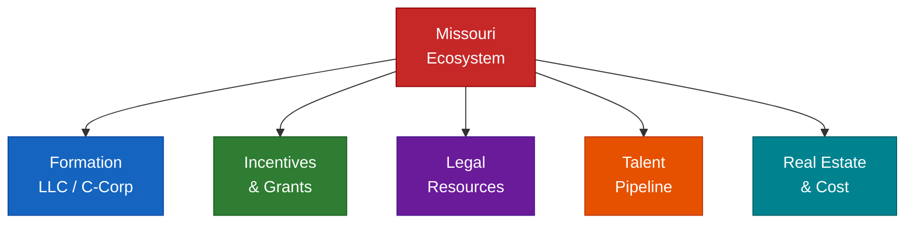

# Missouri — Regional Deployment (Reference Implementation)

**Part of Access to Business — Pillar 7 of the Access To Initiative**

**Disclaimer:** Program details, availability, fees, and contact information change.
Always verify directly with each organization before applying or reaching out.
This is educational context — not legal, tax, or financial advice.

---

## Table of Contents

1. Missouri Startup Quick Facts
2. Ecosystem Map (St. Louis, Kansas City, Statewide)
3. Formation Guide (LLC vs C-Corp)
4. Incentives & Grants
5. Legal Resources
6. Talent & Real Estate

---

## 1. Missouri Startup Quick Facts

- **No state-level capital gains tax** on QSBS — one of few states with this advantage
- **Missouri Angel Investor Tax Credit** — 40% credit on qualified investments
- **Strong life sciences + defense corridors** — BJC/WashU, Boeing, Centene create enterprise customer opportunities
- **Lower cost of living** than coastal hubs — salary leverage for early hires
- **Two major metros:** St. Louis (finance, health, agtech, defense) + Kansas City (fintech, animal health, agtech)
- **University pipeline:** WashU, Mizzou, SLU, UMKC, Missouri S&T — active tech transfer programs

---

## 2. Ecosystem Map

## St. Louis — Accelerators & Incubators

### Capital Innovators
- **Type:** Accelerator (equity-based)
- **Investment:** ~$50K for ~6% equity
- **Focus:** Tech startups, B2B SaaS, enterprise software
- **Program:** 10-week intensive, cohort-based
- **Notable alumni:** Asynchrony (acquired), Bonfyre, Summery
- **Website:** capitalinnovators.com
- **Apply:** Rolling applications; cohorts ~2x/year

### Arch Grants
- **Type:** Non-dilutive grant program
- **Amount:** $50,000 grants (no equity taken)
- **Requirement:** Relocate or be based in St. Louis for 1 year
- **Focus:** Any sector; emphasis on scalable tech
- **Competitive:** ~300+ applicants per cycle; ~15 grants awarded
- **Website:** archgrants.org
- **Apply:** Annual cycle; typically opens Q1

### ITEN (IT Entrepreneurship Network)
- **Type:** Nonprofit support network
- **Cost:** Free membership
- **Services:** Mentorship, networking, pitch coaching, office hours
- **Focus:** Tech startups in St. Louis metro
- **Strong for:** Early-stage founders who need connections and accountability
- **Website:** itennetwork.org

### BioSTL / BioGenerator
- **Type:** Life sciences accelerator + venture fund
- **Focus:** Biotech, medtech, digital health, life sciences
- **Services:** Lab space, funding, mentorship, WashU/BJC connections
- **Investment:** Pre-seed through Series A
- **Website:** biostl.org

### Venture Café St. Louis
- **Type:** Weekly networking + programming (Thursday evenings)
- **Cost:** Free
- **Best for:** Meeting other founders, investors, and ecosystem players
- **Website:** venturecafestl.com

### T-REX
- **Type:** Innovation hub + co-working
- **Location:** Downtown St. Louis
- **Tenants:** Startups, accelerators, investors under one roof
- **Notable:** Houses many ecosystem organizations
- **Website:** trexstl.com

### SixThirty
- **Type:** Fintech accelerator
- **Focus:** Fintech, insurtech, wealthtech
- **Investment:** Up to $75K
- **Program:** Global network, St. Louis-based
- **Website:** sixthirty.co

### Cultivation Capital
- **Type:** VC firm (St. Louis-based)
- **Stage:** Seed through Series B
- **Focus:** SaaS, fintech, ag/food tech, life sciences
- **Check size:** $500K–$5M
- **Website:** cultivation.com
- **Notable:** Most active St. Louis-based VC

### RiverVest Venture Partners
- **Type:** VC firm
- **Focus:** Life sciences, medical devices, diagnostics
- **Stage:** Series A and beyond
- **Website:** rivervest.com

---

## Kansas City — Accelerators & Ecosystem

### Techstars Kansas City
- **Type:** Accelerator (equity-based)
- **Investment:** $120K for 6% equity + $20K convertible note
- **Focus:** Various; historically strong in animal health and agtech
- **Program:** 13-week intensive
- **Website:** techstars.com/kansas-city

### KCRise Fund
- **Type:** VC fund
- **Focus:** Kansas City-area tech startups
- **Stage:** Seed through Series A
- **Website:** kcrisefund.com

### Digital Sandbox KC
- **Type:** Proof-of-concept funding
- **Amount:** Up to $50K (non-dilutive)
- **Focus:** Early-stage tech validation
- **Website:** digitalsandboxkc.com

### UMKC Innovation Center
- **Type:** Incubator + SBDC
- **Services:** Mentorship, SBIR/STTR support, co-working
- **Website:** umkc.edu/innovation-center

---

## Statewide Programs

### Missouri Technology Corporation (MTC)
- **Type:** State quasi-public agency
- **Programs:**
  - IDEA Grants (up to $75K for early-stage tech companies)
  - Proof of Concept grants
  - SBIR/STTR matching funds (up to $100K matching)
- **Website:** missouritechnology.org
- **Eligibility:** Missouri-based for-profit companies

### Missouri Small Business Development Center (SBDC)
- **Type:** Free consulting + training (federally funded)
- **Services:** Business plan development, financial projections, market research, loan prep
- **Locations:** Statewide; hosted at universities and chambers
- **Website:** mo-sbdc.org
- **Best for:** Founders who need free expert guidance on formation, finance, and operations

### Missouri PTAC (Procurement Technical Assistance Center)
- **Type:** Free government contracting support
- **Services:** Help winning federal, state, and local government contracts
- **Best for:** Startups targeting government as a customer
- **Website:** missouriptac.org

### SCORE St. Louis / Kansas City
- **Type:** Free mentoring (volunteer executives)
- **Services:** One-on-one mentoring, workshops, templates
- **Best for:** Very early founders; operations and business plan help
- **Website:** score.org (find local chapter)

---

## University Resources

### WashU Skandy (St. Louis)
- **Skandy Center:** skandycenter.wustl.edu
- **Skandy Accelerator:** Summer program for WashU-affiliated startups
- **Tech transfer:** Office of Technology Management — licensing university IP
- **Strong in:** Life sciences, biotech, AI, energy

### University of Missouri (Columbia)
- **eFactory:** Startup incubator
- **Tech transfer:** Office of Research, Innovation and Impact
- **Strong in:** Agtech, food science, data analytics

### Missouri University of Science and Technology (Rolla)
- **Missouri Enterprise:** Manufacturing and engineering consulting
- **Strong in:** Advanced manufacturing, materials, engineering software

### Saint Louis University
- **Smurfit-Stone Innovation Center**
- **Strong in:** Healthcare, law tech, social enterprise

### UMKC
- **Innovation Center + Bloch School of Business**
- **Strong in:** Entrepreneurship education, fintech, healthcare

---

## Angel Networks

### Arch Angels (St. Louis)
- **Focus:** Early-stage tech startups
- **Check size:** $25K–$250K individual; larger syndicated
- **Application:** Referral + pitch to monthly meetings

### Midwest Angels (St. Louis / regional)
- **Focus:** Broad tech, B2B, consumer
- **Website:** midwestangels.com

### Pipeline Entrepreneurs (Kansas City)
- **Focus:** High-growth, diverse founders
- **Website:** pipeline.us

---

## Key Events & Conferences

| Event | When | Focus |
|-------|------|-------|
| Skandy Demo Day | Varies | Capital Innovators cohort pitches |
| Arch Grants Demo Day | Annual | Grantee presentations |
| Venture Café Thursday | Weekly | General networking, St. Louis |
| St. Louis Startup Week | Annual (Fall) | Multi-day, city-wide |
| KC Startup Week | Annual | Multi-day, Kansas City |
| BioSTL Summit | Annual | Life sciences |
| Missouri Business Summit | Annual | Statewide business + policy |

---

## Key Media & Community

| Resource | Type | Focus |
|----------|------|-------|
| St. Louis Business Journal | Media | Regional business news |
| Startland News (KC) | Media | Startup-focused journalism |
| STL.News | Media | St. Louis tech scene |
| Built In St. Louis | Community | Tech jobs + company profiles |
| MOCAN (MO Cannabis) | Industry | If cannabis-adjacent |

---

## 3. Formation Guide

## Step 1: Choose Your Entity

### Missouri LLC — Best for:
- Bootstrapped or lifestyle businesses
- Service businesses, agencies, solo operators
- Businesses where pass-through taxation is preferred
- Situations where VC funding is NOT planned

**Missouri LLC pros:**
- Simple to form ($50 filing fee)
- Pass-through taxation (no double tax)
- Flexible management structure
- No annual report required (but annual registration fee applies)

**Missouri LLC cons:**
- VCs typically won't invest in LLCs
- Not eligible for QSBS federal tax exclusion
- Self-employment tax on all net income
- Converting to C-Corp later is possible but complex

### Delaware C-Corp — Best for:
- Startups planning to raise venture capital
- Companies issuing stock options to employees
- Businesses seeking QSBS qualification
- Companies planning to scale and eventually exit

**Delaware C-Corp pros:**
- Required/preferred by virtually all institutional investors
- QSBS eligibility (up to $10M tax-free gain)
- Flexible stock structure (common, preferred, options)
- Well-established case law for corporate governance
- Easy to add investors without restructuring

**Delaware C-Corp cons:**
- More expensive to form and maintain (~$500–$1,500)
- Requires annual Delaware franchise tax (~$400 minimum; can be higher)
- Must register as foreign corporation in Missouri (~$105)
- Double taxation (corporate + dividend) unless S-Corp election

### Missouri C-Corp — Rarely recommended
- Use Delaware C-Corp instead; Missouri C-Corp offers no meaningful advantage and investors expect Delaware

---

## Forming a Missouri LLC — Step by Step

**Total cost:** ~$50–$200 | **Time:** 1–3 business days (online)

### Step 1: Choose a Name
- Must include "LLC", "L.L.C.", or "Limited Liability Company"
- Must be distinguishable from existing Missouri entities
- Check availability: **sos.mo.gov** → Business Services → Name Search
- Optional: Reserve the name for 60 days ($25 fee)

### Step 2: Choose a Registered Agent
- Required — must have a physical Missouri address (not PO Box)
- Can be yourself (if you have a MO address) or a service
- Registered agent services: ~$50–$150/year
  - Recommended: Northwest Registered Agent, Registered Agents Inc., ZenBusiness

### Step 3: File Articles of Organization
- File online at: **sos.mo.gov** → Business Services → File Online
- Fee: **$50** (online) | $105 (paper)
- Processing: 1–3 business days online; 5–7 days paper
- Required information:
  - LLC name
  - Registered agent name and address
  - Organizer name and address
  - Management type (member-managed vs. manager-managed)

### Step 4: Get Your EIN
- Required for: bank accounts, payroll, taxes, most business activity
- Free and immediate at: **irs.gov/ein**
- Apply online (takes 5 minutes; EIN issued instantly)
- Have your Articles of Organization filing date ready

### Step 5: Draft an Operating Agreement
- NOT legally required in Missouri but critically important
- Governs: ownership percentages, profit/loss allocation, decision-making, member exit
- Without one, Missouri default rules apply (often unfavorable)
- Options:
  - DIY templates: Rocket Lawyer, LegalZoom (adequate for simple single-member)
  - Attorney-drafted: recommended for multi-member ($500–$2,000)

### Step 6: Open a Business Bank Account
- Required documents: Articles of Organization, EIN, Operating Agreement
- Recommended banks for startups:
  - **Mercury** (online, startup-friendly, no fees, fast setup)
  - **Relay** (online, good for multiple accounts)
  - Local: Enterprise Bank, Midwest BankCentre (relationship banking)

### Step 7: Register for Missouri State Taxes
- Missouri Department of Revenue: **dor.mo.gov**
- Register if you will: collect sales tax, have employees, or pay Missouri income tax
- Missouri Sales Tax: Register at **mytax.mo.gov**
- Missouri Withholding Tax: Register if you have employees

### Step 8: Business Licenses (City/County Level)
- Missouri has no general state business license
- **St. Louis City:** Business license required — stlouis-mo.gov
- **St. Louis County:** Check with county clerk for home-based business permits
- **Kansas City:** Business license required — kcmo.gov
- **Other cities:** Check with city clerk — requirements vary

### Step 9: Annual Requirements
- **Annual Report/Registration Fee:** Due by the last day of the month of your anniversary
- **Fee:** $45 online | $50 paper (verify current fee at sos.mo.gov)
- File at: **sos.mo.gov**
- Failure to file: Administrative dissolution after ~2 years of non-filing

---

## Forming a Delaware C-Corp — Step by Step

**Total cost:** ~$500–$1,500 | **Time:** 1–7 days

### Option A: DIY via Service (Fastest / Cheapest)
- **Stripe Atlas:** $500 flat — includes Delaware incorporation, EIN, banking, stock issuance
- **Clerky:** $399+ — startup-optimized, attorney-reviewed documents
- **Gust Launch:** Free — basic incorporation + cap table
- **Firstbase:** $399 — includes registered agent + compliance tracking

### Option B: Attorney (Most Control)
- Cost: $1,500–$5,000 for full startup package
- Includes: Incorporation, founders' agreements, IP assignment, vesting, option plan
- Recommended: Use an attorney if you have multiple co-founders or complex equity arrangements

### Step-by-Step:
1. **Incorporate in Delaware** via chosen service or attorney
   - Choose authorized shares: typically 10,000,000 common shares at $0.0001 par value
   - File with Delaware Division of Corporations
   - Pay Delaware franchise tax: ~$400/year minimum (higher based on shares/assets)

2. **Register as Foreign Corporation in Missouri**
   - Required to do business in Missouri
   - File at: **sos.mo.gov** → Foreign Corporation Registration
   - Fee: **$105** | Processing: 5–7 business days
   - Requires: Certificate of Good Standing from Delaware (get from Delaware SOS)

3. **Get EIN:** irs.gov/ein (same as LLC process)

4. **Issue Founder Stock**
   - Issue stock immediately after incorporation at lowest possible price
   - **File 83(b) election within 30 days** — see below
   - Set up vesting agreements for all founders

5. **Adopt Corporate Documents**
   - Bylaws
   - Board resolutions (organizational meeting)
   - Stock option plan (typically 10–15% option pool)
   - IP assignment agreements for all founders

6. **Open Bank Account**
   - Mercury is the default for Delaware C-Corps — integrates with Stripe Atlas, Brex
   - Have: Certificate of Incorporation, EIN, any organizational resolutions

7. **Delaware Annual Franchise Tax**
   - Due: March 1 each year
   - Minimum: $400 (Authorized Shares Method can be expensive — use Assumed Par Value Capital Method)
   - File at: **corp.delaware.gov**

8. **Missouri Annual Requirements**
   - Annual Report for foreign corporations: ~$45/year
   - File at: **sos.mo.gov**

---

## 83(b) Election — Do Not Skip This

**What it is:** An IRS election that lets founders pay tax on restricted stock now (at low value) rather than when it vests (at higher value).

**Why it matters:** Without it, every vesting date is a taxable event — potentially hundreds of thousands in unnecessary taxes.

**Who needs it:** Any founder receiving restricted stock subject to vesting. Does NOT apply to stock options (different rules apply to options upon exercise).

**Deadline:** MUST be filed within **30 days** of the stock grant date. No extensions.

**How to file:**
1. Complete IRS Section 83(b) election letter (sample at irs.gov or request from attorney)
2. Mail to IRS Service Center where you file your personal taxes (certified mail, return receipt)
3. Keep a copy for your records
4. File a copy with your company records
5. Attach a copy to your federal income tax return for the year of the grant

**Cost:** Free to file yourself. Attorney assistance: $200–$500.

---

## Missouri-Specific Tax Registration Checklist

| Tax Type | Required When | Register At |
|----------|--------------|-------------|
| Missouri Income Tax (individual) | Always for residents | dor.mo.gov |
| Missouri Income Tax (corporate) | C-Corp with MO income | dor.mo.gov |
| Missouri Sales/Use Tax | Selling taxable goods or services | mytax.mo.gov |
| Missouri Employer Withholding | First employee hired | mytax.mo.gov |
| Missouri Unemployment Insurance | First employee hired | uinteract.labor.mo.gov |
| St. Louis City Earnings Tax | Working/operating in St. Louis City | stlouis-mo.gov |
| Local Business License | Operating in most Missouri cities | City clerk |

**Note:** St. Louis City has a 1% earnings tax on wages and net profits for individuals working or businesses operating within the city limits. This is a frequent surprise for founders.

---

## 4. Incentives & Grants

## Non-Dilutive Grants

### Arch Grants — $50,000
- **Amount:** $50,000 (non-dilutive, no equity)
- **Requirement:** Commit to operating in St. Louis for at least 1 year post-award
- **Eligibility:** Early-stage, scalable companies; any industry
- **Selection:** Highly competitive; ~15 grants/year from 300+ applicants
- **Additional:** Grants come with mentorship, legal, and accounting support
- **Website:** archgrants.org
- **When to apply:** Annual cycle; typically opens Q1; check website for current cycle

### Missouri Technology Corporation (MTC) — IDEA Grants
- **Amount:** Up to $75,000
- **Purpose:** Support early commercialization of technology
- **Eligibility:** Missouri-based for-profit companies; tech focus
- **Match requirement:** Grantees must demonstrate matching funds or in-kind support
- **Website:** missouritechnology.org
- **Note:** MTC also offers proof-of-concept funding and SBIR/STTR matching

### MTC — SBIR/STTR Matching Program
- **Amount:** Up to $100,000 matching funds
- **Purpose:** Match federal SBIR/STTR Phase I or II awards
- **Eligibility:** Missouri-based companies that received a federal SBIR/STTR award
- **Website:** missouritechnology.org

### Digital Sandbox KC — Up to $50,000
- **Amount:** Up to $50,000 (proof-of-concept funding)
- **Geographic focus:** Kansas City region
- **Purpose:** Validate tech concepts before commercialization
- **Website:** digitalsandboxkc.com

### SBA SBIR/STTR (Federal — applicable to Missouri companies)
- **Phase I:** Up to $275,000 (feasibility study)
- **Phase II:** Up to $1,750,000 (R&D, prototype development)
- **Eligibility:** U.S. small businesses (< 500 employees); American-owned
- **Focus:** Research and development in areas of federal interest
- **No equity taken:** Grants, not investments
- **Website:** sbir.gov
- **Missouri-specific:** MTC can help Missouri companies apply (missouritechnology.org)

---

## Missouri Tax Incentives

### Missouri Angel Investor Tax Credit
- **Credit amount:** 40% of investment in a qualified Missouri company
- **Maximum credit per investor:** $50,000/year
- **Maximum credits per company:** $250,000
- **Eligibility (company):** Missouri-based, for-profit, fewer than 100 employees, less than $10M revenue
- **Eligibility (investor):** Must be a "qualified investor" (net worth $1M+ or income $200K+)
- **How it works:** Investor gets a 40% state tax credit on their investment — powerful incentive for Missouri angel investors
- **Website:** ded.mo.gov → Business Incentives → Angel Investor Tax Credit
- **Practical impact:** When pitching Missouri angel investors, lead with this — it dramatically lowers their effective cost basis

### Missouri Small Business Innovation Research (SSBCI) — Capital Access
- **Type:** Loan and equity capital programs
- **Purpose:** Increase access to capital for small businesses
- **Administered by:** Missouri Department of Economic Development
- **Website:** ded.mo.gov

### Missouri Qualified Research Expense Tax Credit
- **Credit:** 15% of qualified research expenses (Missouri-based R&D)
- **Carryforward:** 10 years
- **Eligibility:** Companies conducting qualified R&D in Missouri
- **Federal R&D Credit:** Available separately at federal level (up to 20% of qualifying expenses)
- **Practical note:** SaaS and tech companies frequently qualify — consult a tax advisor

### Missouri Works Program
- **Purpose:** Job creation and retention tax credits
- **Credit:** Up to 7% of new payroll created in Missouri
- **Eligibility:** Companies creating new jobs with wages above the county average
- **Best for:** Startups that are hiring aggressively in Missouri
- **Website:** ded.mo.gov → Business Incentives → Missouri Works

### Missouri New Jobs Training Program
- **Purpose:** Subsidized job training for new hires
- **How it works:** Community colleges administer — companies get training funds tied to new employee creation
- **Best for:** Startups hiring in volume who need to train workers
- **Contact:** Local community college or ded.mo.gov

### Enterprise Zone Program
- **Purpose:** Tax incentives for businesses locating in designated distressed areas
- **Benefits:** State and local tax exemptions, credits for job creation
- **Best for:** Startups considering locations in enterprise zones (many urban St. Louis and KC areas qualify)
- **Website:** ded.mo.gov → Business Incentives → Enterprise Zones

---

## Federal Tax Benefits (Highly Relevant to Missouri Startups)

### Qualified Small Business Stock (QSBS) — Section 1202
- **Benefit:** Up to **$10 million** (or 10x basis) in federal capital gains tax exclusion
- **Eligibility (company):**
  - Must be a C-Corporation (LLC does not qualify)
  - Assets must be under $50M at time of issuance
  - Must be an active business (not professional services, finance, hospitality)
- **Eligibility (holder):**
  - Must be original issuance (not secondary market purchase)
  - Must hold for 5+ years
- **Missouri note:** Missouri does NOT tax QSBS gains either — unlike many states that do. This is a material advantage for Missouri startups.
- **Practical impact:** A Missouri C-Corp founder or early investor with $1M basis who sells for $11M pays $0 federal tax on the $10M gain

### R&D Tax Credit (Section 41)
- **Credit:** 20% of qualified research expenses above base amount; simplified method available
- **Qualifying activities:** Software development, product development, process improvement, prototyping
- **Startup benefit:** Pre-revenue companies can use R&D credits against payroll taxes (up to $500K/year — 2023+ rules)
- **Practical note:** Most SaaS and tech startups qualify and don't claim it. Get a specialist.

### Work Opportunity Tax Credit (WOTC)
- **Credit:** Up to $9,600 per qualifying hire
- **Qualifying employees:** Veterans, long-term unemployed, SNAP recipients, ex-felons, and others
- **Practical note:** Relevant for Missouri startups hiring from workforce development programs

---

## Loan Programs

### Missouri Small Business Loan Program (MOSLP)
- **Amount:** Up to $500,000
- **Purpose:** Working capital, equipment, real estate
- **Administered by:** Missouri Department of Economic Development
- **Website:** ded.mo.gov

### SBA 7(a) Loan
- **Amount:** Up to $5M
- **Use:** Working capital, equipment, real estate, refinancing
- **Guarantee:** SBA guarantees up to 85%
- **Best for:** Established businesses with 1+ years of revenue; requires personal guarantee
- **Local lenders:** Midwest BankCentre, Enterprise Bank, First Midwest

### SBA Microloan
- **Amount:** Up to $50,000
- **Best for:** Very early-stage; pre-revenue acceptable for some intermediaries
- **Administered through:** Local nonprofits (Justine Petersen in St. Louis is a key Missouri intermediary)

### Justine Petersen (St. Louis)
- **Type:** CDFI — Community Development Financial Institution
- **Products:** Microloans, SBA loans, credit building
- **Focus:** Underserved entrepreneurs in St. Louis area
- **Website:** justinepetersen.org

---

## Incentive Application Tips for Missouri Founders

1. **Apply for Arch Grants even if you don't win** — the process forces binder discipline and the feedback is valuable
2. **Mention the Missouri Angel Investor Tax Credit in every pitch to MO angels** — many don't know about it
3. **File for R&D tax credits every year** starting from Year 1 — the payroll tax offset is real money even pre-revenue
4. **Stack incentives where possible** — Arch Grant + MTC IDEA Grant + R&D credit can cover early runway without dilution
5. **SBIR is underused** — if your product has any research or defense/health application, investigate Phase I
6. **Get a startup-specialized CPA** early — not a general accountant. The incentives above require someone who knows them.

---

## 5. Legal Resources

## Startup-Friendly Law Firms — St. Louis

### Lewis Rice
- **Focus:** Corporate, M&A, IP, employment, real estate
- **Startup relevance:** Full-service; handles formation through exit
- **Website:** lewisrice.com

### Bryan Cave Leighton Paisner
- **Focus:** National firm with strong St. Louis roots; corporate, IP, litigation
- **Startup relevance:** Good for funded startups and companies with complex needs
- **Website:** bclplaw.com

### Greensfelder, Hemker & Gale
- **Focus:** Business law, employment, IP, real estate
- **Startup relevance:** Mid-size firm; more accessible than nationals; startup-friendly billing
- **Website:** greensfelder.com

### Thompson Coburn
- **Focus:** Corporate, IP, healthcare, employment
- **Startup relevance:** Strong IP practice; good for life sciences and medtech
- **Website:** thompsoncoburn.com

### Armstrong Teasdale
- **Focus:** Intellectual property, corporate, litigation
- **Startup relevance:** Excellent IP prosecution and protection; common in tech startups
- **Website:** armstrongteasdale.com

### Stinson LLP
- **Focus:** Corporate, employment, real estate, banking
- **Startup relevance:** Active in St. Louis and Kansas City startup communities
- **Website:** stinson.com

---

## Startup-Friendly Law Firms — Kansas City

### Polsinelli
- **Focus:** Healthcare, corporate, real estate, IP
- **Startup relevance:** National firm; strong healthcare tech practice
- **Website:** polsinelli.com

### Husch Blackwell
- **Focus:** Agribusiness, technology, cannabis, corporate
- **Startup relevance:** Strong in agtech and food tech (major KC sectors)
- **Website:** huschblackwell.com

### Spencer Fane
- **Focus:** Business law, employment, IP
- **Startup relevance:** Accessible mid-size firm; active in KC startup scene
- **Website:** spencerfane.com

---

## National Firms with Missouri Presence (VC-Experienced)
For funded startups needing VC-standard documents and investor familiarity:

- **Cooley** — national startup specialist; remote representation available in Missouri
- **Gunderson Dettmer** — national startup/VC specialist
- **Wilson Sonsini** — national; handles most major VC deals
- **Fenwick & West** — national; strong in tech

*These firms work on national standards (YC SAFEs, NVCA docs) and are familiar to most institutional investors, even if they don't have a Missouri office.*

---

## Low-Cost & Pro Bono Legal Resources

### Legal Services of Eastern Missouri (LSEM)
- **For:** Low-income individuals and small businesses
- **Services:** Business formation, contracts, basic legal help
- **Website:** lsem.org
- **Income limits:** Apply; limited to qualifying income levels

### Missouri Bar Lawyer Referral Service
- **Service:** Referral to vetted Missouri attorneys; first consultation often reduced fee
- **Website:** mobar.org
- **Phone:** 573-636-3635

### St. Louis Volunteer Lawyers and Accountants for the Arts (VLAA)
- **For:** Creative businesses, nonprofits, arts organizations
- **Services:** Free legal consultations on IP, contracts, formation
- **Website:** vlaa.org

### WashU Law Entrepreneurship Clinic
- **For:** Startups connected to WashU or St. Louis ecosystem
- **Services:** Formation, contracts, IP basics — supervised by professors
- **Contact:** law.wustl.edu → clinics

### UMKC School of Law Small Business & Tax Clinic
- **For:** Kansas City area small businesses
- **Services:** Formation, tax, basic contracts
- **Contact:** law.umkc.edu

### Mizzou Law Transactional Clinic
- **For:** Early-stage Missouri companies
- **Services:** Formation documents, operating agreements, basic contracts
- **Contact:** law.missouri.edu

---

## Legal Cost Management Tips for Missouri Founders

### What to spend money on early:
- Founder agreements and IP assignment (do this right — it kills deals if wrong)
- 83(b) election preparation and filing assistance
- Employment agreements for first 2–3 key hires
- First SAFE/convertible note (template is fine; review is cheap insurance)

### What you can defer:
- Comprehensive IP prosecution (file provisionals; defer full applications)
- Complex employment handbook (basic offer letter + at-will policy is sufficient early)
- Full trademark registration (conduct a search first; file when you have revenue to protect)

### Templates that are good enough early:
- **YC SAFE Notes:** Free at ycombinator.com/documents — used as-is by most seed-stage companies
- **NVCA Model Documents:** Free at nvca.org — standard for priced rounds
- **Orrick Term Sheet Generator:** Free at tsc.orrick.com
- **Cooley GO Docs:** Free at cooleygo.com — formation and early-stage documents

### Rule of thumb:
- < $1M raised: Use standard templates; get attorney review on major items
- $1M–$3M raised: Regular outside counsel relationship (~$5K–$15K/year)
- > $3M raised: Dedicated outside counsel; bring key functions in-house

---

## Missouri-Specific Legal Considerations

### St. Louis Earnings Tax
- 1% tax on wages and net business income for individuals working in St. Louis City
- Applies to employees working in the city AND sole proprietors/pass-through income
- Often surprises founders — confirm applicability with a CPA

### Missouri Non-Compete Agreements
- Missouri generally enforces reasonable non-competes with courts applying a "blue pencil" approach
- Requirements: Legitimate business interest, reasonable in scope/geography/duration
- Trend: Courts are scrutinizing non-competes more carefully; consult counsel before relying on them

### Missouri Employment At-Will
- Missouri is an at-will employment state
- Exceptions: Discrimination protections under Missouri Human Rights Act (MHRA), public policy exceptions
- MHRA covers: Race, color, religion, national origin, ancestry, sex, disability, age — applies to employers with 6+ employees

### Missouri Trade Secrets Act (MUTSA)
- Missouri adopted the Uniform Trade Secrets Act
- Protects confidential business information if you take reasonable steps to protect it
- Key: Have employees and contractors sign NDAs and IP assignment agreements

### Missouri Securities Registration (Intrastate Offerings)
- Small offerings to Missouri investors may qualify for intrastate exemption
- Consult securities counsel before any offering — securities law is complex and violations are serious

---

## 6. Talent & Real Estate

### Salary Benchmarks (Missouri vs. Coastal)
Missouri salaries typically run **25–40% below** San Francisco/NYC equivalents — a meaningful cost advantage for startups.

| Role | Missouri Range | SF Equivalent | Savings |
|------|---------------|---------------|---------|
| Software Engineer (mid) | $85K–$115K | $140K–$180K | ~35% |
| Product Manager | $90K–$120K | $140K–$170K | ~30% |
| Sales (AE, mid-market) | $70K–$100K base | $100K–$140K | ~30% |
| Data Scientist | $90K–$120K | $140K–$180K | ~35% |
| Marketing Manager | $65K–$90K | $100K–$130K | ~30% |
| Customer Success | $55K–$80K | $75K–$110K | ~25% |
| Operations/COO | $100K–$150K | $150K–$220K | ~30% |

*Benchmarks approximate; verify with current data from Levels.fyi, Glassdoor, LinkedIn Salary, or local recruiters.*

### University Pipeline

**Washington University in St. Louis (WashU)**
- Strong in: CS, biomedical engineering, data science, finance, MBA
- Career center relationships: Contact through Skandy Center or career services
- Notable: Top-ranked nationally; competitive students who often want to stay in St. Louis

**University of Missouri — Columbia**
- Strong in: Computer science, journalism/media, engineering, agriculture
- Large state school pipeline; strong Missouri loyalty

**Missouri University of Science and Technology (S&T)**
- Strong in: Computer science, electrical engineering, software engineering, cybersecurity
- High job placement rate; graduates often stay in Missouri

**Saint Louis University (SLU)**
- Strong in: Healthcare, law, data science, entrepreneurship
- Active internship programs

**University of Missouri — Kansas City (UMKC)**
- Strong in: Business, law, health sciences, entrepreneurship
- KC metro pipeline

**Maryville University (St. Louis)**
- Strong in: Cyber security, business, UX/design
- Strong tech talent pipeline for mid-level roles

### Local Hiring Platforms & Resources

| Platform | Best For |
|----------|---------|
| Built In St. Louis (builtinstl.com) | Tech roles in St. Louis; startup-focused |
| KC Tech Council Job Board | Tech roles in Kansas City |
| Handshake | University students and new grads |
| LinkedIn | All roles; Missouri filter works well |
| Indeed | High volume; hourly and entry-level |
| AngelList / Wellfound | Startup roles; equity-conscious candidates |
| ITEN Job Board | Tech-specific; St. Louis ecosystem |

### Workforce Development Programs

**Missouri Division of Workforce Development**
- Free job posting + candidate referrals
- Missouri Job Centers statewide
- Website: jobs.mo.gov

**Missouri Job Center (St. Louis / KC)**
- Free recruiting assistance for employers
- Access to dislocated workers, veterans, re-entry candidates
- Can subsidize training costs for new hires

**TechHire St. Louis**
- Workforce development program connecting non-traditional tech talent
- Good source for entry-level tech roles

**Year Up**
- Connects young adults (18–24) with tech internships and entry-level roles
- St. Louis chapter available

---

## Remote Work Considerations

Missouri is increasingly competitive for remote/hybrid talent:
- Lower cost of living attracts remote workers from higher-cost markets
- Many Missouri-based startups hire remotely within the state for employment simplicity
- **Multi-state remote employees:** Triggers tax nexus, payroll registration, and potentially sales tax obligations in each state — consult a CPA before hiring out-of-state

---

## Co-Working & Office Space — St. Louis

### T-REX (Downtown St. Louis)
- **Type:** Innovation hub + co-working
- **Tenants:** Startups, accelerators, investors, nonprofits
- **Location:** 911 Washington Ave (Downtown)
- **Cost:** Flexible membership; desk rental by day/month
- **Notable:** Houses many ecosystem organizations; strong networking density
- **Website:** trexstl.com

### CIC St. Louis (Cambridge Innovation Center)
- **Type:** Premium co-working + private offices
- **Location:** 4220 Duncan Ave (Cortex Innovation District)
- **Cost:** Higher-end; includes access to national CIC network
- **Best for:** Funded startups wanting a professional address + networking
- **Website:** cic.us/st-louis

### Cortex Innovation Community
- **What it is:** 200-acre innovation district in St. Louis (Central West End / Forest Park area)
- **Anchors:** WashU, SLU, BJC HealthCare, WUSTL
- **Office space:** Multiple buildings; mixed private + co-working
- **Best for:** Life sciences, biotech, health IT, university spinouts
- **Website:** cortexstl.com

### Nebula (St. Louis)
- **Type:** Co-working, focused on diverse founders
- **Location:** Multiple St. Louis locations
- **Website:** nebulaworkspace.com

### Venture Café at T-REX
- **Not co-working** — free Thursday programming + networking
- Best weekly event in the St. Louis startup scene

---

## Co-Working & Office Space — Kansas City

### WeWork Kansas City
- Locations in downtown KC and Leawood
- Standard WeWork pricing; flexible terms

### Plexpod (Kansas City)
- Multiple KC-area locations
- Startup-friendly pricing; event space
- Website: plexpod.com

### 1 Million Cups KC (Kauffman Foundation)
- Free Wednesday morning presentations + feedback for entrepreneurs
- Not co-working — networking and pitch practice
- Website: 1millioncups.com/kansascity

### Kauffman Foundation Campus
- Philanthropy and entrepreneurship programming
- Not traditional co-working but campus events open to startups
- Website: kauffman.org

---

## Real Estate Considerations for Missouri Startups

### When to Get an Office
- Pre-revenue: Use co-working. Don't sign a lease.
- Post-seed (< $1M raised): Co-working or flexible month-to-month
- Post-Series A: Consider a private office; negotiate 1-year lease with renewal option
- Rule: Don't sign a lease longer than your runway allows you to break without dying

### Lease Negotiation Tips
- Always negotiate: free rent period (1–3 months), tenant improvement allowance, exit clauses
- Startup-friendly lease terms: Month-to-month or 6-month initial; avoid 3-year+ commitments early
- Personal guarantee: Investors hate when founders personally guarantee leases — negotiate a company-only guarantee or a limited personal guarantee

### Missouri Commercial Real Estate Market (2024)
- St. Louis office market: Elevated vacancy post-COVID; favorable for tenants negotiating rates
- Cortex District: Premium pricing but premium ecosystem access
- Downtown St. Louis: Low cost, improving but still risk
- Clayton: Premium suburban market; good for professional services
- Kansas City: Stronger recovery; Crossroads/River Market areas popular for startups
