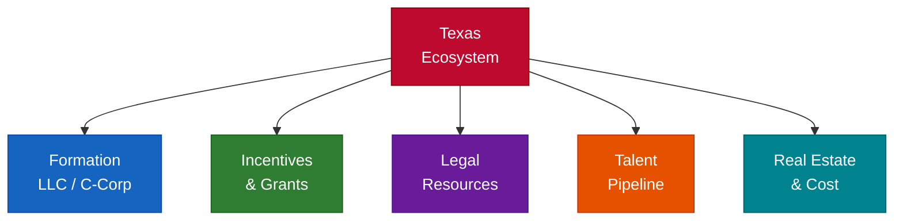

# Texas — Regional Deployment

**Part of Access to Business — Pillar 7 of the Access To Initiative**

**Disclaimer:** Program details, availability, fees, and contact information change. Always verify directly with each organization. This is educational context — not legal, tax, or financial advice.

---

## Table of Contents

1. Texas Startup Quick Facts
2. Ecosystem Map (Austin, Houston, Dallas/Fort Worth, San Antonio)
3. Formation Guide (LLC vs C-Corp)
4. Incentives & Grants
5. Legal Resources
6. Talent & Real Estate

---

## 1. Texas Startup Quick Facts

- **No state income tax** — the single biggest advantage for founders and employees
- **Second-largest state economy** and fastest-growing tech ecosystem in the US
- **Austin is the primary tech hub** — major relocations include Tesla, Oracle, Samsung, and dozens of VC-backed startups
- **Houston:** Energy tech, space (NASA/SpaceX), medical (Texas Medical Center — world's largest)
- **Dallas/Fort Worth:** Fintech, enterprise software, logistics, telecom
- **San Antonio:** Cybersecurity (NSA/military presence), defense tech, bioscience
- **Texas franchise tax (margin tax):** Applies to entities with revenue > $2.47M; most early startups are exempt
- **No state QSBS issue** — since Texas has no income tax, federal QSBS exclusion applies fully
- **University pipeline:** UT Austin, Texas A&M, Rice, SMU, UT Dallas — strong engineering and business programs
- **Cost of living 20-40% below** Bay Area, making salary dollars go further

---

## 2. Ecosystem Map

## Austin — Accelerators & Incubators

### Capital Factory
- **Type:** Accelerator + co-working + VC
- **Focus:** Broad tech; largest startup hub in Austin
- **Investment:** Various programs; early-stage to growth
- **Notable:** Houses 100+ startups; hosts meetups, demo days, mentor networks
- **Website:** capitalfactory.com

### Techstars Austin
- **Type:** Accelerator (equity-based)
- **Investment:** $120K for 6% equity
- **Focus:** Broad tech; strong mentor network
- **Website:** techstars.com/austin

### MassChallenge Texas
- **Type:** Zero-equity accelerator
- **Focus:** Broad; strong in health, energy, social impact
- **Website:** masschallenge.org/programs-texas

### Austin Technology Incubator (ATI)
- **Type:** University-affiliated incubator (UT Austin)
- **Focus:** Deep tech, clean energy, life sciences
- **Website:** ati.utexas.edu

### SKU (formerly Incubation Station)
- **Type:** CPG / consumer products accelerator
- **Focus:** Physical products, food, beverage, retail
- **Website:** sku.is

---

## Houston — Accelerators & Ecosystem

### Station Houston / Ion District
- **Type:** Innovation hub + co-working
- **Focus:** Broad tech; energy transition, space, health
- **Location:** Ion District (Midtown)
- **Website:** ionhouston.com

### TMCx (Texas Medical Center Accelerator)
- **Type:** Health tech accelerator
- **Focus:** Digital health, medtech, biotech
- **Notable:** Access to TMC — world's largest medical center (60+ hospitals)
- **Website:** tmc.edu/innovation

### Greentown Labs Houston
- **Type:** Climatetech incubator
- **Focus:** Clean energy, sustainability, climate solutions
- **Website:** greentownlabs.com

### Rice Alliance for Technology and Entrepreneurship
- **Type:** University entrepreneurship program (Rice University)
- **Focus:** Tech commercialization, life sciences, energy
- **Website:** alliance.rice.edu

---

## Dallas/Fort Worth — Accelerators & Ecosystem

### Health Wildcatters
- **Type:** Health tech accelerator
- **Focus:** Healthcare, biotech, digital health
- **Website:** healthwildcatters.com

### Tech Wildcatters
- **Type:** B2B tech accelerator
- **Focus:** Enterprise software, SaaS, data analytics
- **Website:** techwildcatters.com

### Dallas Entrepreneur Center (DEC)
- **Type:** Co-working + programming
- **Focus:** General startup support; strong community
- **Website:** thedec.co

---

## San Antonio — Accelerators & Ecosystem

### Geekdom
- **Type:** Co-working + startup community
- **Focus:** Cybersecurity, defense tech, enterprise
- **Notable:** Founded by Rackspace co-founder Graham Weston
- **Website:** geekdom.com

### Port San Antonio
- **Type:** Innovation campus (former military base)
- **Focus:** Cybersecurity, aerospace, defense
- **Website:** portsanantonio.us

---

## Major Texas VC Firms

| Firm | Stage | Focus | Location |
|------|-------|-------|----------|
| LiveOak Venture Partners | Series A-B | Enterprise, SaaS | Austin |
| S3 Ventures | Seed-Series B | Broad tech | Austin |
| Silverton Partners | Series A-C | Software, marketplaces | Austin |
| Mercury Fund | Seed-Series A | B2B, enterprise | Houston |
| Next Coast Ventures | Series A-B | Software, marketplace | Austin |
| Perot Jain | Seed-Series A | Enterprise, infrastructure | Dallas |
| Greycroft (TX office) | Seed-Series B | Consumer, media | Austin |
| 8VC (TX office) | Series A+ | Deep tech, defense | Austin |

---

## Statewide Programs

### Texas Small Business Development Centers (SBDC)
- **Type:** Free consulting + training
- **Locations:** 60+ centers statewide (hosted at universities)
- **Website:** txsbdc.org

### SCORE Texas
- **Type:** Free mentoring (volunteer executives)
- **Chapters:** Austin, Houston, Dallas, San Antonio, and more
- **Website:** score.org

### Texas Economic Development Corporation
- **Type:** State business recruitment and support
- **Website:** businessintexas.com

---

## 3. Formation Guide

### Texas LLC — Best for:
- Bootstrapped or lifestyle businesses
- Service businesses, agencies, freelancers
- Founders not planning to raise VC

**Texas LLC formation:**
- File Certificate of Formation → sos.texas.gov
- Fee: **$300**
- Processing: 2-3 business days online
- No state income tax (major advantage over most states)
- Franchise tax: Only applies if revenue exceeds $2.47M (most startups exempt)
- Annual report: **No annual report required** (unlike most states)

### Delaware C-Corp — Best for (even in Texas):
- Startups planning to raise venture capital
- Companies issuing stock options
- Businesses seeking QSBS qualification

**Delaware C-Corp operating in Texas:**
- Form in Delaware via Stripe Atlas ($500), Clerky ($399+), or attorney
- Register as foreign corporation in Texas → sos.texas.gov → **$750 filing fee**
- No state income tax on personal income (federal QSBS exclusion applies fully)
- Texas franchise tax: Only on entities with > $2.47M in total revenue
- Delaware franchise tax: ~$400/year minimum (due March 1)

### Texas Tax Advantages

| Tax | Texas | California | New York |
|-----|-------|-----------|----------|
| State income tax | **None** | 13.3% top rate | 10.9% top rate |
| QSBS state treatment | **No state tax to worry about** | Fully taxed | Partially excluded |
| Franchise/margin tax | >$2.47M revenue only | $800 minimum | Various |
| Sales tax | 6.25% + local (up to 8.25%) | 7.25% + local | 4% + local |

---

## 4. Incentives & Grants

### Texas Enterprise Fund (TEF)
- **Type:** Deal-closing fund for major relocations and expansions
- **Amount:** Negotiated; based on jobs and investment
- **Administered by:** Governor's Office
- **Website:** gov.texas.gov/business

### Texas Emerging Technology Fund (TETF)
- **Type:** Investment fund for tech commercialization
- **Focus:** University research → startup commercialization
- **Note:** Verify current program status — has been restructured

### SBIR/STTR (Federal — applicable to Texas companies)
- **Phase I:** Up to $275,000
- **Phase II:** Up to $1,750,000
- **Website:** sbir.gov
- **Note:** Texas companies win significant SBIR/STTR awards, especially in defense and energy

### Houston Exponential / Innovation Grants
- **Type:** Regional innovation grants and programs
- **Focus:** Houston-area tech and startup support
- **Website:** houstonexponential.org

### Cancer Prevention & Research Institute of Texas (CPRIT)
- **Type:** State-funded cancer research grants
- **Amount:** Up to $6M for commercialization
- **Focus:** Cancer-related biotech, diagnostics, therapeutics
- **Website:** cprit.texas.gov

### SBA Microloans (Texas intermediaries)
- **Amount:** Up to $50K
- **Intermediaries:** LiftFund (San Antonio), PeopleFund (Austin), ACCION Texas
- **Best for:** Pre-revenue and very early-stage

---

## 5. Legal Resources

### Startup-Friendly Law Firms — Austin

**Wilson Sonsini** — national startup specialist; Austin office
**DLA Piper** — global firm with strong Austin tech practice
**Gunderson Dettmer** — VC-backed companies exclusively; Austin office
**Vinson & Elkins** — Texas-founded; strong in energy tech, corporate
**Jackson Walker** — Texas-based; startup-friendly, accessible

### Startup-Friendly Law Firms — Houston

**Baker Botts** — Houston-founded; energy, IP, corporate
**Norton Rose Fulbright** — global firm; strong Houston corporate
**Bracewell** — energy, technology, government

### Startup-Friendly Law Firms — Dallas

**Haynes and Boone** — Texas-based; strong startup practice
**Thompson & Knight (now Holland & Knight)** — corporate, IP, tech

### Low-Cost & Pro Bono Legal Resources

**Texas RioGrande Legal Aid** — free legal services for qualifying individuals
**Lone Star Legal Aid** — free civil legal services in 72 Texas counties
**UT Law Entrepreneurship Clinic** — free startup legal help from supervised law students
**South Texas College of Law Houston Clinic** — small business legal assistance

### Free Standard Documents
- **YC SAFE Notes:** ycombinator.com/documents
- **NVCA Model Documents:** nvca.org
- **Cooley GO Docs:** cooleygo.com
- **Orrick Term Sheet Generator:** tsc.orrick.com

---

## 6. Talent & Real Estate

### Salary Benchmarks (Texas vs. Coastal)

Texas salaries run **15-30% below** Bay Area but **at or above** national average, while cost of living is significantly lower.

| Role | Austin Range | Houston/Dallas Range | Bay Area Range |
|------|-------------|---------------------|---------------|
| Software Engineer (mid) | $110K-$150K | $100K-$140K | $140K-$200K |
| Product Manager | $115K-$155K | $105K-$145K | $150K-$200K |
| Sales (AE, mid-market) | $80K-$120K base | $75K-$110K | $100K-$150K |
| Data Scientist | $110K-$150K | $100K-$140K | $150K-$200K |
| Marketing Manager | $80K-$110K | $75K-$100K | $110K-$150K |
| Customer Success | $65K-$90K | $60K-$85K | $80K-$120K |

*Plus no state income tax — effectively a 5-13% raise vs. California or New York.*

### University Pipeline

**UT Austin** — CS (top 10 nationally), engineering, business (McCombs), AI/ML
**Texas A&M** — Engineering, CS, agriculture, cybersecurity
**Rice University** — Engineering, CS, business, biomedical (strong TMC connection)
**SMU (Dallas)** — Business, data science, entrepreneurship
**UT Dallas** — CS, engineering, business (strong corporate connections)
**University of Houston** — Engineering, supply chain, energy
**Texas State** — Growing CS and engineering programs

### Co-Working & Office Space

**Austin:**
- Capital Factory — startup hub, co-working, events (downtown)
- WeWork (multiple Austin locations)
- Galvanize Austin — tech-focused co-working
- Domain-area offices — cheaper than downtown, near tech companies

**Houston:**
- Ion District — innovation hub (Midtown)
- Station Houston — startup co-working
- WeWork (multiple locations)
- Greentown Labs — climatetech-specific

**Dallas/Fort Worth:**
- Dallas Entrepreneur Center (DEC)
- WeWork (Uptown, Deep Ellum)
- Common Desk (multiple DFW locations)

**San Antonio:**
- Geekdom — largest co-working in SA
- Port San Antonio — defense/cyber campus

### Real Estate Considerations

- Austin office market: Tightened post-tech-boom; still more affordable than Bay Area ($40-$60/sq ft/year)
- Houston: Very affordable office space ($25-$45/sq ft/year); strong sublease market
- Dallas: Growing tech corridor along US-75; competitive pricing ($30-$50/sq ft/year)
- **Remote-first is common** — many Texas startups hire across the state or nationally

---

> **Disclaimer:** This regional deployment provides educational information about the Texas startup ecosystem. Program details, fees, and availability change frequently. Always verify directly with each organization. This is not legal, tax, or financial advice. Consult qualified professionals for entity formation, tax planning, and compliance decisions.
