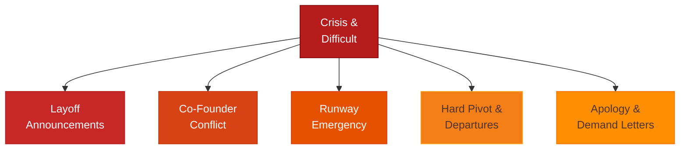

# Crisis & Difficult Conversation Templates



Load this file for layoffs, co-founder conflict, bad press, apologies, runway emergencies, and hard pivots.

---

## Layoff Announcement — To Affected Employee(s)

```
[Deliver verbally first — in person or video call. Send written confirmation same day.
Never deliver a layoff by email alone.]

VERBAL SCRIPT:
"[Name], I need to have a difficult conversation with you.
We've made the decision to eliminate your position, effective [Date].
This is not about your performance — it's a decision we made to [brief honest reason].
I'm sorry. I know this is hard to hear."

[Pause. Let them respond. Don't rush to fill silence.]

WRITTEN CONFIRMATION:

Subject: Employment Separation — Confidential

Dear [Name],

This confirms our conversation today. Your position at [Company] is being eliminated,
and your last day of employment is [Date].

This decision reflects [business reasons — headcount reduction / restructuring /
budget constraints] and is not a reflection of your performance or your contributions.

SEPARATION DETAILS
Final paycheck: $[X], issued [Date]
Severance: [X weeks] pay, totaling $[X], paid [on Date / over X weeks]
Benefits: Continue through [Date]; COBRA information will follow
Equity: [X] vested options remain yours; [X days] to exercise
PTO payout: $[X] ([X hours] accrued)

REFERENCE
I will provide a positive reference. You may use my name directly.

RETURN OF PROPERTY
Please return [equipment] by [Date].

I'm grateful for what you've contributed here. I'm sorry this is how it ends.

[Founder Name]
[Direct phone]
```

---

## Layoff Announcement — To Remaining Team

```
[Send same day as the layoffs. Don't let people find out informally.]

Team,

I want to talk to you directly about what happened today, and what it means.

WHAT WE DID
Today we eliminated [X positions / the [role] role]. [Names, if appropriate to share
and they've consented] have been let go. This was effective today.

WHY
[Be honest: "We missed our revenue targets and had to reduce burn" /
"We raised less than planned" / "We restructured the team around our new direction"]
This was not about their performance. It was a decision about where we need to be.

HOW I FEEL ABOUT IT
[Don't hide behind corporate language. If it was hard, say it was hard.
Authenticity here builds more trust than polish.]

WHAT THIS MEANS FOR YOU
[Address the unspoken fear: "Your roles are not at risk" / "Here's where we stand"]

WHAT HAPPENS NEXT
[The plan — specific, not vague reassurance]

I'm available [today / this week] for questions. Please come to me directly.

[Name]
```

---

## Co-Founder Conflict — Opening the Conversation

```
[Have this in person or video — never by text or email for the first conversation.]

SCRIPT OPENER:
"I want to talk about something that's been on my mind, because I think we need
to address it directly. I'm not coming at this as an accusation — I'm coming at
it because I think we're misaligned on [X] and I'd rather fix it now than let it get worse."

FOLLOW-UP EMAIL (to document conversation and next steps):

Subject: Following up on our conversation

[Name],

Thank you for talking today. I wanted to put our agreement in writing
so we're both clear.

WHAT WE DISCUSSED
[What came up — as neutrally as possible]

WHERE WE LANDED
• [Agreement 1]
• [Agreement 2]

WHAT WE EACH COMMITTED TO
You: [Specific behavior or action]
Me: [Specific behavior or action]

CHECK-IN
We'll revisit this on [Date] to see how it's going.

If I've characterized anything incorrectly, please let me know.

[Name]
```

---

## Co-Founder Separation Letter (When a Founder Leaves)

```
[This requires an attorney. Use this as a conversation framework, not a final document.]

Key terms to document:

1. EFFECTIVE DATE OF DEPARTURE: [Date]

2. EQUITY TREATMENT
   Vested shares: [X] — founder retains ownership
   Unvested shares: [X] — [forfeited / company repurchase at $X]
   Post-departure exercise period: [90 days for options if applicable]

3. ROLE GOING FORWARD
   [No further role / advisory capacity at X hours/month for X months / board observer]

4. ONGOING OBLIGATIONS
   IP: All work created during tenure remains company property
   Confidentiality: [X year] post-departure
   Non-compete: [Scope and duration — consult attorney]
   Non-solicit: Cannot recruit employees or customers for [X years]

5. ANNOUNCEMENT
   Public statement by mutual agreement: [Draft here]

6. RETURN OF PROPERTY
   Return all company property by [Date]

Signed: _____________________ Date: _________
        [Departing Founder]

Signed: _____________________ Date: _________
        [Remaining Founder / Company]
```

---

## Runway Emergency — Investor Communication

```
Subject: [Company] — urgent update — your input needed

[Investor Name],

I need to be direct with you about something.

THE SITUATION
Our runway is [X months] at current burn. We [missed our revenue target /
lost a key customer / had an unexpected expense]. This is not where I planned to be.

WHAT I'VE DONE
• [Cost cut 1: eliminated X, saves $X/month]
• [Cost cut 2: restructured Y]
• [Revenue action: pursuing Z]

WHAT I NEED FROM YOU
[Option A: "I'm reopening the round. Are you able to bridge $X?"]
[Option B: "I need introductions to [type of investor] quickly."]
[Option C: "I need your honest advice on whether to keep going or wind down."]

I'm available this week at any time. Can we talk?

[Name]
[Direct phone]
```

---

## Hard Pivot — Customer Communication

```
Subject: An important update about [Product]

Hi [Name],

I want to be direct with you about a change we're making.

WHAT'S CHANGING
Effective [Date], [Product] will [be discontinued / pivot to / change its focus to].

WHY
[Honest explanation — not corporate fluff. "We found that X wasn't working.
We're doubling down on Y because Z." Customers respect honesty.]

WHAT THIS MEANS FOR YOU
[If discontinuing]: Your data will be available for export until [Date]: [link]
[If changing focus]: Here's how the new direction might affect you: [specific]

WHAT WE'RE OFFERING
[If discontinuing]: [Refund policy / data export assistance / referral to alternatives]
[If pivoting]: [Free tier / transition discount / grandfather pricing]

I'm sorry if this creates inconvenience. Reply here with questions.

[Name]
```

---

## Key Person Departure — Customer Communication

```
Subject: A change at [Company] — [Name] is moving on

Hi [Name],

I want to let you know that [Team Member Name], who has been your [point of contact /
CSM / account lead], is leaving [Company] on [Date].

[1 sentence: positive send-off for the departing person]

Going forward, [New Contact Name] will be your primary contact.
[He/She/They] has been fully briefed on your account and will reach out to
introduce themselves by [Date].

Your relationship with [Company] isn't changing — just the person on our side.

If you have any concerns or questions, you can reach me directly: [email / phone]

[Founder Name]
```

---

## Public Apology — Company Error or Misstep

```
[Publish on website / email list / social — wherever the affected people are.
Speed matters. A slow apology is a second offense.]

To our customers and community,

[What happened — specific, no corporate passive voice. Not "mistakes were made."]

[Why it happened — honest context without making excuses]

[Who was affected and how — acknowledge the specific impact]

[What we've done to fix it — specific actions already taken]

[What we're changing to prevent it — specific, not vague promises]

[What we're offering affected customers — credits, refunds, direct contact]

We let you down. I'm sorry.

[Your name]
Founder, [Company]
[Direct email / phone for those who want to talk]

[Date]
```

---

## Investor — Missed Milestone Communication

```
Subject: [Company] — missed milestone + updated plan

[Investor Name],

I owe you a direct update.

We missed [milestone — specific] by [how much]. Here's the honest picture:

WHAT HAPPENED
[Specific reason — not excuses, but real cause: market timing, execution gap,
wrong assumption]

WHAT WE LEARNED
[The insight this revealed — show you're processing it, not just apologizing]

THE UPDATED PLAN
Original target: [X] by [Date]
New target: [X] by [New Date]
What changes: [Specific — different approach, cut scope, new channel]

WHAT I NEED FROM YOU
[Honest ask: "Your patience for X more weeks" / "An intro to Y" /
"Your honest take on whether we should continue this direction"]

I'd rather tell you directly than have you find out another way.

[Name]
[Direct phone]
```

---

## Declining a Partnership or Opportunity

```
Subject: Re: [Opportunity]

Hi [Name],

Thank you for thinking of [Company] for this — and for the time you've put into it.

After careful consideration, we're going to pass.

[If comfortable being specific]: The main reason is [honest 1-sentence explanation:
"It's not the right stage for us" / "We're focused on a different segment right now"
/ "The economics don't work for where we are."]

This isn't a permanent no — it's a timing issue, and I'd genuinely like to stay in touch.

Thank you again.

[Name]
```

---

## Demand Letter Response (When You Receive One)

```
[Always consult an attorney before responding to a legal demand letter.
Use this as a framework for what your attorney will help you draft.]

Key principles:
1. Do not ignore it — a non-response can imply admission
2. Do not respond emotionally or admit liability
3. Respond within the timeframe stated (or request an extension)
4. Keep the response brief and factual
5. Route to an attorney within 24 hours of receipt

Initial holding response (while getting counsel):

"Dear [Attorney/Party],

We have received your letter dated [Date] regarding [matter].
We are reviewing the claims with our legal counsel and will respond by [Date].

[Company Name]"
```
