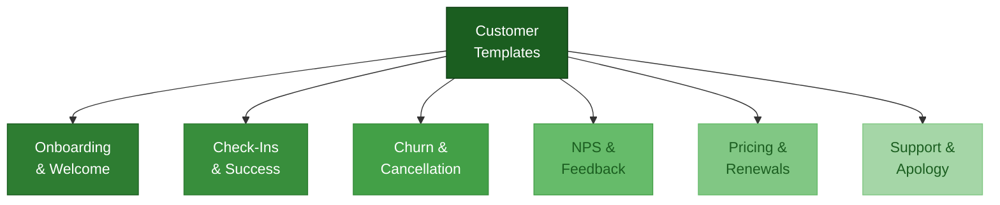

# Customer Communications Templates



Load this file for onboarding, check-ins, churn recovery, NPS, price increases, support, and renewals.

---

## Welcome / Onboarding Email (New Customer)

```
Subject: Welcome to [Product] — here's how to get started

Hi [Name],

Welcome — we're glad you're here.

Here's how to get the most out of [Product] in your first week:

STEP 1: [Core setup action — e.g., "Connect your account"]
→ [Link or instruction]

STEP 2: [First value action — e.g., "Create your first [X]"]
→ [Link or instruction]

STEP 3: [Sticky feature or habit — e.g., "Set up your weekly summary"]
→ [Link or instruction]

Most customers see [specific result] within [timeframe].

If you get stuck or have questions, reply to this email — I read every one.

[Your name]
[Title], [Company]
[Email] | [Support link]
```

---

## Onboarding Check-In (Day 3–5)

```
Subject: Quick check-in — how's [Product] going?

Hi [Name],

You've been using [Product] for a few days — I wanted to check in.

• Have you been able to [core action]?
• Is there anything that's unclear or not working the way you expected?

I'm available for a 15-minute call if it would help: [Calendly link]

[Name]
```

---

## Onboarding Check-In (Day 14)

```
Subject: Two weeks in — are you getting value?

Hi [Name],

You've had [Product] for two weeks. I want to make sure it's actually working for you.

Quick question: Have you been able to [core job the product does]?

If yes → great. What's one thing that would make it 2x more useful?
If not → let's fix that. What's getting in the way?

Reply here or grab 15 minutes: [Calendly link]

[Name]
```

---

## Customer Success Check-In (Monthly / Quarterly)

```
Subject: [Company] + [Your Company] — [Month/Quarter] check-in

Hi [Name],

Wanted to touch base on how things are going with [Product].

A few things on my end:
• [Recent product update or feature relevant to them]
• [Relevant insight, benchmark, or resource]

A few questions for you:
• How is [Product] fitting into your workflow?
• Is there anything we could do better?
• Any upcoming projects or changes we should know about?

Happy to jump on a call if that's easier: [Calendly link]

[Name]
```

---

## Churn Risk — Proactive Outreach

```
Subject: Checking in — want to make sure [Product] is working for you

Hi [Name],

I noticed you haven't [used the product / logged in / completed setup] recently —
and I want to make sure we're not letting you down.

If something isn't working or the timing isn't right, I'd rather know now
so we can either fix it or part on good terms.

Can I ask — what's getting in the way?

[Name]
```

---

## Cancellation Save — Immediate Response

```
Subject: Re: Cancellation request

Hi [Name],

I received your cancellation request and I've paused it for 48 hours
so I can reach out directly.

Before I process this — can I ask what drove the decision?

If it's [price] → I may be able to help
If it's [not using it enough] → I can help you get more value in 15 minutes
If it's [missing a feature] → I want to know what it is
If it's [timing / budget] → we can pause your account rather than cancel

If you'd still like to cancel after hearing from me, I'll take care of it, no friction.

[Name]
[Direct phone / Calendly]
```

---

## Cancellation Confirmation + Offboarding

```
Subject: Your [Product] account has been cancelled

Hi [Name],

Your account has been cancelled as requested. No further charges will be made.

A few quick things:
• Your data will be available for export until [Date]: [link]
• If you'd like to reactivate, here's how: [link]

One last ask — would you be willing to tell me the main reason you cancelled?
Your feedback genuinely shapes what we build next.

[1-click reason options or reply link]

Thank you for giving [Product] a shot. I'm sorry it didn't work out this time.

[Name]
```

---

## NPS / Feedback Request

```
Subject: Quick question about [Product]

Hi [Name],

One question:

On a scale of 0–10, how likely are you to recommend [Product] to a colleague?

[0–6 link] [7–8 link] [9–10 link]

If you have 2 minutes, I'd love to know why.

Thank you,
[Name]
```

**NPS Follow-Up — Promoter (9–10)**
```
Subject: Re: [Product] feedback — thank you!

Hi [Name],

Thank you — that means a lot, especially at this stage.

Would you be open to [writing a short testimonial / doing a quick case study / letting us use your name]?
It would help other [role/company type] discover us. No pressure at all.

[Name]
```

**NPS Follow-Up — Detractor (0–6)**
```
Subject: Re: [Product] feedback — I want to understand

Hi [Name],

Thank you for being honest — that score tells me something's not right
and I want to understand it.

Can we get on a 15-minute call this week? I'm not going to pitch you —
I just want to learn what went wrong.

[Calendly link]

[Name]
```

---

## Price Increase Announcement

```
Subject: Important update about your [Product] pricing

Hi [Name],

I want to be direct with you: we're raising prices on [Date].

YOUR NEW RATE
Current: $[X]/[mo or yr]
New: $[X]/[mo or yr], effective [Date]

WHY WE'RE DOING THIS
[Be honest: "We've added [X, Y, Z features]" or "Our costs have increased" or
"Our pricing hasn't reflected the value we deliver."]

WHAT THIS MEANS FOR YOU
Because you've been with us since [timeframe], we're:
[Option A: "Locking in your current rate for another [X months]"]
[Option B: "Offering you the new rate at a [X]% loyalty discount"]
[Option C: "Giving you 60 days' notice to evaluate your options"]

If you have questions, reply here. I read every email.

Thank you for being a customer.

[Name]
```

---

## Upsell / Expansion Offer

```
Subject: [Name] — a conversation about growing your [Product] usage

Hi [Name],

Based on how you've been using [Product], I think you're hitting the limits
of your current plan — and there's more we can do for you.

[Specific usage signal: "You've created X [items] this month" or "You have X users on your team"]

Our [Plan Name] would give you:
• [Benefit 1]
• [Benefit 2]
• [Benefit 3]

It's $[X]/month more — and based on what I've seen, [specific value it would unlock for them].

Want to talk through whether it makes sense? [Calendly link]

[Name]
```

---

## Renewal Reminder (B2B Annual)

```
Subject: Your [Product] subscription renews in [30/14/7] days

Hi [Name],

Your annual subscription renews on [Date] at $[X].

Before it auto-renews, I want to make sure you're getting value and
that this is still the right fit for your team.

Can we schedule 20 minutes before [Date] to review and confirm?
[Calendly link]

If you'd like to cancel, upgrade, or make changes, reply here and I'll take care of it.

[Name]
```

---

## Product Update / Release Announcement

```
Subject: [Product] just got [better / faster / smarter] — here's what's new

Hi [Name],

We just shipped [feature or update name]. Here's why it matters for you:

WHAT'S NEW
[Feature 1]: [What it does + why it's useful — 1–2 sentences]
[Feature 2]: [What it does + why it's useful — 1–2 sentences]

HOW TO USE IT
[Link to docs / walkthrough / Loom video]

COMING NEXT
[Brief teaser — 1 sentence on what's in the pipeline]

As always, reply here if you have questions or feedback.

[Name]
```

---

## Customer Reference / Case Study Request

```
Subject: Would you be willing to share your [Product] story?

Hi [Name],

Working with you has been one of the highlights of this year for us.

I'd like to ask a small favor: would you be open to being featured
as a customer case study? It would involve:

• A 20-minute call with me
• A short written summary (we draft it, you approve it)
• Use of your name/logo on our website

We'd [promote it to our audience / send you leads / give you early access to new features]
as a thank-you.

No pressure — and if the timing isn't right, just say so.

[Name]
```

---

## Apology / Service Failure

```
Subject: We let you down — here's what happened and what we're doing

Hi [Name],

I want to address [the outage / bug / mistake] directly.

WHAT HAPPENED
[Clear, non-defensive explanation — what failed and when]

HOW IT AFFECTED YOU
[Acknowledge the specific impact on their work — don't be vague]

WHAT WE'VE DONE
• [Fix 1 — completed]
• [Fix 2 — completed]
• [What's in place to prevent it happening again]

WHAT WE'RE DOING FOR YOU
[Specific make-good: credit, extension, refund, priority support — not just "sorry"]

I'm sorry. We're better than what you experienced, and I intend to prove it.

[Name]
[Direct phone / email]
```

---

## Support Ticket — Acknowledgment

```
Subject: Re: [Ticket subject]

Hi [Name],

Got it — I'm looking into this now.

[If quick fix: "Here's what to do: [steps]"]
[If needs investigation: "I'll have an answer for you by [time/date]."]

If this is urgent, reply here or reach me directly at [phone/Slack].

[Name]
```
