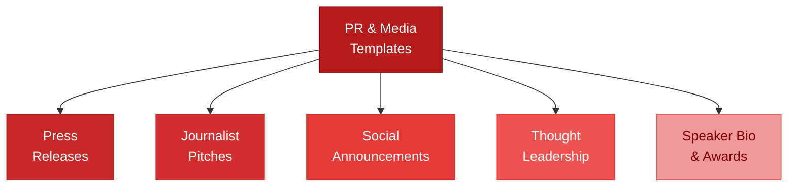

# PR & Media Templates



Load this file for press releases, journalist pitches, social announcements, and public communications.

---

## Press Release — Product Launch

```
FOR IMMEDIATE RELEASE

[COMPANY NAME] LAUNCHES [PRODUCT / FEATURE] TO [BENEFIT FOR TARGET MARKET]

[City, Date] — [Company Name], a [category] startup, today announced the launch of
[product or feature], a [brief description] designed to help [target customer]
[specific outcome].

[QUOTE — Founder]
"[1–2 sentences from the founder — what this means and why it matters.
Should sound human, not corporate.]"
— [Founder Name], [Title], [Company Name]

[PROBLEM THIS SOLVES — 1 paragraph]
[Customers face X problem. Current solutions fail because Y. Company solves it by Z.]

[PRODUCT DESCRIPTION — 1 paragraph]
[What it does, how it works, key features or differentiators — 3–5 sentences]

[TRACTION / CREDIBILITY — 1 paragraph]
[Company Name] has [X customers / $X ARR / launched in X / backed by X].
[Optional: customer quote here]

[CUSTOMER QUOTE — if available]
"[Specific result or value statement.]"
— [Name], [Title], [Company]

AVAILABILITY
[Product] is available [immediately / starting Date] at [website].
[Pricing: Starting at $X/month.]

ABOUT [COMPANY NAME]
[Company Name] helps [ICP] [outcome]. Founded in [Year] by [Founders],
the company is based in [City]. Learn more at [website].

MEDIA CONTACT
[Name] | [Email] | [Phone]
[Press kit: URL if applicable]

###
```

---

## Funding Announcement Press Release

```
FOR IMMEDIATE RELEASE

[COMPANY NAME] RAISES $[X] TO [MISSION STATEMENT OR KEY GOAL]

[City, Date] — [Company Name], a [category] startup helping [ICP] [outcome],
today announced it has raised $[X] in [pre-seed / seed / Series A] funding.

The round was led by [Lead Investor] with participation from [Other Investors].

[FOUNDER QUOTE]
"[What this funding enables — where you're going, why this is a big deal.
Human and direct.]"
— [Founder Name], [Title], [Company Name]

[INVESTOR QUOTE — if available]
"[Why they invested — their thesis on the space and the team.]"
— [Name], [Title], [Firm]

[COMPANY BACKGROUND — 1 paragraph]
Founded in [Year], [Company] [what you do, who you serve, why it matters].
The company has [traction signal: X customers / $X ARR / X% growth].

USE OF FUNDS
The company will use the funding to [expand the team / accelerate product development /
expand into [market]].

ABOUT [COMPANY NAME]
[2–3 sentence company description]

ABOUT [INVESTOR FIRM]
[1–2 sentence investor description]

MEDIA CONTACT
[Name] | [Email] | [Phone]

###
```

---

## Journalist / Reporter Pitch

```
Subject: Story idea: [Specific angle — not a PR pitch]

Hi [Reporter Name],

I've been reading your work on [specific topic they cover] — [specific article or angle
you found compelling]. You clearly understand [the space].

I think there's a story here you might find interesting:

[STORY ANGLE — 2–3 sentences. Lead with the story, not your company.]
[e.g., "Family courts are generating millions of pages of documentation with
no standard format — and it's costing families and attorneys real money.
There's a growing movement to standardize this."]

We're in the middle of it — [Company] is [what you do], and I've got [data / access
to sources / a compelling customer story] that could add to the story.

Not looking for a press mention — just thought this might be worth a conversation.

[Your name]
[Title], [Company]
[Email] | [Phone]
```

---

## Launch Announcement — LinkedIn / Social

**Short (with traction):**
```
Today we launched [Product].

[One sentence: what it does and for whom.]

[Traction signal: "We've been testing this with X customers for Y months.
Here's what we learned: [insight]."]

If you [ICP description], this is for you: [link]

[Optional: tag early customers or collaborators]
```

**Longer story format:**
```
18 months ago, I couldn't find a tool that [solved the problem].

So I built one.

Today, [Company] is launching [Product] — [one sentence description].

Here's what I learned building it:

1. [Insight 1]
2. [Insight 2]
3. [Insight 3]

[Traction signal: "We've had X customers on it since [Month]. [Specific result].]

If this is relevant to you or someone you know: [link]

[CTA: "Happy to answer questions in the comments."]
```

---

## Funding Announcement — Social Post

```
We raised $[X]. Here's what I actually want to say about it:

[Not the normal PR fluff. What does this mean to you personally?
What does it mean for customers? What problem are you now able to solve?]

[Thank the team / early customers / investors — specific names if appropriate]

[What's next — one sentence on what you'll do with it]

[Company / link]
```

---

## Partnership Announcement — Social Post

```
Excited to announce [Company] is now [integrated with / partnered with / backed by] [Partner].

Here's why this matters for [ICP]:
[1–2 sentences: specific customer benefit, not corporate buzzwords]

[Quote from partner if available]

[Link to announcement or product page]
```

---

## Thought Leadership Article Outline

Use for LinkedIn articles, blog posts, or contributed bylines.

```
TITLE: [Counterintuitive claim or strong POV — not a feature announcement]

HOOK (first 2–3 sentences):
[Start with a surprising stat, bold claim, or specific story. Make them need to keep reading.]

SECTION 1: THE PROBLEM EVERYONE ACCEPTS
[The conventional wisdom in your space that you disagree with]

SECTION 2: WHAT ACTUALLY HAPPENS
[What you've observed from customers / data / your own experience]

SECTION 3: THE BETTER WAY
[Your framework, approach, or insight — be specific]

SECTION 4: PROOF
[Customer story, data, or example that validates the better way]

CLOSE: WHAT TO DO NOW
[Specific, actionable takeaway — not "contact us"]

OPTIONAL SOFT CTA:
[One sentence mentioning your company in context — not a hard sell]
```

---

## Speaker Bio (Conference / Event Submission)

**Short (50 words):**
```
[Name] is the founder of [Company], a [category] startup helping [ICP] [outcome].
[One credential or prior achievement.] [Name] has [traction signal or notable milestone].
[Company] was founded in [Year] and is based in [City].
```

**Full (150 words):**
```
[Name] is the founder and CEO of [Company], a [category] startup on a mission to
[mission statement].

Prior to founding [Company], [Name] [1–2 relevant prior roles or achievements].
[He/She/They] brings [X years] of experience in [relevant domain].

[Company] has [traction signal] and serves [customer description] across [geography or vertical].

[Name] speaks on [topic 1], [topic 2], and [topic 3] — drawing from [what makes the
perspective unique: lived experience, data, customer stories].

[He/She/They] has [spoken at / been featured in / been recognized by] [optional credibility signal].

[Name] is based in [City].

Contact: [email] | [website] | [LinkedIn]
```

---

## Award / Recognition Submission (Short Answer Format)

```
COMPANY OVERVIEW (25 words):
[Company] helps [ICP] [specific outcome] by [mechanism]. We've [traction signal].

WHAT MAKES US DIFFERENT (100 words):
[Clear differentiation. Avoid buzzwords. Lead with customer impact, not features.]

KEY ACHIEVEMENT THIS YEAR (50 words):
[Most impressive metric, milestone, or moment — specific and verifiable]

FOUNDER STORY (50 words):
[Why this founder for this problem — personal connection or unfair advantage]

WHAT'S NEXT (50 words):
[Where you're going — specific milestone or market expansion]
```

---

## Crisis / Negative Press Response

```
[Internal note: Respond quickly — within 24 hours. Brief and direct. Don't go defensive.]

Subject: Re: [Article/Story title] — a note from [Company]

[If the story is accurate in part:]
"[Reporter Name] got some things right. Here's the full picture: [specific clarification].
We take [issue] seriously. Here's what we've done: [action]. Here's what we're doing next: [action]."

[If the story is factually wrong:]
"The [publication] story contained a factual error. Here is the accurate information: [fact].
We've asked for a correction. In the meantime, [customer/stakeholder reassurance]."

[Template for social or public response:]
"We saw [story / post / thread]. Here's our response directly:

[Clear, specific, non-defensive statement]
[What we're doing about it]
[How to reach us if you have questions]"
```
