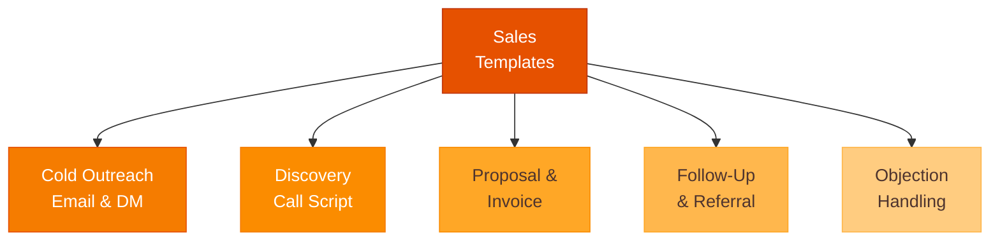

# Sales Templates



Load this file for cold outreach, discovery scripts, proposals, follow-ups, and objection handling.

---

## Cold Email — B2B (3-Email Sequence)

**Email 1 — The Hook**
```
Subject: [Specific result] for [their company type / role]

Hi [Name],

[1 sentence personal relevance — why them, why now.]

[Company] helps [ICP] [specific outcome] — [one proof point or traction signal].

Worth a quick call to see if it's a fit?

[Your name]
```

**Email 2 — The Value Add (3–5 days later)**
```
Subject: Re: [original subject]

Wanted to share [relevant resource / insight / case study] in case it's useful regardless of timing.

Still happy to connect if the moment is right.

[Name]
```

**Email 3 — The Close (5 days after Email 2)**
```
Subject: Re: [original subject]

Last note — didn't want to keep bothering you.

If timing ever works, [calendly link or simple ask].

Rooting for you either way.

[Name]
```

---

## Cold LinkedIn DM

```
Hi [Name] — saw [specific thing about them / their company / their post].

Quick question: [problem-focused question, not a pitch].

Happy to share what we've learned if useful.
```

---

## Discovery Call Script (30-Minute Structure)

```
0:00 — OPEN (2 min)
"Thanks for making time. I want to make sure this is worth your 30 minutes.
Here's my plan: I'll spend the first 20 minutes learning about your situation,
and if it seems like we might be a fit, I'll take 5 minutes to share what we do.
Does that work?"

0:02 — THEIR SITUATION (8 min)
"Tell me about [relevant context — their role, team, current process]."
→ Listen. Don't pitch.

0:10 — THE PROBLEM (7 min)
"What's the hardest part of [topic area] for you right now?"
"What does that cost you — in time, money, or something else?"
"What have you tried to fix it?"

0:17 — CURRENT SOLUTION (5 min)
"What are you doing today to handle this?"
"What does that solution not do that you wish it did?"

0:22 — THE PITCH (5 min)
"Based on what you've shared, I think we can help. Here's what we do: [2–3 sentences]."
"For companies like yours, the typical result is [outcome]."

0:27 — THE CLOSE (3 min)
"Does this seem like a fit for what you're dealing with?"
If yes: "What would a next step look like for you?"
If no: "What's missing?" → address or disqualify

0:30 — END
Confirm next step. Send follow-up within 2 hours.
```

---

## Proposal (One-Page)

```
PROPOSAL FOR [CUSTOMER NAME]
[Your Company] | [Date] | Prepared by [Your Name]

THE SITUATION
[2 sentences: their specific problem and why it matters to them now]

OUR APPROACH
[What you'll do + how it works + what makes it different — 3 sentences]

WHAT YOU GET
• [Deliverable or outcome 1]
• [Deliverable or outcome 2]
• [Deliverable or outcome 3]
• [Support / onboarding / access included]

INVESTMENT
$[X] — [payment structure: monthly / annual / one-time]
[Any guarantee, trial period, or refund policy]

TIMELINE
Start: [Date]
[Key milestone]: [Date]
Completion / renewal: [Date]

NEXT STEP
[Specific action — "Sign and return by [date] to lock in [start date]"]

Questions? [Name] | [Email] | [Phone]
```

---

## Follow-Up Sequence

**Day 1 after no response:**
```
Subject: Re: [original subject]
Hi [Name], just making sure this didn't get buried. Still worth a quick chat?
```

**Day 5 — Value add:**
```
Wanted to share [something useful] in case it's helpful regardless of timing.
Open if the moment's right.
```

**Day 10 — Pattern interrupt:**
```
Hi [Name], I'll stop following up after this — just wanted to give it one more try.
[One-sentence reminder of the value].
Happy to connect whenever works. [Calendar link]
```

---

## Referral Request

```
Hi [Customer Name],

Working with you on [project/product] has been great.

I'm looking to connect with more [their type of company/role]. Do you know 1–2 people
who might be dealing with [the problem you solve]?

Even a quick intro by email would mean a lot. Happy to make it easy — I can send you
a short blurb you can forward if that helps.

Thanks,
[Name]
```

---

## Objection Quick Reference

| Objection | Response |
|-----------|----------|
| "Too expensive" | "Compared to what? What's the cost of not solving this?" |
| "Already have something" | "What does it not do that you wish it did?" |
| "Not right now" | "When would be right? Can we put a date on the calendar?" |
| "Send more info" | "What specifically would help you evaluate this?" |
| "Need to check with team" | "Who else should be on the next call?" |
| "We tried something like this before" | "What happened? What would have to be different this time?" |
| "How do I know it'll work?" | "Here's how [similar customer] used it. Can I connect you with them?" |

---

## Invoice Email

```
Subject: Invoice #[XXX] — [Your Company] — Due [Date]

Hi [Name],

Attached is invoice #[XXX] for [service/product description].

Amount due: $[X]
Due date: [Date]
Payment: [Stripe link / bank transfer / check instructions]

Let me know if you have any questions.

Thank you,
[Name]
```
