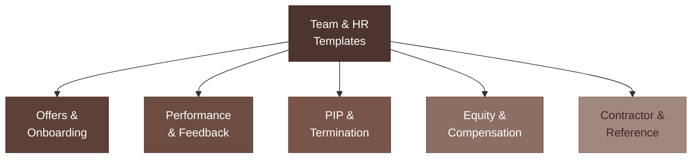

# Team & HR Templates



Load this file for offer letters, onboarding, performance conversations, compensation, and exits.

**Disclaimer:** Employment law varies by state. Review with an employment attorney before sending any offer, termination, or equity-related document.

---

## Offer Letter (Early-Stage, Equity + Cash)

```
Subject: Offer of Employment — [Company Name]

[Date]

Dear [Name],

We're excited to offer you a position at [Company Name] as [Title].

COMPENSATION
Base salary: $[X] per year, paid [bi-weekly / semi-monthly]
Start date: [Date]

EQUITY
Stock options: [X] shares ([X]% fully diluted)
Vesting: 4 years / 1-year cliff, then monthly
Strike price: $[X] per share (current 409A FMV)
Plan: [Company] 20XX Stock Option Plan

BENEFITS
[Health insurance / dental / vision if any]
[PTO policy — e.g., "Flexible PTO" or "15 days/year"]
[Remote / in-office / hybrid policy]

TERMS
This is an at-will employment relationship. A formal employment agreement,
IP assignment, and confidentiality agreement will be provided on your start date.

This offer expires [Date / in 5 business days].

We're building something important and we want you to be part of it.

[Founder Name]
[Title], [Company]
[Email] | [Phone]

Accepted by: _____________________ Date: _________
```

---

## Offer Rejection — Staying In Touch

```
Subject: Re: [Company] Opportunity

Hi [Name],

Thank you for the time you invested in our process — and for being genuinely great to talk to.

We've decided to move forward with another candidate whose background is a closer match
for where we are right now. This wasn't an easy call.

I'd like to stay in touch. As we grow, our needs will change, and I'd want you on my list.

Thank you again — and good luck with whatever's next.

[Name]
```

---

## New Hire Welcome (Day 1)

```
Subject: Welcome to [Company] — everything you need for Day 1

Hi [Name],

Welcome. We're glad you're here.

Here's what you need for today:

ACCESS
• Slack: [invite link]
• Email: [setup instructions]
• Notion / docs: [link]
• GitHub / tools: [link]

DAY 1 AGENDA
[Time]: [Activity — e.g., "Intro call with [Founder]"]
[Time]: [Activity — e.g., "Review company docs"]
[Time]: [Activity — e.g., "Set up your dev environment"]

YOUR FIRST WEEK
By end of week 1, we'd love for you to:
• [Goal 1 — e.g., "Ship one small thing"]
• [Goal 2 — e.g., "Meet everyone on the team"]
• [Goal 3 — e.g., "Review the product roadmap and share first impressions"]

Questions? Ping me on Slack anytime.

[Name]
```

---

## 30/60/90 Day Check-In

```
Subject: [Name] — [30/60/90]-Day Check-In

Hi [Name],

We're at the [30/60/90]-day mark and I want to make sure we're set up well together.

A few questions — honest answers only:

1. What's going well that we should do more of?
2. What's unclear or making it harder to do your best work?
3. What do you need from me that you're not getting?
4. How are you feeling about the role overall?

I'll share my perspective too when we connect.

[Name]
```

---

## Performance Feedback (Constructive)

```
[Use in 1:1. Document in writing after the conversation.]

Hi [Name],

I want to talk about something that's been on my mind, because I think you deserve
direct feedback rather than vague signals.

WHAT I'VE OBSERVED
[Specific behavior or output — not personality. "I've noticed X" not "You are X."]

WHY IT MATTERS
[Impact on the team, product, customer, or company — concrete]

WHAT I NEED TO SEE
[Specific, measurable change — not "be better at X" but "do X by [date/milestone]"]

SUPPORT I'M OFFERING
[What you'll do to help them succeed — not just demands]

I'm telling you this because I want you to succeed here. Let's check in on this in [timeframe].

[Name]
```

---

## Performance Improvement Plan (PIP) — Outline

```
PERFORMANCE IMPROVEMENT PLAN

Employee: [Name]
Role: [Title]
Manager: [Name]
Date: [Date]
Review period: [Start] to [End — typically 30–60 days]

PERFORMANCE CONCERNS
[Specific, observable gaps — behavior, output, attendance, quality]
[Each concern on a separate line with examples]

SUCCESS CRITERIA
To successfully complete this PIP, [Name] must:
• [Measurable goal 1] by [Date]
• [Measurable goal 2] by [Date]
• [Measurable goal 3] by [Date]

SUPPORT
[Company] will provide:
• [Weekly 1:1 with manager]
• [Specific training or resources]

CHECK-INS
Week 1: [Date] | Week 2: [Date] | Week 3: [Date] | Week 4: [Date]

CONSEQUENCES
Failure to meet the criteria above may result in termination of employment.

Employee signature: _____________________ Date: _________
Manager signature: ______________________ Date: _________
```

---

## Termination — Without Cause (Layoff)

```
[Deliver in person or video call first. Send written confirmation same day.]

Subject: Employment Separation — [Name]

Dear [Name],

This letter confirms our conversation today. Your employment with [Company] ends on [Date].

REASON
This decision is due to [company restructuring / budget constraints / role elimination]
and is not a reflection of your performance or character.

FINAL COMPENSATION
• Final paycheck through [Date]: $[X]
• [Severance if any: X weeks pay, paid [how]]
• PTO payout: $[X] ([X hours] accrued)
• Benefits end: [Date]

EQUITY
• Vested shares/options: [X] — you have [90 days] to exercise
• Unvested: forfeited per your agreement

RETURN OF PROPERTY
Please return [laptop / equipment / access cards] by [Date].

REFERENCES
I'm happy to serve as a reference and will speak positively about your work here.

I'm sorry this is the outcome. Thank you for what you built with us.

[Founder Name]
```

---

## Termination — For Cause

```
[Always consult an employment attorney before terminating for cause.]

Dear [Name],

This letter confirms that your employment with [Company] is terminated effective [Date]
for the following reason(s):

[Specific policy violation or performance failure — documented, specific]

As discussed, this follows [prior warning / PIP / incident on Date].

FINAL COMPENSATION
Final paycheck through [Date]: $[X]
[Benefits end / COBRA notification per state law]

EQUITY
[Per your vesting agreement: unvested forfeited / vested subject to company repurchase right]

Please return all company property by [Date] and confirm deletion of
any company data from personal devices.

[Name]
[Title]
```

---

## Contractor / Freelancer Agreement Summary

```
STATEMENT OF WORK — SUMMARY

Contractor: [Name / Company]
Client: [Your Company]
Effective date: [Date]

SCOPE OF WORK
[Contractor] will provide: [Specific deliverables or services]

TIMELINE
Start: [Date] | Deadline: [Date]
Milestones: [List if applicable]

COMPENSATION
$[X] — [Flat fee / hourly at $X/hr / monthly retainer]
Payment terms: [Net 15 / Net 30 / milestone-based]
Invoice to: [Email]

IP OWNERSHIP
All work product created under this agreement is owned by [Company].
Contractor waives any claim to intellectual property created during this engagement.

CONFIDENTIALITY
Contractor agrees to keep all company information confidential.

INDEPENDENT CONTRACTOR
[Contractor] is not an employee. No benefits, withholding, or equity unless stated.

Signatures:
[Founder] _____________________ Date: _________
[Contractor] ___________________ Date: _________
```

---

## Equity Conversation — Existing Employee Refresh

```
Hi [Name],

I want to revisit your equity to make sure it still reflects your contribution.

When you joined, we granted you [X] options at $[X] strike. You've vested [X] of those.

Given [milestone — e.g., "everything you've done to get us to this stage / the new
responsibility you've taken on"], I'd like to propose a refresh grant of [X] additional
options on the same 4-year schedule.

I want you to feel like a real owner here — because you are.

Let's talk through the details when you have time.

[Name]
```

---

## All-Hands Agenda Template

```
ALL-HANDS AGENDA — [Company] — [Date]

Duration: [45 / 60 minutes]

1. STATE OF THE COMPANY (10 min) — [Founder]
   • Where we are: [key metrics — MRR, customers, runway]
   • What's working
   • What we're working on

2. WIN OF THE WEEK/MONTH (5 min) — [Any team member]
   • [Specific win — celebrate publicly]

3. TEAM UPDATES (15 min) — [Each lead]
   • Product: [What shipped / what's next]
   • Sales/GTM: [Pipeline, closed deals, blockers]
   • Operations/Finance: [Burn, runway, anything the team needs to know]

4. FOCUS FOR THE NEXT [SPRINT/MONTH] (10 min) — [Founder]
   • [Priority 1]
   • [Priority 2]
   • [Priority 3]

5. OPEN Q&A (10 min)
   • Anonymous questions welcome: [link to anonymous form]

6. CLOSE (5 min)
   • [Recognition / shoutout]
   • [Next all-hands date]
```

---

## Reference Letter

```
[Date]

To Whom It May Concern,

I'm writing to recommend [Name] without reservation.

[Name] served as [Title] at [Company] from [Date] to [Date]. In that time, [he/she/they]
[specific accomplishment 1] and [specific accomplishment 2].

What stood out most was [specific quality — e.g., "their ability to operate independently
in ambiguous situations" / "their direct communication style under pressure"].

[Name] would be an asset to any team. I'm happy to speak further — [email / phone].

Sincerely,
[Your name]
[Title], [Company]
```
