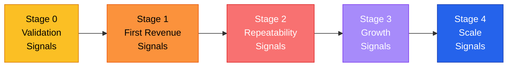

# Traction Benchmarks by Stage

## Core Rule
**Traction is proof that customers care.** Every stage has specific signals that tell you whether to keep going, adjust, or stop. Know your numbers.

---

## Stage 0 — Idea (Validation)

**Goal:** Prove the problem exists and someone will pay to solve it.

| Signal | Green | Yellow | Red |
|--------|-------|--------|-----|
| Problem interviews completed | 20+ with clear pain pattern | 10-19, mixed signals | < 10 or no pattern |
| Prospects who describe the problem unprompted | > 50% of interviewees | 25-50% | < 25% |
| Waitlist signups (if landing page) | 100+ | 50-99 | < 50 |
| Waitlist-to-signup conversion | > 5% | 2-5% | < 2% |
| Pre-sales or LOIs collected | 3+ paying or 5+ LOIs | 1-2 paying or 3-4 LOIs | Zero |
| People who offer to introduce you to others with the problem | Happens frequently | Occasionally | Never |

**Key question:** *"Can I find 20 people who describe this problem with emotion?"*

**Move to Stage 1 when:** You have pre-sales, LOIs, or strong interview evidence that people will pay.

---

## Stage 1 — Pre-Revenue (First 10 Customers)

**Goal:** Get 10 paying customers through a repeatable motion.

| Signal | Green | Yellow | Red |
|--------|-------|--------|-----|
| Paying customers | 10+ | 5-9 | < 5 after 3 months |
| Outreach-to-conversation rate | > 10% | 5-10% | < 5% |
| Conversation-to-close rate | > 20% | 10-20% | < 10% |
| Time from first contact to payment | < 30 days | 30-60 days | > 60 days |
| Customer willingness to refer | Proactively refer | Refer when asked | Won't refer |
| Revenue (MRR) | > $1K | $500-$1K | < $500 after 3 months |
| Customer acquisition source | 2+ working channels | 1 channel works | No channel working |

**Key question:** *"Can I describe, step-by-step, how I got my last 3 customers?"*

**Move to Stage 2 when:** You have 10+ customers and can describe your sales process.

---

## Stage 2 — Early Revenue (Repeatability)

**Goal:** Build a sales motion someone else could run.

| Signal | Green | Yellow | Red |
|--------|-------|--------|-----|
| MRR | > $10K | $5K-$10K | < $5K after 6 months |
| MoM revenue growth | > 15% | 5-15% | < 5% |
| Monthly churn | < 3% | 3-5% | > 5% |
| Net Revenue Retention (NRR) | > 100% | 90-100% | < 90% |
| CAC payback period | < 12 months | 12-18 months | > 18 months |
| LTV:CAC ratio | > 3:1 | 1-3:1 | < 1:1 |
| Non-founder can close deals | Yes | Sometimes | Never tried |
| Defined ICP (ideal customer profile) | Specific and proven | General hypothesis | "Everyone" |

**Key question:** *"If I got hit by a bus, could someone else close the next 5 deals using my process?"*

**Move to Stage 3 when:** Non-founder sales are working, churn is under control, and unit economics are healthy.

---

## Stage 3 — Growth (Systems + Capital)

**Goal:** Build systems that scale and attract investment.

| Signal | Green | Yellow | Red |
|--------|-------|--------|-----|
| MRR | > $50K | $25K-$50K | < $25K |
| MoM revenue growth | > 10% | 5-10% | < 5% |
| Monthly churn | < 2% | 2-4% | > 4% |
| NRR | > 110% | 100-110% | < 100% |
| LTV:CAC | > 4:1 | 3-4:1 | < 3:1 |
| Burn multiple | < 2x | 2-3x | > 3x |
| Gross margin | > 70% | 50-70% | < 50% |
| Team size | Key roles filled | Hiring in progress | Solo founder |
| Pipeline coverage | 3x+ target | 2-3x target | < 2x target |
| NPS score | 40+ | 20-40 | < 20 |

**Burn multiple** = Net burn / Net new ARR. Measures efficiency of growth spend. Under 2x is efficient; over 3x means you're burning cash faster than you're growing.

**Key question:** *"Are my unit economics getting better or worse as I grow?"*

**Move to Stage 4 when:** Systems are automated, team is executing without founder in every deal, metrics justify investment.

---

## Stage 4 — Scaling (Efficiency + Team)

**Goal:** Scale efficiently with strong unit economics and operational maturity.

| Signal | Green | Yellow | Red |
|--------|-------|--------|-----|
| ARR | > $1M | $500K-$1M | < $500K |
| YoY growth | > 100% (2x) | 50-100% | < 50% |
| Monthly churn | < 1.5% | 1.5-3% | > 3% |
| NRR | > 120% | 110-120% | < 110% |
| Burn multiple | < 1.5x | 1.5-2x | > 2x |
| Magic number | > 0.75 | 0.5-0.75 | < 0.5 |
| Gross margin | > 75% | 65-75% | < 65% |
| CAC payback | < 12 months | 12-18 months | > 18 months |
| Employee NPS | > 50 | 30-50 | < 30 |
| Board meeting rhythm | Quarterly + structured | Irregular | None |

**Magic number** = Net new ARR in quarter / Sales & marketing spend in prior quarter. Above 0.75 means your GTM spend is efficient enough to invest more.

**Key question:** *"If I raised $10M tomorrow, could I deploy it efficiently without the business breaking?"*

---

## Quick Reference — The 5 Numbers Every Founder Must Know

Regardless of stage, always know these:

1. **MRR** (or revenue equivalent) — and the trend
2. **Burn rate** — monthly cash going out
3. **Runway** — months of cash remaining
4. **Churn** — % of customers or revenue leaving per month
5. **CAC** — what it costs to acquire a customer

If you don't know these, start with `/metrics`.

---

## When to Worry vs. When to Celebrate

| You should worry if... | You should celebrate if... |
|------------------------|---------------------------|
| Churn is rising month over month | Customers refer you without being asked |
| CAC is increasing while growth is flat | NRR is above 100% (customers spend more over time) |
| Your best customers are your cheapest | MoM growth has been consistent for 3+ months |
| Pipeline is shrinking | You're turning away customers (demand exceeds capacity) |
| You can't explain why the last customer bought | Your sales cycle is getting shorter |
| Revenue depends on 1-2 large customers | No single customer is > 10% of revenue |

---

> **Disclaimer:** These benchmarks are educational guidelines based on common SaaS and tech startup patterns. Your specific industry, market, and business model may have different thresholds. Use these as starting points and calibrate to your context. This is not financial advice.
